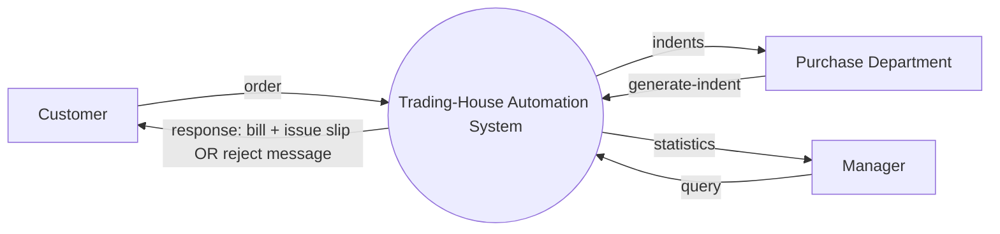

# Software Engineering — Ultra-Detailed Master Notes

## Complete study guide built from the seven supplied PDFs

**Purpose:** This document converts the supplied lecture PDFs and DFD exercises into a single, exam-oriented learning text. It is deliberately expansive: concepts are unpacked, diagrams are expressed textually, examples are walked through, and every source PDF page is audited one-by-one later in the document.

**Source set:** 7 PDFs, **105 source pages total**.

### Source map

| Source | PDF pages | Main topics |
|---|---:|---|
| *SoftEngg - Intro.pdf* | 8 | Software engineering foundations, software products, evolution, hardware/software partitioning, process models |
| *LECT2_LifeCycleModels_Redesigned.pdf* | 34 | Life cycle, Waterfall, Iterative Waterfall, Prototyping, Evolutionary, Spiral |
| *LECT3_Requirements_Analysis_Specification_Redesigned.pdf* | 33 | Requirements analysis, SRS, functional/nonfunctional requirements, decision logic, formal specification, Z, predicate logic |
| *LECT4_Software_Design_Redesigned.pdf* | 21 | Design phase, good design, cohesion, coupling, module hierarchy, function-oriented vs object-oriented design |
| *DFD_problem_statement.pdf* | 1 | Trading-House Automation System exercise |
| *DFD_solution_tutorial.pdf* | 4 | Complete Trading-House DFD solution, level 0 → level 1 → level 2 |
| *dfd_practice_10.pdf* | 4 | Ten independent DFD practice requirements |

> **How to use this guide:** Read the deep-dive chapters first. Then use the one-to-one page audit as a completeness check. Finally, use the DFD analysis and exam revision sections without looking back at the PDFs.

---

# Part I — The Big Picture: What Software Engineering Is Trying to Solve

## 1. Software engineering is an engineering approach, not merely “writing code”

The introductory PDF begins with the idea of an **engineering approach to developing software**. The lecture uses the analogy of building construction: large buildings are not produced by a person improvising every structural decision while construction is already under way. The same broad idea applies to software. As systems grow, a purely ad hoc approach becomes unreliable, so engineering practice organizes experience into repeatable techniques, methodologies, and guidelines.

The important conceptual shift is this:

> A small program can sometimes be produced successfully by an individual programmer through direct experimentation. A large software product has to be understood, planned, designed, documented, tested, managed, and maintained in a disciplined way.

The source explicitly emphasizes a **systematic collection of past experience**. This does not mean every software engineering rule is a theorem. The lecture distinguishes among experience, theoretical or quantitative techniques, and practical “thumb rules.” Engineering practice therefore involves judgment as well as method.

### Art → craft → engineering

The introductory slides show a progression:

1. **Art:** highly individual work, based heavily on intuition.
2. **Craft:** experience exists, but its use is still relatively informal.
3. **Engineering:** past experience becomes organized and is combined with scientific or quantitative reasoning.

The point of the diagram is not that software stops requiring creativity. The point is that creativity must operate inside a framework strong enough to support large, complex projects.

### Why size changes the problem

The lecture stresses the rapidly increasing difficulty of large programs. It uses a comparison such as **10K versus 1000K lines of code** to make the point. The exact numeric values are illustrative; the core lesson is that complexity grows dramatically as software size grows. An approach that works for a small script may collapse once many people, modules, users, interfaces, and requirements interact.

This is why software engineering teaches **abstraction and decomposition**. Abstraction hides irrelevant detail so we can reason at the right level. Decomposition breaks a large problem into smaller units that can be understood and managed separately.

---

## 2. Why study software engineering?

The introductory lecture gives several related reasons.

### 2.1 To handle complex programming problems

The most important transferable skill is the ability to take a large problem and break it into manageable parts. The lecture explicitly connects this to:

- abstraction,
- decomposition,
- specification,
- design,
- interface development,
- testing,
- project management.

This is broader than learning a programming language. A language gives you a way to express a solution; software engineering teaches how to arrive at, organize, evaluate, and evolve that solution.

### 2.2 To become a better programmer

The source links software engineering with **higher productivity** and **better quality programs**. A disciplined programmer is not merely someone who writes fast; the goal is to produce software that satisfies the intended requirements, can be understood by others, and can be changed without excessive damage.

### 2.3 Because software products have recurring problems

The introductory lecture lists typical failure patterns of software products:

- failure to meet user requirements,
- frequent crashes,
- high cost,
- difficulty changing, debugging, or enhancing the product,
- late delivery,
- inefficient resource use.

These problems are precisely what the later lectures address. Requirements analysis attacks the “wrong product” problem. Design attacks complexity and maintainability. Testing attacks correctness. Life-cycle models attack unmanaged development. Maintenance addresses the long period after delivery.

---

## 3. Programs versus software products

One of the most useful conceptual distinctions in the introductory slides is between a **program** and a **software product**.

The program-oriented picture is small-scale:

- often small in size,
- possibly written by one developer,
- the author may also be the only user,
- documentation may be weak or absent,
- the interface may be minimal,
- development can be ad hoc.

The software-product picture is large-scale:

- many users,
- a team of developers,
- a well-designed interface,
- documentation and a user manual,
- systematic development.

The difference is therefore not simply “old versus modern.” It is primarily about **scale, stakeholders, longevity, coordination, and the consequences of mistakes**.

A useful exam sentence is:

> A program can be a personal artifact; a software product is an engineered deliverable that must satisfy users, survive maintenance, and be developed systematically by a team.

---

## 4. Software engineering inside computer systems engineering

The introduction makes an important systems-level point: **computer systems engineering encompasses software engineering** when the product includes both software and hardware.

The examples in the source include a coffee vending machine and a mobile communication product. For such systems, the high-level question becomes:

> Which tasks should be solved by software, and which should be solved by hardware?

This is the **hardware/software partitioning** problem.

The source also shows that hardware and software may be developed together. A hardware simulator may support software development before the physical hardware is ready, followed by hardware/software integration and final system testing.

A useful mental model is:

```text
                 FEASIBILITY STUDY
                         |
        REQUIREMENTS ANALYSIS & SPECIFICATION
                         |
                HARDWARE/SOFTWARE
                   PARTITIONING
                   /           \
          HARDWARE             SOFTWARE
         DEVELOPMENT          DEVELOPMENT
                   \           /
                    \         /
                 INTEGRATION
                 AND TESTING
```

The point is that “software engineering” does not automatically mean software exists in isolation. In embedded or cyber-physical products, software is one part of a larger engineered system.

---

## 5. Evolution of software development practice

The introductory PDF describes early programming in the 1950s as being dominated by assembly language and relatively small programs. Over time, development approaches evolved through several styles represented in the lecture as:

- ad hoc,
- control-flow-based,
- data-structure-based,
- data-flow-based,
- object-oriented.

The later stages also introduce a stronger process discipline:

- greater attention to requirements specification,
- a distinct design phase,
- standard design techniques,
- periodic reviews during development,
- systematic software testing,
- standard testing techniques,
- documentation supporting maintenance and fault diagnosis,
- metrics for project management and quality assurance,
- systematic estimation, scheduling, and monitoring,
- CASE tools.

This list forms the historical bridge into the rest of the course. The course is effectively showing why a project needs a sequence of engineering artifacts and decisions rather than one long coding activity.

---

# Part II — The Software Life Cycle

## 6. What is a software life cycle?

The Life Cycle Models PDF defines the software life cycle as a **series of identifiable stages that a software product undergoes during its lifetime**. The six stages used throughout the lecture are:

1. feasibility study,
2. requirements analysis and specification,
3. design,
4. coding,
5. testing,
6. maintenance.

This six-stage model is a foundation. The different life-cycle models in the lecture do not invent completely different activities; rather, they organize these activities differently, especially with respect to sequencing, iteration, feedback, releases, and risk.

### What is a life-cycle model?

A life-cycle model is both **descriptive and diagrammatic**. According to the source, it:

- identifies the activities required for product development,
- establishes a precedence ordering among activities,
- divides the life cycle into phases that the development team must identify and adhere to.

That means a process model is not just a pretty flowchart. It tells the team **how the work is arranged**.

---

## 7. Why model the life cycle?

The source provides three central reasons.

### Common understanding

A written life-cycle description gives developers a common understanding of the activities. This matters much more in a team than in solo work.

### Finding process defects

A process model can reveal:

- inconsistencies,
- redundant activities,
- missing activities.

The model is therefore itself a review artifact.

### Tailoring the process

Different projects have different characteristics. A life-cycle model gives a starting structure that can be adapted to a particular project.

### Team coordination

The introductory and lifecycle lectures emphasize the difference between a single programmer and a development team. A solo programmer can often decide the exact order of work informally. A team needs a shared answer to **who does what, and when**. The lifecycle source explicitly corrects a possible misunderstanding: the problem is **unmanaged team development**, not the existence of solo development itself.

---

## 8. The six phases — what each one contributes

### 8.1 Feasibility study

This phase asks whether developing the product is worthwhile and technically feasible. The analyst obtains a rough understanding of inputs, processing, outputs, and constraints and explores alternative solution strategies.

### 8.2 Requirements analysis and specification

The team learns what the customer actually needs, resolves ambiguity and inconsistency, and records the result in an SRS.

### 8.3 Design

The SRS is transformed into an implementable structure: modules, their relationships, interfaces, data structures, and algorithms.

### 8.4 Coding and unit testing

The design is translated into source code. Each module is independently tested and debugged.

### 8.5 Integration and system testing

Modules are integrated through planned steps. Partially integrated systems are tested along the way, and the complete system is tested against the SRS.

### 8.6 Maintenance

The product continues to change after delivery. The source distinguishes corrective, perfective, and adaptive maintenance.

The most useful memory chain is:

```text
Feasibility → What is possible/worthwhile?
Requirements → What is needed?
Design → How will the required system be structured?
Coding → Build it.
Testing → Does the built system satisfy the requirements?
Maintenance → Keep it correct, useful, and usable as the world changes.
```

---

## 9. Classical Waterfall Model

The classical Waterfall model is presented as the original idealized model: six phases, one after another, with no way back.

```text
Feasibility
    ↓
Requirements Analysis & Specification
    ↓
Design
    ↓
Coding & Unit Testing
    ↓
Integration & System Testing
    ↓
Maintenance
```

The central assumption is strict sequencing: a phase starts only after the previous phase is complete.

### Why the model is attractive

The source emphasizes that Waterfall is simple to understand and easy to manage. Each phase has a clear start and end, deliverables can be reviewed, and organizations can define entry/exit criteria and standards for each phase.

This structure gives project managers visible milestones. It also forces documentation, which can help later maintenance.

### Effort distribution

The source shows illustrative relative effort values that increase toward maintenance, with maintenance consuming the maximum effort among all life-cycle phases and testing the maximum among the development phases. The lecture explicitly labels the displayed proportions as **illustrative, not exact published percentages**.

The important exam point is not to memorize the chart as a universal statistic. Memorize the comparative message:

> Maintenance consumes the largest overall effort in the illustrated lifecycle, and testing is the heaviest effort among the development phases.

### Worked example: University Examination Portal

The source uses a fixed-scope examination portal with requirements such as exam form fill-up, admit cards, marks entry, and result publication. Design establishes modules, database schema, and roles for students, faculty, and administrators. Coding builds forms, validation, login, and reports. Testing covers registrations, invalid data, and result calculations. Deployment happens before the examination cycle, and maintenance handles report-format changes or minor policy updates.

This example works for Waterfall because the project is framed as comparatively fixed and milestone-driven.

---

## 10. Feasibility study in detail

The feasibility study is not “start coding to see whether it works.” It is a structured early investigation.

### What the analyst explores

The source says the analyst:

- obtains an overall understanding of the problem,
- formulates different solution strategies,
- compares strategies by resources, cost, and development time,
- performs cost/benefit analysis,
- recognizes that the project can be infeasible because of high cost, resource limits, or technical limitations.

A project can therefore fail **correctly and usefully** at feasibility: discovering early that an idea is not viable is preferable to discovering it after a large implementation investment.

### GMC case study

The Galaxy Mining Company case involves roughly 50 mine sites across 8 states and a proposed Special Provident Fund system. The sanctioned budget is ₹1 million. This number is explicitly important because every feasibility trade-off must fit the stated budget. The case illustrates how feasibility depends simultaneously on business payoff, project cost, and the scale of the system.

---

## 11. Requirements phase inside the life cycle

The Life Cycle lecture gives the same requirements concepts that are expanded in the dedicated Requirements Analysis lecture. The source identifies two activities:

1. requirements gathering and analysis,
2. requirements specification.

The goals are to collect relevant data, understand what the customer wants, discover inconsistencies and incompleteness, and resolve them.

The source notes that interviews and discussions are common ways of collecting information from end users. Raw interviews rarely produce a perfect specification because users have partial views, and different people may contradict each other. The analyst therefore cleans and resolves the input and produces an SRS.

---

## 12. Design, implementation, testing, and maintenance in the life cycle

### Design

The traditional approach described in the lifecycle lecture has two activities: **structured analysis** and **structured design**. Structured analysis identifies functions and data flows using DFDs. Structured design then produces modules, invocation relationships, data structures, and algorithms.

### Coding and unit testing

Each module is implemented and tested individually. This gives a set of modules that are already individually debugged before they are integrated.

### Integration and system testing

Integration occurs through planned steps rather than assuming all modules will work when connected at once. The fully integrated system is then tested against the SRS.

### Maintenance

The lecture gives a development-to-maintenance effort ratio of approximately **40:60** as a typical framing in the source. Maintenance types shown are:

- **Corrective:** fix errors missed during development.
- **Perfective:** improve implementation and enhance functionality.
- **Adaptive:** port the software to a new environment, such as a new operating system or computer.

The percentage is a source-level heuristic rather than a law; the classification of maintenance is the important concept.

---

## 13. Classical Waterfall — merits and demerits

### Merits from the source

- simple to understand and use,
- easy to manage through staged deliverables and reviews,
- disciplined documentation at every phase,
- suitable for small projects with clear, stable requirements.

### Demerits from the source

- idealized assumption that defects are not introduced and discovered later,
- no formal feedback path to earlier phases,
- customer sees working software only late,
- poor fit when requirements are unclear, incomplete, or likely to change.

The most exam-worthy contrast is:

> Waterfall gives strong structure and predictability, but pays heavily when early assumptions turn out to be wrong.

---

## 14. Iterative Waterfall Model

The Iterative Waterfall Model keeps the phase structure but adds **feedback paths**.

The central problem with Classical Waterfall is that defects are often introduced in one phase and discovered in a later phase. A design defect, for example, may only become obvious during coding or testing.

The iterative model uses the **principle of phase containment of errors**:

> Ideally, an error should be detected in the same phase in which it was introduced.

When a defect is detected, work returns to the phase where it was introduced and the affected later phases are redone.

### Fund-transfer example

The lecture uses ambiguity in a “daily fund-transfer limit”: does the limit reset at midnight or 24 hours after the first transfer? System testing discovers the ambiguity. The team traces it to requirements, clarifies it with the business team, and then updates the downstream artifacts.

This is exactly the kind of situation classical Waterfall handles badly and iterative Waterfall handles more realistically.

### Merits and limitations

The source describes Iterative Waterfall as more realistic, with better error containment, while still remaining understandable. It is presented as the most widely used life-cycle model in practice in the lecture. However, it is still not ideal for highly uncertain or rapidly changing requirements and late major changes remain expensive.

---

## 15. Prototyping Model

A prototype is a **working but intentionally limited version** built before the final system. The source calls it a “toy implementation”: limited functionality, low reliability, and inefficient performance are acceptable because the prototype exists primarily to learn.

### Why prototype?

The lecture gives two major reasons plus the practical observation that the first version may need to be discarded:

1. Show customers input formats, messages, reports, and interaction/dialog behavior.
2. Investigate technical issues such as controller response time or algorithm efficiency.
3. Learn what the correct requirements/design should actually be by trying something concrete.

### Building the prototype

Start with approximate requirements, make a quick design, and use shortcuts. A dummy routine or simple table lookup may stand in for a real algorithm. The purpose is not production quality; the purpose is information.

### Refinement cycle

The conceptual loop is:

```text
Approximate requirements
        ↓
Quick design
        ↓
Prototype
        ↓
Customer / technical feedback
        ↓
Refine understanding
        ↓
Repeat or discard prototype
        ↓
Build the real product
```

### Prototype danger

The source explicitly warns that customers may mistake the prototype for an almost-finished product, and a rushed prototype architecture may accidentally get carried into the final system. The final system should not inherit poor design simply because the prototype already exists.

---

## 16. Hospital OPD token display example

The prototype example concerns a hospital screen that calls patients using tokens. The key lesson is that a seemingly simple interface can expose questions about how information should appear, what the staff need to see, and what real interaction feels like.

When the source shows the example over multiple pages, treat it as a **refinement illustration**, not as two unrelated examples: the repeated pages reinforce how a prototype helps reveal requirements and interaction decisions before the final product is constructed.

---

## 17. Evolutionary Model

The Evolutionary Model is also described as the **successive-versions or incremental model**. The idea is to deliver a working core first, then grow the system through successive releases.

```text
Release 1: Core working system
          ↓
Release 2: More functionality / refinements
          ↓
Release 3: More complete mature system
          ↓
...
```

The crucial property is that **each release is itself a functioning system capable of doing useful work**. This distinguishes it from a disposable prototype.

### Combining evolutionary and iterative ideas

The lecture says organizations frequently combine iterative and incremental development. A new release can add new functionality, improve old functionality, incorporate customer feedback, and address problems discovered during actual use.

### Campus ERP example

The source uses a campus ERP scenario:

- Release 1: admissions and enrolment.
- Release 2: fee payment and library modules, informed by Release 1 feedback.
- Release 3: hostel allocation and placement tracking.

Each release is genuinely used by the university rather than thrown away.

### Merits

- users can experiment with working software earlier,
- real requirements surface earlier,
- core modules receive repeated testing,
- overall project failure becomes less likely because a useful core appears early.

### Demerits

- not every problem can be cleanly decomposed into independent increments,
- upfront total cost and schedule are harder to fix,
- works best when the system has natural functional modules and sufficient scale.

---

## 18. Spiral Model

The Spiral Model is presented as a **risk-driven meta-model**, associated in the source with Barry Boehm in 1988.

Unlike a model defined mainly by a fixed list of phases or by releases, Spiral is driven by the question:

> What is the biggest unresolved risk right now, and what should we do this loop to reduce it?

### Four quadrants in every loop

1. **Objective setting** — define objectives and identify associated risks.
2. **Risk assessment and reduction** — analyze identified risks and take steps to reduce them.
3. **Development and validation** — produce and validate the appropriate next artifact or level of product.
4. **Review and planning** — review progress with the customer/stakeholders and plan the next iteration.

### The key subtlety

The “development” quadrant does not necessarily mean writing the full application. In an early loop it could produce:

- a feasibility study,
- an experiment,
- a prototype,
- a technical proof,
- a validated requirements model.

Only when the risk picture and project maturity justify implementation does the development activity become full coding and integration.

### Spiral as a meta-model

The source says Spiral can subsume ideas from the other models:

- a single loop can resemble a waterfall-style sequence,
- successive loops provide evolutionary growth,
- prototyping can be used as a risk-reduction technique.

It can even build a family of related products in which different components use different models, such as Waterfall for one component, prototyping for another, and evolutionary development for a third.

---

## 19. Online examination system — spiral example

The source identifies risks such as:

- 5,000 students attempting to log in together,
- internet interruption,
- exam security/cheating,
- disagreement among teachers over rules,
- unacceptable failure during an exam.

The loops then focus on the currently dominant risk.

### Loop 1 — feasibility

Question: can the system support the target load and is it economically/technically viable?

A smaller load experiment may be run, such as simulating 500 students.

### Loop 2 — requirements

Question: what exactly should happen when users lose connectivity, autosave answers, move between questions, or apply exam rules?

The main output is a validated requirements understanding.

### Loop 3 — design

Question: can the architecture support the target load reliably?

The source considers alternatives such as a powerful single server, multiple load-balanced servers, or a cloud-based scalable design, with experimental validation of the alternatives.

### Loop 4 — implementation

Now actual coding, integration, testing, and readiness work dominate. Risks include security vulnerabilities, database failure, cheating, and performance.

### The one-sentence distinction

The source gives an excellent memorization line:

> **Waterfall is phase-driven. Evolutionary is release-driven. Spiral is risk-driven.**

---

## 20. Overall life-cycle comparison

| Model | Main organizing idea | Source emphasis |
|---|---|---|
| Classical Waterfall | strict sequential phases | simplicity and discipline |
| Iterative Waterfall | phases + feedback | error containment |
| Prototyping | learn before final build | unclear requirements / technical uncertainty |
| Evolutionary | useful releases | early working functionality |
| Spiral | risk-driven loops | explicit risk management |

The source’s final selection table should be remembered as a **fit-by-project-characteristics** table, not as a universal formula. Stable, well-understood projects fit the more sequential approaches; unclear requirements call for prototyping; very large systems with natural increments fit evolutionary development; large, technically risky projects fit Spiral.

---

# Part III — Requirements Analysis and Specification

## 21. Why requirements work happens before design

The Requirements Analysis lecture opens with a simple but powerful motivation: many projects fail before coding starts because teams implement a system before establishing that they are building what the customer actually needs.

Requirements work exists to catch the mismatch **early, when it is cheaper to fix**.

The lecture presents two activities and one deliverable:

```text
Requirements Gathering & Analysis
              ↓
Requirements Specification
              ↓
      Reviewed & Approved SRS
```

The approved SRS then becomes the basis for later development. Design, coding, and testing all trace back to it.

---

## 22. Requirements gathering — what analysts actually do

The source identifies four ways of learning the real requirements:

1. observe the existing system or procedures,
2. study existing documentation,
3. discuss with customers and end users,
4. analyze what actually needs to be done beyond what is simply asked for.

The fourth item is particularly important. A user may ask for a button, report, or feature because that is how they imagine the solution. The analyst has to understand the underlying problem rather than blindly turning every request into a feature.

### Existing system versus new system

When automating an existing system, the analyst can observe input/output formats and procedures directly, so the starting point is more concrete.

When building something new, there may be no working system to observe. The analyst must therefore use more imagination, experience, questioning, modeling, and interaction.

The source states that in both situations, simply asking “what do you want?” is rarely enough.

---

## 23. Two common defects: inconsistency and incompleteness

### Inconsistency

Two requirements conflict.

The lecture’s example is a temperature-control situation in which one stakeholder says that when temperature exceeds 100°C the heater should turn off and the shower should open, while another says the heater should turn off and the cooler should switch on at the same threshold.

The analyst must identify the contradiction and resolve it before writing the final SRS.

### Incompleteness

The specification omits an important case.

The same example says the system behavior above 100°C is written down, but the behavior when temperature falls below 90°C is omitted. The missing case might require the heater to turn on and the shower to turn off.

The important exam distinction is:

> **Inconsistency = two recorded rules conflict. Incompleteness = a required case is missing.**

---

## 24. Four questions every analyst should answer

The requirements lecture summarizes analysis around four questions:

1. **What is the problem?** — define it precisely before discussing a solution.
2. **Why solve it?** — understand the reason the investment matters.
3. **What are the possible solutions?** — consider alternatives rather than prematurely choosing one.
4. **What complexities might arise?** — anticipate difficulties before they become surprises.

These four questions are a practical checklist for requirements interviews and examination answers.

---

## 25. Functional requirements

The source defines a functional requirement in terms of system behavior. A system can be viewed as performing functions \(f_i\), and each function transforms input data into corresponding output data.

Conceptually:

```text
Input data ──→ Function fᵢ ──→ Output data
```

The function description should make the input, output, and necessary processing clear. A high-level requirement may contain several identifiable functions and can therefore be decomposed further.

### Library search example

The lecture defines a library Search Book function:

- **Input:** an author name.
- **Processing:** match the name against the catalogue.
- **Output:** details of the author’s books and their library locations.

This is a useful template for writing a functional requirement:

> Given this input, the system shall perform this required transformation and make this output available.

---

## 26. Nonfunctional requirements and constraints

The lecture separates the SRS into three major categories:

1. **Functional requirements** — what the system must do.
2. **Nonfunctional requirements** — qualities the system must have.
3. **Constraints** — things the system must or must not do because of imposed conditions.

The source examples of nonfunctional qualities include:

- reliability,
- performance,
- human-computer interface,
- system interfacing,
- security,
- maintainability,
- portability,
- usability.

Constraints can concern standards, hardware/OS/DBMS choices, I/O-device capabilities, response time, and data representation required by another system.

### Practical distinction

A functional statement usually describes an action or transformation.

A nonfunctional statement describes a quality.

A constraint describes an imposed limitation or requirement on what the system should or should not use/do.

---

## 27. What is an SRS?

The SRS is more than a list of features. The lecture presents four roles:

- statement of user needs,
- contract document,
- reference document,
- definition used for implementation.

The approved SRS becomes the common reference point between customer and development team.

### SRS as a contract

The lecture explicitly says that after approval, the SRS acts as a contract. Later disputes should be settled by referring back to what the document records rather than relying on memory or assumption.

The product is therefore judged against the requirements that were recorded and approved.

---

## 28. SRS as a black-box specification

The SRS should primarily specify **externally visible behavior**.

```text
              +----------------------+
Input Data →  |  System S (Black Box)| → Output Data
              +----------------------+
```

The internal algorithms, data structures, and implementation choices are deliberately left unspecified at this stage.

This connects directly to the following rule:

> SRS says **WHAT**, design says **HOW**.

### Why this separation matters

If the requirement says “store names in alphabetical order,” that may be unnecessarily prescriptive if sorted storage is not actually a user need. Dictating an implementation strategy too early reduces the designer’s freedom.

---

## 29. What the SRS should and should not say

### It should

- state clearly what needs to be done,
- use end-user terminology,
- remain precise and contractual,
- be written so it can later support formal specification if needed.

### It should avoid

- prescribing implementation details,
- premature technical detail that unnecessarily restricts the design,
- vague literary language,
- ambiguous expressions that different readers could interpret differently.

---

## 30. Properties of a good SRS

The source’s table is central and should be learned almost verbatim in meaning:

| Property | Meaning |
|---|---|
| Concise & unambiguous | Says exactly what is meant without excess or multiple interpretations |
| Specifies what, not how | Describes required behavior rather than implementation |
| Easy to change | Structured so changes do not create unpredictable ripple effects |
| Consistent | No two requirements contradict each other |
| Complete | No important requirement is omitted |
| Traceable | Requirements can be linked to design/code and traced back to their origin |
| Verifiable | It is possible to determine objectively whether the requirement is satisfied |

The lecture’s classic contrast is between “user-friendly” and an objectively measurable response-time requirement. The first is ambiguous; the second is verifiable.

---

## 31. Standard SRS structure

The source presents a four-part structure aligned with the shape of IEEE 830-style documents:

### 1. Introduction
Purpose, scope, definitions and abbreviations, references, and document overview.

### 2. Overall Description
Product perspective, major functions, user characteristics, general constraints, and assumptions.

### 3. Specific Requirements
Functional requirements, external interfaces, performance requirements, and design constraints.

### 4. Appendices / Index
Supporting data, glossary, cross-reference index.

For an exam question asking “write standard SRS structure,” this four-section hierarchy is the safest framework from the supplied lecture.

---

## 32. Writing precise functional clauses

The Library Search example shows how a vague requirement becomes a sequence of smaller, testable clauses.

For Search Book:

- selecting the search option should cause the system to prompt for keywords;
- entering keywords should cause the system to return all books whose title or author matches the keywords;
- the output includes title, author, publisher, year, ISBN, catalogue number, and location;
- the processing is a search through the book list;
- the sample also gives a performance note: response within 2 seconds for a catalogue of up to 200,000 titles.

The key technique is **input → processing → output** with a stable requirement ID and, where useful, priority.

---

## 33. Renew Book — clause-by-clause precision

The source decomposes Renew Book into:

### R.2.1
Input: Renew option selected. Output: prompt for membership number and password.

### R.2.2
Input: membership number and password. Output: list of borrowed books or an error for invalid password. Processing includes password validation and searching the borrower list.

### R.2.3
Input: selected renewal choices. Output: confirmation of renewed books. Processing updates the borrower list.

This style is valuable because every clause has a clear trigger/input and observable result. It also helps testing: each clause can be turned into a test objective.

---

## 34. Bad SRS patterns

The lecture lists several failure modes.

### Unstructured specification
A narrative essay makes precise editing, traceability, and consistency difficult.

### Noise
Irrelevant material makes the real requirement harder to find.

### Silence
Important aspects are omitted.

### Overspecification
Implementation details are dictated unnecessarily.

### Contradictions
The same requirement is stated differently in multiple places.

### Ambiguity
Terms such as “good user interface” or other non-quantifiable descriptions invite multiple interpretations.

### Forward references
A statement relies on a definition the reader has not encountered yet, making local interpretation difficult.

### Wishful thinking
A desired capability is written even though no realistic solution is available under the project conditions.

A good SRS avoids all eight patterns.

---

## 35. Decision logic

Decision logic is introduced when a process depends on multiple conditions and outcomes. The lecture presents two equivalent representations:

- **decision tree:** conditions are represented by branches and actions at leaf nodes;
- **decision table:** conditions and resulting actions are arranged as rules/rows.

### When to use which

Trees are intuitive when the number of conditions is small and you want to visualize branching paths.

Tables are especially useful for checking that cases are complete and that conditions are not duplicated or accidentally omitted.

---

## 36. ATM example — decision tree

The supplied ATM practice problem requires:

1. validate card and PIN,
2. check amount against balance and daily withdrawal limit,
3. dispense cash and update balance only when checks pass.

The decision tree is effectively:

```text
Card & PIN valid?
├── No  → Reject / show error / retain or eject card per policy
└── Yes
    ↓
Amount ≤ balance AND daily limit?
├── No  → Reject: insufficient funds / limit exceeded
└── Yes → Dispense cash + update balance + print receipt
```

The source solution gives four functional requirements and three listed constraints, including a 5-second response target under normal network conditions, supported cash denominations, and retaining the card after three consecutive incorrect PIN attempts.

---

## 37. Formal specification — why mathematics appears in requirements

Formal specification is a mathematical way to describe required system behavior. The lecture says it replaces natural-language ambiguity with set theory and predicate logic.

The basic pattern is:

- represent system **state** using variables,
- describe what is true before an operation,
- describe what must be true after the operation,
- use notation with precise semantics.

### Why use it?

Natural language is easy to write but easy to interpret differently. Formal notation aims to give each statement one mathematical meaning that can be checked rigorously.

The lecture emphasizes that formal specification is especially valuable when a mistake is expensive, such as in safety-critical or high-reliability systems.

---

## 38. How formal specification is built

The lecture presents three broad steps:

1. choose a notation;
2. model the state;
3. define each operation with preconditions and postconditions.

The notation introduced in detail is **Z notation**.

---

## 39. Z notation — core ideas

The source describes Z as a formal notation developed at Oxford University in the early 1980s and built on set theory and first-order predicate logic.

The major structural idea is the **schema**: a named box containing declarations and predicates/constraints.

Z separates:

- the state: what the system remembers;
- operations: how the state may change.

### Core notation reference

| Symbol / convention | Meaning |
|---|---|
| \(\mathbb{N}, \mathbb{Z}\) | natural numbers, integers |
| Schema box | named structure containing declarations and predicates |
| \(\Delta\) | the operation changes state |
| \(\Xi\) | query/read operation that does not change state |
| `x?` | input |
| `x!` | output |
| `x, x′` | before and after values |

### Logical and set operators

- \(\land\): AND
- \(\lor\): OR
- \(\neg\): NOT
- \(\Rightarrow\): implication
- \(\Leftrightarrow\): if and only if
- \(\forall\): for all
- \(\exists\): there exists
- \(\in\): member of
- \(\subseteq\): subset of
- \(\cup\): union
- \(\cap\): intersection
- \(\to\): total function
- `dom`: domain
- `ran`: range

---

## 40. First-order predicate logic

A predicate is a statement about one or more objects that is either true or false. Examples from the lecture include `PassedAll(s)` and `Available(b)`.

Predicates can be combined using logical connectives, and quantifiers let us state rules over sets of objects.

The recurring structure emphasized in the lecture is:

```text
∀ x ∈ Domain • Condition(x) ⇒ Conclusion(x)
```

Read it as:

> For every x in the domain, if the condition holds, then the conclusion must hold.

The exam technique recommended by the source is to identify, in order:

1. the domain,
2. the condition,
3. the conclusion,
4. the connective or quantifier words in the English sentence.

---

## 41. Translating English into first-order logic

The translation guide in the lecture gives the following clues:

| English | Symbol |
|---|---|
| all / every / each | \(\forall\) |
| some / there exists / at least one | \(\exists\) |
| and / both | \(\land\) |
| or / either-or | \(\lor\) |
| not / no / never / none | \(\neg\) |
| if … then / implies | \(\Rightarrow\) |
| if and only if | \(\Leftrightarrow\) |

### Example: students

English:

> Every student who has passed all exams graduates.

Formal structure:

\[
\forall s \in Students \bullet PassedAll(s) \Rightarrow Graduates(s)
\]

Notice that “every student” creates the universal quantifier, “passed all exams” becomes the condition, and “graduates” becomes the consequence.

### Software example

English:

> Every request that fails authentication is rejected.

Formal form:

\[
\forall r \in Requests \bullet \neg Authenticated(r) \Rightarrow Rejected(r)
\]

---

## 42. Formal-logic practice cases

### Library rule

A member may issue a book if the member has no overdue books **and** the book is available.

The lecture formalizes this with:

\[
\forall m \in Members, b \in Books \bullet
(\neg HasOverdue(m) \land Available(b)) \Rightarrow MayIssue(m,b)
\]

### Course registration

A student can register if a seat exists **or** special permission has been granted:

\[
\forall s \in Students, c \in Courses \bullet
((\exists seat \in Seats(c) \bullet Free(seat)) \lor HasPermission(s,c))
\Rightarrow CanRegister(s,c)
\]

### Additional practice statements

The source provides examples for:

- unique employee IDs,
- at least one administrator logged in,
- encryption versus public readability,
- stock status being equivalent to zero quantity,
- every transaction being logged or flagged,
- passwords being at least eight characters.

The point of these questions is not memorization. They train the transformation from English quantifier/connective phrases to a formal rule.

---

## 43. Building a Z schema — five-step method

The source gives a five-step sequence:

1. **Identify the State**
2. **Write the State Schema**
3. **Name the Operation**
4. **Add Inputs & Outputs**
5. **Write Preconditions and Postconditions**

Memorize the sequence because it is the structure of the worked ATM example.

---

## 44. ATM withdrawal in Z — state

The source asks: what must the ATM remember between transactions?

It identifies:

- current account balance,
- amount already withdrawn today,
- daily withdrawal limit.

The state schema is conceptually:

```text
ATM
-------------------------
balance, dailyWithdrawn : ℕ
dailyLimit              : ℕ
-------------------------
dailyWithdrawn ≤ dailyLimit
```

The lower line is an **invariant**: a fact that must always remain true.

---

## 45. ATM withdrawal in Z — operation and input

The operation is named `Withdraw`.

`ΔATM` says the ATM state changes.

`amt? : ℕ` says the requested amount is an input and is a natural number.

Then the source adds preconditions:

\[
amt? \le balance
\]

and

\[
dailyWithdrawn + amt? \le dailyLimit
\]

Together they say that the requested withdrawal cannot exceed the balance and cannot push the daily total beyond the daily limit.

---

## 46. ATM withdrawal in Z — postcondition

The after-values are written using primes:

\[
balance' = balance - amt?
\]

\[
dailyWithdrawn' = dailyWithdrawn + amt?
\]

The specification therefore expresses both legality and state change:

```text
Before:
    amount is within balance
    amount keeps daily total within limit

After:
    balance has decreased by the withdrawn amount
    dailyWithdrawn has increased by the withdrawn amount
```

This is the essence of a formal operation specification: **state + conditions before + exact state relation after**.

---

## 47. Formal specification merits and demerits

### Merits in the source

- well-defined semantics reduce ambiguity;
- automated tools can check properties;
- some specifications can be executed as working prototypes.

### Demerits in the source

- difficult to learn/use without mathematical background;
- less suitable for very large and complex systems.

The important exam theme is the trade-off: mathematical precision is gained at the cost of accessibility and modeling effort.

---

# Part IV — Software Design

## 48. Where design sits between requirements and code

The Software Design lecture defines design as the transformation of a validated SRS into a form that can be implemented in a programming language.

The inputs and outputs are explicit:

```text
Validated SRS
     ↓
Software Design
     ↓
Design documents / module specifications
     ↓
Code
```

The design phase decides:

- module structure,
- control relationships among modules,
- interfaces and data exchanged,
- data structures inside modules,
- algorithms.

This is the “HOW” stage that follows the SRS “WHAT.”

---

## 49. Anatomy of a module: data + functions

The source depicts a module as a combination of information and behavior. Its example data include a customer record, account balance, and transaction log. Example functions include validation, interest computation, transaction posting, receipt generation, and audit entry.

This is a deliberately general abstraction. A module is not merely a function; it can contain the data it works with and multiple closely related operations.

The quality question becomes: **do those data and functions belong together, and how much does the module depend on other modules?** That leads directly to cohesion and coupling.

---

## 50. High-level versus detailed design

### High-level design

The source says high-level design:

- identifies modules,
- identifies control relationships,
- identifies interfaces,
- commonly uses a structure chart,
- produces the program structure/architecture.

### Detailed design

Detailed design:

- designs module data structures,
- designs module algorithms,
- produces module specifications detailed enough to code from.

Thus:

```text
Validated SRS
   ↓
High-Level Design
   → modules + relationships + interfaces
   ↓
Detailed Design
   → data structures + algorithms
   ↓
Code-ready module specifications
```

---

## 51. What makes a design good?

The lecture highlights four major properties:

1. **Correct** — implements every SRS functionality.
2. **Understandable** — has a clear structure other engineers can follow.
3. **Efficient** — uses processing time and resources sensibly.
4. **Maintainable** — can be changed safely as requirements evolve.

The lecture gives special emphasis to understandability. A design that is hard to understand is difficult to maintain and change, and the lecture states that roughly 60% of total lifecycle effort is typically spent on maintenance. Again, that percentage is used as a lecture-level heuristic; the conceptual takeaway is that maintenance is a major part of software life.

---

## 52. Modularity: divide and conquer

A good design is decomposed into a clean set of modules. The source repeatedly emphasizes **divide and conquer**.

If modules are close to independent, each one can be understood in isolation. This lowers the amount of information a developer needs to hold in their head simultaneously.

The hierarchy should also be tree-like rather than tangled. The payroll example separates employee records, time and attendance, deductions and tax, and payslip generation.

The deeper idea is not “make as many modules as possible.” Over-decomposition also adds coordination overhead. The goal is to find modules whose boundaries make the overall system easier to understand.

---

## 53. Cohesion

**Cohesion** measures the functional strength of a single module: how strongly the responsibilities inside one module belong together.

The source gives a scale from low to high:

```text
Coincidental
   ↓
Logical
   ↓
Temporal
   ↓
Procedural
   ↓
Communicational
   ↓
Sequential
   ↓
Functional
```

The target is **functional cohesion**: all elements contribute to one clearly describable purpose.

### Why high cohesion helps

A highly cohesive module has an obvious reason to exist. It is easier to understand, explain, test, and potentially reuse.

---

## 54. Seven types of cohesion

### 54.1 Coincidental cohesion

Elements are grouped together without meaningful relationship. The lecture’s example mixes error logging, file reading, and socket opening.

This is the weakest form because the module is effectively a random utility bag.

### 54.2 Logical cohesion

Several operations belong to the same broad category but one operation is selected by a parameter. An I/O handler that switches among file, keyboard, or network behavior illustrates this.

The operations are similar conceptually, but the module still contains multiple distinct responsibilities.

### 54.3 Temporal cohesion

Functions are grouped because they execute in the same time period. The lecture’s startup example initializes variables, sets up logging, and opens connections.

The common link is “these things happen during startup,” not one single functional purpose.

### 54.4 Procedural cohesion

Elements follow a sequence of steps in one procedure, such as successive stages in message decoding.

The relationship comes from order of execution.

### 54.5 Communicational cohesion

Elements operate on the same data structure. The stack example pushes, pops, and peeks at the same stack.

The shared data provides the relationship.

### 54.6 Sequential cohesion

The output of one part becomes the input of the next, such as `sort → search → display`.

The functions form a pipeline.

### 54.7 Functional cohesion

Every element contributes to one single, well-defined task. The payroll example groups work such as calculating work hours, overtime, and deductions as one coherent payroll-processing purpose in the lecture.

---

## 55. Quick cohesion test

The lecture gives a clever textual test: write one sentence that explains what the module does.

Watch the language:

- a compound “and” sentence may indicate sequential or communicational cohesion;
- words such as “first,” “next,” “after,” or “then” suggest sequential or temporal relationships;
- “initialize” strongly suggests temporal cohesion;
- a single simple sentence describing one purpose is a strong sign of functional cohesion.

The examples are:

```text
startup() initializes variables, sets up logging, and opens connections.
→ temporal

useStack() pushes, pops, and peeks at the same stack.
→ communicational

search() sorts the data and then finds the match.
→ sequential

payroll() computes the overtime pay for an employee.
→ functional
```

This heuristic is not a mathematical measurement. It is a fast design-review aid.

---

## 56. Coupling

**Coupling** measures how interdependent two modules are. The source connects coupling to the complexity of the interface between modules.

The scale is:

```text
Data → Stamp → Control → Common → Content
loosest                         tightest
```

The design goal is **low/loose coupling**. When one module can change without forcing changes in another, the design is easier to maintain.

---

## 57. Five types of coupling

### Data coupling

Modules exchange only an elementary data item through a parameter. Example: passing an integer amount.

This is the loosest and most desirable form in the lecture’s scale.

### Stamp coupling

A composite structure is passed even though only part of it is used. Example: passing a whole `Order` object when only `order.total` is needed.

The interface exposes more structure than necessary.

### Control coupling

One module passes a flag that directs the logic of another module. Example: `isRushOrder` causes the callee to choose one branch or another.

This means information crossing the boundary is influencing the callee’s control flow rather than merely supplying data.

### Common coupling

Modules share global data. Two modules can both access and modify a global inventory count.

This creates hidden dependencies because a change from one location can affect the other.

### Content coupling

One module directly reaches into another’s internals, such as jumping into the middle of another module’s code. This is the tightest form and is presented as almost always a defect.

---

## 58. Control coupling worked example

The lecture shows `validateOrder()` setting an `isRushOrder` flag which is then passed to `processOrder()`.

The flag does not merely describe a business datum. It tells the second module **which path of its own internal logic to execute**.

That is why this is worse than simple data coupling: the caller must know something about the callee’s control decisions.

A useful test is:

> If a parameter is essentially telling the receiving module **how to behave**, rather than merely supplying data it needs, suspect control coupling.

---

## 59. Module hierarchy: depth, width, fan-out, fan-in

These measures concern the shape of the whole module tree.

### Depth
Number of levels of control in the hierarchy.

### Width
Overall span across the widest level.

### Fan-out
How many modules a module directly controls/calls.

### Fan-in
How many modules directly call a particular module.

The source emphasizes a design intuition:

- **High fan-in** often indicates useful reuse.
- **High fan-out** can be a warning that a module is coordinating too many subordinates and may lack cohesion.

The structure-chart example shows a `Log Utility` called from three places, giving it fan-in of 3, while `Main` directly controls three modules, giving it fan-out of 3.

---

## 60. Visibility and layering

The source defines a module that controls another as **superordinate**, while the controlled module is **subordinate**.

A module is visible to another if the caller can reach it directly or indirectly.

The **layering principle** says a module should call only modules in the immediately lower layer. Lower layers perform lower-level mechanical work such as I/O; upper layers coordinate and manage.

The abstraction principle is crucial:

> A lower-level module must not call upward into a higher-level module.

This preserves direction of dependency and makes the structure easier to reason about.

---

## 61. Goal of high-level design

The source describes high-level design as mapping system functions \(\{f_1, f_2, …, f_n\}\) onto modules \(\{m_1, m_2, …, m_j\}\) such that:

- each module has high cohesion,
- coupling among modules is low,
- the modules form a neat, shallow hierarchy.

This mapping is one of the core design decisions of the course.

---

## 62. Function-oriented design versus object-oriented design

The two philosophies ask different first questions.

### Function-oriented design (FOD)

- views the system as functions to perform;
- successively refines functions into sub-functions;
- maps functions to modules;
- centralizes state in shared data structures.

### Object-oriented design (OOD)

- views the system as a collection of real-world entities/objects;
- bundles data with the operations acting on that data;
- lets objects communicate through messages;
- distributes state across objects.

The lecture’s mnemonic is a quote attributed to Grady Booch:

> “Identify verbs if you are after procedural design, and nouns if you are after object-oriented design.”

The point is a modeling heuristic: procedural analysis naturally focuses on actions, while object-oriented analysis naturally focuses on entities and their responsibilities.

---

## 63. Function-oriented worked example: create-library-member

The source starts with:

```text
create-library-member
        /       |       \
       /        |        \
assign membership  create-member-record  print-bill
number
```

Each sub-function can be refined again until the resulting modules are small enough to implement directly.

This is **functional decomposition**: repeatedly break a larger function into smaller functions while preserving the overall purpose.

The key concept is recursive refinement rather than merely splitting the screen into UI components.

---

## 64. Object-oriented library example

In the OOD version, each library member is represented as an object with its own state and operations. A class defines the shared structure and behavior of similar objects, such as a `Member` class.

The lecture also mentions inheritance: classes may inherit features from a more general superclass.

A central rule is that one object’s functions do not directly reach into another object’s data. Objects communicate by sending messages.

This creates encapsulation of state.

---

## 65. Where the state lives: the central contrast

The source visualizes the distinction clearly.

### Function-oriented
Many functions interact with one central pool of member records.

```text
createMember()  ─┐
returnBook()    ─┼→ Member Records ← issueBook()
deleteMember() ─┤
updateRecord() ─┘
```

### Object-oriented
Each object owns its state and exposes behavior through its interface.

```text
Member: Asha  ↔ messages ↔ Member: Rahul
    own data + methods        own data + methods

Book: OS Concepts             Librarian
own data + methods            own data + methods
```

The important conceptual contrast is **centralized versus distributed state**.

---

## 66. Fire-alarm case study: why the difference matters

The case describes an 80-floor, 1,000-room building. Every room has a smoke detector and alarm.

When a detector reports a fire, the system must:

1. determine the location,
2. sound alarms in neighboring locations,
3. display a message for fire-fighting staff,
4. allow staff to reset alarms after the condition is handled.

### Function-oriented version

The lecture uses five global arrays:

- `detector_status[1000]`
- `detector_locs[1000]`
- `alarm_status[1000]`
- `alarm_locs[1000]`
- `neighbor_alarms[1000][10]`

and six functions:

- `interrogate_detectors()`
- `get_detector_location()`
- `determine_neighbor()`
- `ring_alarm()`
- `reset_alarm()`
- `report_fire_location()`

All functions can access the shared state. Nothing explicitly owns it. Therefore, correctness depends on all functions consistently understanding the same global structures.

### Object-oriented version

The source defines two small classes:

`Detector`
- attributes: status, location, neighbors;
- operations: create, senseStatus, getLocation, findNeighbors.

`Alarm`
- attributes: location, status;
- operations: create, ringAlarm, getLocation, resetAlarm.

In practice there is a Detector object and Alarm object associated with each room.

### The deeper lesson

The source concludes that real systems commonly use both styles. An overall design may use objects to encapsulate data, while individual class methods can still be refined in a top-down function-oriented way.

Thus FOD and OOD are not presented as mutually exclusive religions; they are complementary perspectives.

---

# Part V — Structured Analysis and Data Flow Diagrams

## 67. What the DFD exercises are teaching

The DFD materials use **structured analysis**. The core task is to read a requirements paragraph and convert its nouns and verbs into a data-oriented model.

The supplied practice materials establish four rules that should be treated as exam rules:

1. The **context diagram** contains the whole system as one bubble.
2. Every external entity appears at that boundary and nowhere else in the context diagram.
3. A bubble should usually decompose into around **3 to 7 child bubbles**.
4. A DFD shows **data in motion**, not control flow. Do not draw arrows whose meaning is “then,” “if,” “loop,” or “do this next.”

The practice sheets additionally emphasize that every function named in the requirement should appear somewhere and that the analyst should not invent extra behavior.

---

## 68. The four things to mine from a requirement

The worked Trading-House solution gives a very effective extraction method:

- every external “who” is a candidate **external entity**;
- every verb describing system work is a candidate **function**;
- every document or message produced is a candidate **report/output**;
- every noun that must be remembered between requests is a candidate **data store**.

This is a disciplined way to start a DFD before drawing any bubbles.

### Example vocabulary

Suppose the requirement says:

> A customer sends an order; the system checks the customer record; if valid, it updates inventory and produces a bill.

Candidate extraction:

- External entity: Customer.
- Function: accept/check order.
- Function: update inventory.
- Output: bill.
- Data stores: customer file, inventory.

The diagram comes after the vocabulary mining.

---

# Part VI — Trading-House Automation System: Complete DFD Reasoning

## 69. Read the Trading-House requirement as a model

The requirement describes a trading house that maintains customers, checks creditworthiness, validates ordered items, checks inventory, issues bills and material issue slips, records pending orders, generates vendor indents, and answers manager queries about item sales.

The problem statement explicitly instructs the student to produce:

1. a list of entities, functions, and reports,
2. context diagram (level 0),
3. level 1 DFD,
4. one level 2 decomposition.

The worked solution follows exactly that order.

---

## 70. External entities in TAS

The worked solution identifies **three** external entities:

| Entity | Sends to system | Receives from system |
|---|---|---|
| Customer | order | bill + material-issue-slip or reject-message |
| Purchase Department | generate-indent command | indents |
| Manager | query | statistics |

A subtle but important point from the solution: **Vendors are not external entities in the DFD** because TAS does not communicate with them directly. The system reads the internal vendor list and prints indents for the Purchase Department, which then handles them.

This is an excellent example of the difference between “mentioned in the story” and “directly interacting with the software.”

---

## 71. Four level-1 functions in TAS

The four bubbles are:

| ID | Function | Main responsibility |
|---|---|---|
| 0.1 | Accept-order | look up customer, evaluate creditworthiness, accept/reject |
| 0.2 | Process-order | validate items, check stock, bill available items, log pending items |
| 0.3 | Handle-query | return sales statistics for a requested period |
| 0.4 | Handle-indent-request | consolidate pending orders, identify vendors, print indents |

Notice the clean decomposition: four functions are comfortably inside the 3–7 guideline.

---

## 72. TAS data stores

The worked solution identifies eight internal data stores:

1. Customer-file
2. Customer-history
3. Item-file
4. Inventory
5. Accepted-orders
6. Pending-order
7. Vendor-list
8. Sales-statistics

The solution explains that a data store is something the system remembers across requests. Vendors, by contrast, are not a store merely because the system stores vendor details; the **vendor-list** is the store.

---

## 73. TAS Level 0 — context diagram

The whole system is one bubble.



The context diagram intentionally collapses all internal distinctions. The response is shown generically because the level-0 picture does not yet distinguish between a successful order and a rejected one.

The important rule is **boundary purity**: internal files such as Customer-file or Inventory do not appear in the context diagram.

---

## 74. TAS Level 1 — Accept-order

`Accept-order (0.1)` receives a customer order, uses the Customer-file and Customer-history, and either sends an accepted order onward to Process-order or produces a reject message.

```text
Customer
   |
   | order
   v
+----------------+
| Accept-order   |
|      0.1       |
+----------------+
  |            |
  | accepted   | reject-message
  v            v
Process-order Customer
```

The data stores read by this function are:

- Customer-file → customer record,
- Customer-history → payment history.

The key semantic point is that an order rejected for creditworthiness **stops there** in the process model; it does not continue to Process-order.

---

## 75. TAS Level 1 — Process-order

`Process-order (0.2)` is more complex. It receives an accepted order and needs to:

1. validate ordered items against Item-file;
2. check availability in Inventory;
3. generate bill and material issue slip for available items;
4. record shortage/pending items;
5. update stores and sales information.

The source identifies Item-file, Inventory, Accepted-orders, and Pending-order here; Sales-statistics is updated when a sale completes.

This bubble still hides multiple distinct decisions, which is exactly why the worked solution chooses it for level 2 decomposition.

---

## 76. TAS Level 1 — Handle-query

`Handle-query (0.3)` is intentionally simple:

```text
Manager → query → Handle-query → Sales-statistics → statistics → Manager
```

The solution emphasizes that Sales-statistics is written when Process-order records a sale, while Handle-query simply reads it to answer managerial requests.

This separation prevents the query function from taking responsibility for generating sales data.

---

## 77. TAS Level 1 — Handle-indent-request

`Handle-indent-request (0.4)` receives a generate-indent command from the Purchase Department.

It reads:

- Pending-order,
- Vendor-list.

It determines the items still required and the total quantities, finds supplying vendors, and prints indents to the Purchase Department.

The shared store **Pending-order** is important: Process-order writes shortage information into it, while Handle-indent-request later reads it.

---

## 78. TAS Level 2 — decompose Process-order

The solution chooses Process-order because it hides the most complexity.

The four child bubbles are:

1. **Validate-items (0.2.1)**
2. **Check-availability (0.2.2)**
3. **Generate-documents (0.2.3)**
4. **Update-records (0.2.4)**

The high-level idea is:

```text
Accepted order
      |
      v
Validate items
      |
      v
Check availability
     / \
available short
    |      |
    +---+--+
        v
Generate documents / update records
```

The source describes this as a fan-out/fan-in pattern: one accepted-order stream splits into different result types and the information is ultimately consolidated into the record-update stage.

---

## 79. TAS DFD quality checklist

The worked tutorial’s final checks are exam-friendly:

- context diagram has one system bubble and all three external entities,
- level 1 contains exactly four bubbles,
- only the complex Process-order bubble is decomposed further,
- no arrow encodes execution order or conditions,
- every function mentioned in the requirement appears,
- nothing beyond the requirement is invented.

The last two are especially important. A DFD should be **requirement-driven, not imagination-driven**.

---
# Part VII — DFD Practice Set: How to Analyze All Ten Problems

## 80. A repeatable DFD algorithm for examinations

For each requirements paragraph, do not start drawing immediately. Use this sequence:

### Step A — Mark the outsiders
Underline people, offices, departments, or other systems that directly exchange data with the software. These are candidate external entities.

### Step B — Extract the verbs
Write down every system responsibility: book, check, calculate, reserve, record, generate, report, notify, etc. Group related verbs into 3–7 major functions.

### Step C — Extract persistent nouns
Anything that must be remembered between separate interactions becomes a candidate data store: customer record, inventory, appointment list, loan history, course list, etc.

### Step D — Extract outputs
Bills, slips, confirmations, receipts, reports, notices, lists, messages, and tracking histories are output data flows.

### Step E — Draw the context diagram first
Place the complete system in one bubble and connect only the external entities. Do not place internal data stores here.

### Step F — Make level 1
Break the system into 3–7 major functions. Connect each function to the appropriate stores and external entities.

### Step G — Choose one genuinely complex function for level 2
Choose a bubble that contains several transformations or meaningful internal subdivisions. Do not decompose a trivial one just to create another diagram.

### Step H — Check balancing
Everything entering or leaving a parent process must be explainable in its child decomposition. Even when the source practice sheet does not explicitly use the word “balancing,” this is a useful structured-analysis check derived from the hierarchy demonstrated by the Trading-House worked solution.

---

## 81. Problem 1 — Community Library Automation System

### Requirement focus
The library automates book issue and return, fines, catalogue search, and a weekly overdue list.

### External entities directly implied

- **Member** — provides membership identity when borrowing/returning and receives rejection/fine information and overdue correspondence.
- **Clerk** — performs the issue/return/search interactions with the system.
- **Librarian** — requests the weekly overdue list.

The source problem does not say that an external bank, payment gateway, or publisher interacts with the system, so those should not be invented.

### Candidate level-1 functions

1. **Issue Book** — verify member, borrowing limit, outstanding fines, create loan, assign due date, produce rejection message when blocked.
2. **Return Book** — compare due date with today, calculate fine if overdue, close loan, mark book available, print receipt.
3. **Search Catalogue** — search by title or author and report availability.
4. **Generate Overdue List** — find all overdue loans and create a member-addressed weekly list.

Four bubbles are a natural decomposition and match the 3–7 guideline.

### Candidate data stores

- Member-file
- Book/Catalogue-file
- Loan-records
- Fine/account records

These names are analytical labels; the requirement itself specifies what the library remembers, not a mandatory database schema.

### Important flows

```text
Member/Clerk → Issue Book → membership + book information
Issue Book ↔ Member/Loan/Fine data
Issue Book → confirmation OR rejection message

Clerk → Return Book → return information
Return Book → fine receipt (when applicable)
Return Book → loan closed + book available

Clerk → Search Catalogue → title/author → availability result

Librarian → Generate Overdue List → weekly overdue list
```

### Best level-2 candidate
`Issue Book` is a good choice because it contains several real decisions: member eligibility, borrowing limit, unpaid-fine check, issuing, and loan recording.

### Exam traps
Do not treat the **library catalogue** as an external entity; it is an internal data store. Do not draw the overdue case as a control-flow branch with “IF overdue” on a DFD. Put the required information transformation into the relevant process and use named data flows.

---

## 82. Problem 2 — Outpatient Appointment System for a Clinic

### Requirement focus
The system books appointments, handles arrival, provides patient history to the doctor, records consultation results, and produces operational/billing reports.

### External entities

- Patient
- Receptionist
- Doctor
- Clinic Administrator

### Candidate level-1 functions

1. **Book Appointment**
2. **Check In Patient / Retrieve History**
3. **Record Consultation**
4. **Generate Clinic Reports**

### Candidate stores

- Patient-file / history
- Doctor schedules / appointment records
- Consultation records
- Waiting list

### Important data flows

Booking sends doctor/specialty/date preferences and patient identity into the system and yields a confirmed slot, offered alternative, or waiting-list outcome.

Check-in sends an arrival event and retrieves the patient history for the doctor.

Consultation sends diagnosis and prescribed medicines and results in a recorded patient-file update plus a visit summary.

Reports include:

- daily appointments for each doctor,
- monthly consultation count by specialty.

### Level-2 candidate
`Book Appointment` contains multiple sub-activities: identify desired doctor/specialty, inspect schedule, reserve a slot, or generate an alternative/waiting-list outcome.

### Modeling caution
The requirement distinguishes “doctor” from “receptionist.” Even if both could theoretically be the same human in a tiny clinic, the DFD should respect the roles described in the requirement.

---

## 83. Problem 3 — Hotel Room Reservation System

### External entities

- Guest
- Front-desk clerk
- Hotel manager

### Major functions

1. **Reserve Room**
2. **Check In Guest**
3. **Manage Stay Charges**
4. **Check Out / Produce Invoice**
5. **Generate Occupancy Report**

Five level-1 bubbles fit the practice guideline.

### Candidate stores

- Room inventory/status
- Reservations
- Guest records
- Running bills / stay charges
- Housekeeping status

### Key transformations

Reservation uses requested dates and room type to determine availability over the **full requested period**. If no complete-period match exists, the system returns alternative dates or room type information.

Check-in changes reservation state, assigns a room number, and produces the registration card and room-key instruction.

During the stay, additional services such as room service and laundry are added to the running bill.

Checkout totals charges, accepts payment, prints final invoice, and marks the room as needing housekeeping before it can be booked again.

### Level-2 candidate
`Check Out / Produce Invoice` or `Reserve Room` both contain real complexity. Reservation is especially useful if the examiner wants a decomposition around availability over multiple requested dates.

### DFD-specific caution
“Nearest alternative dates” is a result of processing. Do not put “if no room then…” as a control arrow. The flow should be an **alternative availability result** produced by the reservation process.

---

## 84. Problem 4 — Courier Parcel Tracking System

### External entities

- Customer
- Booking clerk
- Pickup agent
- Hub / hub operator
- Delivery agent
- Operations manager

### Major functions

1. **Book Pickup / Create Tracking Record**
2. **Scan and Update Parcel Status**
3. **Answer Tracking Request**
4. **Manage Delivery Attempts**
5. **Store / Provide Proof of Delivery**
6. **Generate Overdue Parcel Report**

Six bubbles are within the recommended range.

### Candidate stores

- Parcel/tracking records
- Rate table
- Location/status history
- Delivery attempt history
- Proof-of-delivery records

### Critical flows

Booking receives addresses, weight, and speed and calculates shipping charge. A unique tracking number is associated with the parcel.

Each hub supplies scan information containing the tracking number, location, and timestamp.

A tracking request is answered with current status and location history.

At destination, failed delivery attempts are recorded; re-delivery is scheduled for the next day, up to three attempts. The requirement explicitly says the parcel is returned to the sender after three failed attempts.

After successful delivery, the receiver’s signature becomes part of the proof-of-delivery record, which is made available to the sender.

### Level-2 candidate
`Manage Delivery Attempts` is ideal because it contains repeated delivery outcomes and the eventual return-to-sender rule.

### Modeling caution
A DFD does not draw a loop saying “next day.” The re-delivery information itself is data. Timing and repetition remain part of the requirement semantics, but DFD arrows should remain data-oriented.

---

## 85. Problem 5 — University Course Registration System

### External entities

- Student
- Finance Office
- Faculty member
- Academic Office

The student and university staff interact with the registration system; the finance office receives finalized registration information.

### Major functions

1. **Authenticate / Start Registration**
2. **Validate Course Selection**
3. **Check Schedule Conflicts / Build Provisional Timetable**
4. **Finalize Registration**
5. **Produce Class / Enrollment Reports**

### Candidate stores

- Student academic record
- Course catalogue
- Prerequisite information
- Seat counts
- Timetable/schedule
- Registration records

### Core validation

For each chosen course, the system checks:

- prerequisite completion,
- seat availability.

Then it checks clashes among selected courses.

The important conceptual distinction is between **provisional** and **finalized** registration. Until confirmation, selections belong in an intermediate state. Once confirmed, seats are decremented, the registration slip is produced, and finance is notified.

### Outputs

- rejection messages explaining failed prerequisite/seat checks,
- registration slip,
- notification to finance,
- faculty class lists after registration closes,
- academic-office enrolment report.

### Level-2 candidate
`Validate Course Selection` can be decomposed into prerequisite check, seat availability check, and timetable-conflict processing.

---

## 86. Problem 6 — Restaurant Table and Order Management System

### External entities explicitly represented by operational roles

- Host
- Waiter
- Kitchen stations
- Restaurant manager

The requirement describes customers as participants in the business scenario, but customers are not explicitly stated to enter data directly into the software. For a strict DFD derived from the requirement, the direct external interfaces are better represented by the staff roles and kitchen stations that interact with the system.

### Major functions

1. **Assign Table**
2. **Enter / Validate Order**
3. **Send / Split Kitchen Tickets**
4. **Track Course Preparation**
5. **Generate Bill / Record Payment**
6. **Generate Sales Report**

### Candidate stores

- Table/seating chart
- Menu availability
- Current orders
- Bill/payment records
- Sales statistics

### Key transformation
The order is checked against the day’s menu. Unavailable items have to be communicated back to the waiter. Once confirmed, the order is split into starters, mains, and desserts tickets.

The kitchen stations send ready-status information, which causes the system to notify the waiter about the course. Again, the DFD should represent status information, not a control-flow arrow saying “when ready, notify waiter.”

### Checkout
The bill process totals the order, applies a discount when applicable, prints the itemized bill, records payment, and marks the table free.

### Level-2 candidate
`Send / Split Kitchen Tickets` is a good candidate because it contains order decomposition by course/station and later readiness information.

---

## 87. Problem 7 — Car Rental Booking System

### External entities

- Customer
- Booking clerk
- Pickup clerk
- Receiving clerk
- Fleet manager

### Major functions

1. **Create Booking**
2. **Activate Rental at Pickup**
3. **Process Return**
4. **Calculate Final Charges**
5. **Generate Fleet Status Report**

### Candidate stores

- Fleet records
- Reservations
- Customer/license records
- Rental contract/current rental status
- Branch/location information
- Maintenance status

### Important requirements to preserve
The car must be free for the **whole requested date range**. A booking reference and estimated charge are produced.

At pickup, odometer and fuel readings are recorded and the reservation becomes active.

At return, the receiving clerk records both readings again. Extra charges can arise from mileage beyond the included limit or fuel shortfall. A final invoice covers the base rental and extras.

A return to another branch causes the system to flag the car for eventual repositioning.

### Level-2 candidate
`Process Return` can be decomposed into reading capture, rental closure, mileage comparison, fuel comparison, extra-charge determination, final invoice preparation, and repositioning flag creation.

---

## 88. Problem 8 — Utility Bill Payment System

### External entities

- Meter reader
- Customer
- Collection counter
- Online payment gateway
- Revenue Office

The payment gateway is explicitly mentioned by the requirement, so unlike some other problems there is a clear external system boundary here.

### Major functions

1. **Record Meter Reading / Generate Bill**
2. **Record Payment**
3. **Manage Late / Unpaid Accounts**
4. **Generate Revenue Report**
5. **Generate Flagged-Accounts List**

### Candidate stores

- Connection/account records
- Previous/current meter readings
- Tariff table
- Bills and balances
- Payment records
- Account-status/disconnection flags

### Billing logic
The system calculates:

```text
current reading − previous reading
          ↓
units consumed
          ↓
slab-wise tariff calculation
          ↓
current amount
          +
unpaid carried-forward balance
          ↓
amount due
```

The bill contains units, amount due, and payment due date.

### Unpaid consequences
Late payment leads to a surcharge on the following month’s bill. Two consecutive unpaid bills cause the account to be flagged for disconnection and a notice to be sent.

### Level-2 candidate
`Manage Late / Unpaid Accounts` is the strongest candidate because it incorporates previous payment status, surcharge information, consecutive nonpayment, flagging, and notice generation.

---

## 89. Problem 9 — Online Bookstore Order System

### External entities

- Customer
- Warehouse
- Delivery partner
- Store manager

The requirement says the system “processes the payment,” but does not explicitly name a payment gateway as an interacting external entity. Under the source rule “nothing beyond the requirement should be invented,” do not automatically add a payment gateway.

### Major functions

1. **Browse Catalogue / Cart Management**
2. **Validate Stock at Checkout**
3. **Calculate Total and Process Payment**
4. **Pack and Update Fulfilment**
5. **Record Tracking / Notify Customer**
6. **Handle Partial Fulfilment / Refund**
7. **Generate Manager Reports**

Seven bubbles is right at the source guideline and captures the many explicitly named responsibilities.

### Candidate stores

- Catalogue
- Inventory
- Carts/orders
- Payment/order status
- Fulfilment records
- Tracking information
- Refund records

### Important branch information
Items not in stock are rejected from the remaining order selection, with an expected restock date shown where known.

Only after payment succeeds is the order confirmed and a packing slip printed.

If warehouse picking discovers a damaged or missing book, the order is partially fulfilled and a partial refund is issued.

### Level-2 candidate
`Handle Partial Fulfilment / Refund` or `Validate Stock at Checkout` both contain significant internal logic.

---

## 90. Problem 10 — Fitness Club Membership System

### External entities

- Prospective/existing member
- Front-desk staff
- Kiosk
- Gate/card scanner
- Club manager

### Major functions

1. **Create / Activate Membership**
2. **Renew / Upgrade Membership**
3. **Book / Cancel Class**
4. **Manage Waiting List**
5. **Validate Entry / Log Visit**
6. **Generate Membership and Attendance Reports**

### Candidate stores

- Member records
- Membership plans and validity
- Payments
- Classes and capacities
- Class bookings
- Waiting lists
- Visit/attendance records

### Membership logic
A joining payment activates a membership from the current date for the plan duration, and a membership card is printed.

Renewal extends validity by the plan duration. Upgrading calculates the fee difference automatically.

### Class logic
The system checks:

- whether the class is full,
- whether the member’s plan includes group classes.

On cancellation, the first waiting-list person is offered the released place when a waiting list exists.

### Entry logic
Each visit begins with a card scan. The system checks active membership before allowing entry and logs the visit.

### Reports
- monthly attendance trends,
- memberships expiring within the next two weeks.

### Level-2 candidate
`Book / Cancel Class` is an excellent choice because capacity, eligibility, booking, cancellation, and waiting-list promotion all relate to the same underlying responsibility.

---

# Part VIII — Cross-Topic Connections: Requirements → DFD → Design → Code

## 91. The course is one continuous chain

Although the PDFs are separated into lectures, they form a single engineering story.

```text
Problem / user need
        ↓
Requirements gathering & analysis
        ↓
SRS
        ↓
Structured analysis / functional understanding
        ↓
Design
   ┌────┴────┐
   ↓         ↓
FOD       OOD perspectives
   ↓         ↓
Module hierarchy / objects
        ↓
Detailed data structures + algorithms
        ↓
Coding
        ↓
Unit testing
        ↓
Integration + system testing
        ↓
Maintenance
```

The life-cycle lecture gives the overall process. The requirements lecture explains how to define the “WHAT.” The DFD exercises show one traditional analysis technique. The design lecture explains how to turn the understood system into modules. The introductory lecture explains why all this discipline is necessary as software size and organizational complexity increase.

---

## 92. SRS versus DFD versus design

### SRS
Describes required external behavior and constraints.

### DFD
Within the traditional structured-analysis approach, describes functions/processes and data moving among processes and data stores. It does not specify implementation-level algorithms.

### High-level design
Maps understood functions onto modules and defines relationships and interfaces.

### Detailed design
Defines module-level data structures and algorithms.

A useful “do not mix levels” table:

| Question | Artifact |
|---|---|
| What must the system do? | SRS |
| Which functions and data flows exist? | Structured analysis / DFD |
| Which modules should exist and how are they connected? | High-level design / structure chart |
| How does one module calculate its result? | Detailed design |
| Is the code correct? | Testing |

---

## 93. Requirement quality and design quality are related

A good design cannot rescue a requirement that was never understood. The requirements lecture emphasizes inconsistency, incompleteness, ambiguity, and the need for resolution before design.

Conversely, a perfect SRS can still be implemented poorly. That is why the design lecture introduces correct, understandable, efficient, and maintainable design, with cohesion, coupling, and hierarchy as concrete design-quality yardsticks.

The two stages therefore solve different problems:

> **Requirements quality asks whether the team is building the right thing. Design quality asks whether the required thing has been structured well enough to implement and maintain.**

---

## 94. DFD and function-oriented design fit together

The lifecycle lecture says structured analysis identifies functions and data flow using DFDs. The same lecture then says structured design decomposes the software into modules and defines invocation relationships.

The Software Design lecture continues this traditional path through functional decomposition:

```text
Requirement understanding
        ↓
Functions + data flow (DFD)
        ↓
Functional decomposition
        ↓
Module hierarchy / structure chart
        ↓
Detailed module design
```

This is why the Trading-House DFD exercise belongs next to the design lecture rather than being an isolated diagramming topic.

---

## 95. Cohesion and coupling as design consequences

When DFD functions are mapped into modules, the mapping is not arbitrary.

A good mapping aims for:

- high cohesion within a module,
- low coupling between modules,
- sensible hierarchy,
- reasonable fan-in/fan-out,
- proper layering and abstraction.

Imagine a DFD process named `Generate Invoice`. If the designer bundles invoice formatting, socket management, employee login, unrelated error handling, and inventory scanning into one module, the module may become low-cohesion. If `Generate Invoice` reaches directly into internal variables owned by five other modules, coupling becomes tight.

The analysis artifact gives a functional vocabulary; the design stage determines whether that vocabulary becomes a healthy module structure.

---

# Part IX — Exam-Oriented Master Sheets

## 96. Life-cycle models — one-page memory sheet

### Classical Waterfall
**Shape:** sequential, no way back.

**Use when:** requirements are small, stable, and well understood.

**Strength:** simple and disciplined.

**Weakness:** late discovery of defects/changes is expensive.

### Iterative Waterfall
**Shape:** sequential phases + feedback paths.

**Use when:** requirements are relatively stable but defects can emerge later.

**Strength:** phase containment of errors.

**Weakness:** still weak for highly uncertain/change-heavy work.

### Prototyping
**Shape:** quick rough implementation → feedback → refine.

**Use when:** requirements or technical issues are unclear.

**Strength:** learn early.

**Weakness:** prototype may be mistaken for production software or poor design may leak into final product.

### Evolutionary
**Shape:** working releases grow over time.

**Use when:** large problems have natural functional increments.

**Strength:** useful software arrives early.

**Weakness:** not every problem decomposes cleanly; total cost/schedule is harder to freeze.

### Spiral
**Shape:** repeated risk-driven loops.

**Use when:** project is large, complex, and high-risk.

**Strength:** explicit risk analysis in every loop.

**Weakness:** more difficult and costly to manage.

---

## 97. Six life-cycle stages — what comes out

| Stage | Main question | Main output idea |
|---|---|---|
| Feasibility | Is the project worthwhile and feasible? | feasibility understanding / decision |
| Requirements | What exactly is needed? | reviewed SRS |
| Design | How will it be structured? | architecture + module specifications |
| Coding | Can the design be implemented? | source modules |
| Testing | Does the system satisfy requirements? | tested/integrated system |
| Maintenance | How is the product kept useful? | corrected/enhanced/adapted product |

---

## 98. SRS master sheet

### Three major requirement categories

- Functional requirements
- Nonfunctional requirements
- Constraints

### Seven good-SRS properties

**Concise & unambiguous — specifies what not how — easy to change — consistent — complete — traceable — verifiable.**

### Four standard roles

**User needs — contract — reference — implementation definition.**

### Black-box principle

Only external observable input/output behavior is specified; internal design is left open.

---

## 99. Decision logic master sheet

### Decision tree

- branches/edges = conditions,
- leaves = actions,
- visually intuitive for small decision sets.

### Decision table

- rows/rules = combinations/actions,
- easier to inspect for completeness and duplicates.

### ATM logic

```text
Valid card & PIN?
  No  → reject
  Yes → amount within balance and daily limit?
           No  → reject
           Yes → dispense + update balance + receipt
```

---

## 100. Z notation master sheet

### Five steps

1. identify state,
2. write state schema,
3. name operation,
4. add inputs/outputs,
5. write pre/postconditions.

### Core symbols

`ℕ` natural numbers; `ℤ` integers; `Δ` state change; `Ξ` state read without change; `?` input; `!` output; prime = after-state.

### Logic

`∧` AND; `∨` OR; `¬` NOT; `⇒` implication; `⇔` iff; `∀` for all; `∃` there exists.

### ATM withdrawal

Preconditions:

\[
amt? \le balance
\]

\[
dailyWithdrawn + amt? \le dailyLimit
\]

Postconditions:

\[
balance' = balance - amt?
\]

\[
dailyWithdrawn' = dailyWithdrawn + amt?
\]

Invariant:

\[
dailyWithdrawn \le dailyLimit
\]

---

## 101. Cohesion master sheet

```text
Coincidental → Logical → Temporal → Procedural →
Communicational → Sequential → Functional
```

Think of the question:

> “Why are these things together?”

If the answer becomes “they are all random utilities,” cohesion is poor. If the answer is “every part contributes to one clearly defined task,” cohesion is high.

---

## 102. Coupling master sheet

```text
Data → Stamp → Control → Common → Content
```

Think of the question:

> “How much knowledge/dependency crosses the module boundary?”

- elementary value → data;
- whole structure when only part is needed → stamp;
- flag that directs behavior → control;
- shared global state → common;
- direct access to internals → content.

The source’s design direction is to prefer **data coupling** and avoid unnecessarily tight coupling.

---

## 103. Module hierarchy master sheet

- **Depth:** number of control levels.
- **Width:** span at widest level.
- **Fan-out:** how many modules one module directly controls.
- **Fan-in:** how many modules directly call a module.
- **Superordinate:** controller of another module.
- **Subordinate:** controlled module.
- **Visibility:** reachable by direct/indirect calling.
- **Layering:** upper level should call the immediately lower layer.
- **Abstraction:** lower-level modules should not call upward.

The source’s high-level design target is a **neat, shallow hierarchy** with high cohesion and low coupling.

---

## 104. FOD versus OOD in one table

| Feature | Function-Oriented | Object-Oriented |
|---|---|---|
| Primary viewpoint | functions/actions | objects/entities |
| Refinement | function → sub-functions | object/class responsibilities |
| State | centralized | distributed |
| Data/behavior | commonly separated/shared | bundled |
| Communication | function calls / shared data structures | message passing |
| Source mnemonic | focus on verbs | focus on nouns |

The fire-alarm case makes this concrete: global arrays plus functions versus Detector/Alarm objects with local state and operations.

---

# Part X — Source Page-by-Page Audit

The following section is the completeness layer. It maps **all 105 pages** from the supplied PDFs to a study note. The extracted page text is retained in normalized form so that small labels, examples, lists, and slide-specific wording are not silently lost. Each page also receives a teaching interpretation.

> **Important:** The page audit is a source-coverage device. The long concept chapters above explain the ideas; this section verifies that each source page was considered.


# Part XI — One-to-One Audit of All 105 Source Pages

Each source page below has its own study entry. Source text is normalized only for layout noise; the conceptual content is retained. The teaching note is an explanatory layer built from the supplied material.

\newpage

## Study Page 001 — Introduction to Software Engineering — PDF page 1

**Source file:** `SoftEngg - Intro.txt`  
**PDF page:** 1

### Page focus

**What is Software Engineering? — Programs vs. Software Products**

### Captured source points

- What is Software Engineering?
- Programs vs. Software Products
S Roy Evolution of Software Engineering  
Sikkim (Central) University  
Gangtok, Sikkim Notable Changes In Software  
Development Practices  
sroy01@cus.ac.in  
- Introduction to Life Cycle Models
- Summary
1 2  
3 4  

### Deep explanation

This page provides foundational context for the course. Read the slide as part of the larger engineering chain rather than as an isolated definition. The useful study technique is to connect the page's terms to the later artifacts and decisions: why a concept is needed, what problem it addresses, and what later activity depends on it. For examinations, retain both the definition and the practical implication shown by the example or diagram.

\newpage

## Study Page 002 — Introduction to Software Engineering — PDF page 2

**Source file:** `SoftEngg - Intro.txt`  
**PDF page:** 2

### Page focus

** Engineering approach to develop software.  Heavy use of past experience: —  Building Construction Analogy.**

### Captured source points

- Engineering approach to develop software.  Heavy use of past experience:
- Building Construction Analogy.
- Past experience is systematically arranged.
- Theoretical basis and quantitative techniques provided.
- Many are just thumb rules.
- Tradeoff between alternatives
- Systematic collection of past experience:
- Pragmatic approach to cost-effectiveness
- techniques,
- methodologies,
- guidelines.
5 6  
- To acquire skills to develop large
Engineering  
programs.  
Technology  Exponential growth in complexity and difficulty level  
with size.  
Esoteric Past  
Craft Systematic Use of Past  10K vs 1000K LOC  
Experience Experience and Scientific Basis  
Unorganized Use of  
Past Experience  
Art  
Time  
- The ad hoc approach breaks down when
size of software increases: --- “One thorn  
of experience is worth a whole wilderness of warning.”  
7 8  

### Deep explanation

This page provides foundational context for the course. Read the slide as part of the larger engineering chain rather than as an isolated definition. The useful study technique is to connect the page's terms to the later artifacts and decisions: why a concept is needed, what problem it addresses, and what later activity depends on it. For examinations, retain both the definition and the practical implication shown by the example or diagram.

\newpage

## Study Page 003 — Introduction to Software Engineering — PDF page 3

**Source file:** `SoftEngg - Intro.txt`  
**PDF page:** 3

### Page focus

** Ability to solve complex programming problems: To acquire skills to be a better —  abstraction and decomposition**

### Captured source points

- Ability to solve complex programming problems: To acquire skills to be a better
- abstraction and decomposition
programmer:  
- How to break large projects into smaller and manageable parts?
- Higher Productivity
- Better Quality Programs
- Learn techniques of:
- specification, design, interface development, testing,
project management, etc.  
9 10  
- Software products:
- fail to meet user requirements. Hw cost
- frequently crash. Sw cost
- expensive.
- difficult to alter, debug, and enhance.
- often delivered late.
- use resources non-optimally.
1960 Year  
1999  
Relative Cost of Hardware and Software  
11 12  

### Deep explanation

This page belongs to the requirements/specification thread. The central discipline is **precision before implementation**. Identify the required behavior, inputs, outputs, conditions, constraints, and any missing or contradictory cases. When notation appears, focus on what each symbol contributes to precision rather than memorizing a picture. When an SRS example appears, treat its IDs, inputs, outputs, processing, and measurable constraints as a template for writing requirements that can later be designed and tested. For decision logic, identify conditions and actions. For formal logic, identify the domain, quantifier, condition, connective, and conclusion.

\newpage

## Study Page 004 — Introduction to Software Engineering — PDF page 4

**Source file:** `SoftEngg - Intro.txt`  
**PDF page:** 4

### Page focus

** Usually small in size  Large — Larger problems,**

### Captured source points

- Usually small in size  Large
- Larger problems,
- Author himself is sole  Large number of users
- Lack of adequate training in user
- Single developer
software engineering,  Team of developers  
- Lacks proper user  Well-designed interface
- Increasing skill shortage, interface
- Low productivity improvements.  Lacks proper  Well documented &
documentation user-manual prepared  
- Ad hoc development.  Systematic development
13 14  
- The high-level problem:
- Computer systems engineering:
- encompasses software engineering.
- deciding which tasks are to be solved by software
- Many products require development of software  which ones by hardware.
as well as specific hardware to run it:  
- a coffee vending machine,
- a mobile communication product, etc.
15 16  

### Deep explanation

This page provides foundational context for the course. Read the slide as part of the larger engineering chain rather than as an isolated definition. The useful study technique is to connect the page's terms to the later artifacts and decisions: why a concept is needed, what problem it addresses, and what later activity depends on it. For examinations, retain both the definition and the practical implication shown by the example or diagram.

\newpage

## Study Page 005 — Introduction to Software Engineering — PDF page 5

**Source file:** `SoftEngg - Intro.txt`  
**PDF page:** 5

### Page focus

** Often, hardware and software are developed Feasibility — Study**

### Captured source points

- Often, hardware and software are developed Feasibility
Study  
together:  
Requirements  
- Hardware simulator is used during software Analysis and
Specification Hardware  
development. Development  
Hardware  
Software  
- Integration of hardware and software. Partitioning
Software  
Development  
- Final system testing Integration
and Testing  
Project Management  
17 18  
- Early Computer Programming
Object-Oriented  
(1950s): Data flow-based  
- Programs were being written in Data structure-
based  
assembly language.  
Control flow-  
- Programs were limited to about a based
few hundreds of lines of assembly  
Ad hoc  
code.  
19 40  

### Deep explanation

This page belongs to the life-cycle/process-model thread. Read it as a question of **how software-development activities are organized**, not as a different set of fundamental activities. Compare the page against the six-stage baseline—feasibility, requirements, design, coding, testing, maintenance—and ask what this model changes about sequencing, feedback, releases, or risk. The most important exam move is to connect the model to the project characteristic highlighted on the page: stability, uncertainty, need for feedback, natural increments, or technical risk.

\newpage

## Study Page 006 — Introduction to Software Engineering — PDF page 6

**Source file:** `SoftEngg - Intro.txt`  
**PDF page:** 6

### Page focus

**During all stages of development — A lot of effort and attention is now**

### Captured source points

- During all stages of development
- A lot of effort and attention is now
process:  
being paid to:  
- Periodic reviews are being carried out
- requirements specification.
- Software testing has become
- Also, now there is a distinct design
systematic:  
phase:  
- standard testing techniques are
- standard design techniques are being
available.  
used.  
41 42  
- Because of good documentation: Projects are being thoroughly
- fault diagnosis and maintenance are planned:
smoother now.  estimation,  
- Several metrics are being used:  scheduling,
- help in software project management,  monitoring mechanisms.
quality assurance, etc. Use of CASE tools.  
43 44  

### Deep explanation

This page belongs to the requirements/specification thread. The central discipline is **precision before implementation**. Identify the required behavior, inputs, outputs, conditions, constraints, and any missing or contradictory cases. When notation appears, focus on what each symbol contributes to precision rather than memorizing a picture. When an SRS example appears, treat its IDs, inputs, outputs, processing, and measurable constraints as a template for writing requirements that can later be designed and tested. For decision logic, identify conditions and actions. For formal logic, identify the domain, quantifier, condition, connective, and conclusion.

\newpage

## Study Page 007 — Introduction to Software Engineering — PDF page 7

**Source file:** `SoftEngg - Intro.txt`  
**PDF page:** 7

### Page focus

**Software life cycle (or software process): A software life cycle model (or —  seriesof identifiable stages that a**

### Captured source points

- Software life cycle (or software process): A software life cycle model (or
- seriesof identifiable stages that a
software product undergoes during its life process model):  
- a descriptive and diagrammatic model of
time:  
- Feasibility study
- requirements analysis and specification,
software life cycle:  
- identifies all the activities required for product
- design,
development,  
- coding,
- establishes a precedence ordering among the different
- testing
activities,  
- maintenance.
- Divides life cycle into phases.
45 46  
- A written description:
- The development team must identify
- forms a common understanding of
activities among the software developers. a suitable life cycle model:  
- helps in identifying inconsistencies,  and then adhere to it.
redundancies, and omissions in the  Primary advantage of adhering to a life  
development process. cycle model:  
- Helps in tailoring a process model for  helps development of software in a systematic
specific projects. and disciplined manner.  
47 48  

### Deep explanation

This page belongs to the life-cycle/process-model thread. Read it as a question of **how software-development activities are organized**, not as a different set of fundamental activities. Compare the page against the six-stage baseline—feasibility, requirements, design, coding, testing, maintenance—and ask what this model changes about sequencing, feedback, releases, or risk. The most important exam move is to connect the model to the project characteristic highlighted on the page: stability, uncertainty, need for feedback, natural increments, or technical risk.

\newpage

## Study Page 008 — Introduction to Software Engineering — PDF page 8

**Source file:** `SoftEngg - Intro.txt`  
**PDF page:** 8

### Page focus

**When a program is developed by When a software product is being — a single programmer --- developed by a team:**

### Captured source points

- When a program is developed by When a software product is being
a single programmer --- developed by a team:  
- there must be a precise understanding
- he has the freedom to decide his
among team members as to when to do  
exact steps.  
what,  
- otherwise it would lead to chaos and
project failure.  
49 50  
- R. Mall, “Fundamentals of Software Engineering,”
- Many life cycle models have been proposed . Prentice-Hall of India, 1999, CHAPTER 1.
- We will confine our attention to a few important and
commonly used models.  
- classical waterfall model
- iterative waterfall,
- evolutionary,
- prototyping, and
- spiral model
51 52  

### Deep explanation

This page belongs to the life-cycle/process-model thread. Read it as a question of **how software-development activities are organized**, not as a different set of fundamental activities. Compare the page against the six-stage baseline—feasibility, requirements, design, coding, testing, maintenance—and ask what this model changes about sequencing, feedback, releases, or risk. The most important exam move is to connect the model to the project characteristic highlighted on the page: stability, uncertainty, need for feedback, natural increments, or technical risk.

\newpage

## Study Page 009 — Life Cycle Models — PDF page 1

**Source file:** `LECT2_LifeCycleModels_Redesigned.txt`  
**PDF page:** 1

### Page focus

**Life Cycle Models**

### Captured source points

SOFTWARE ENGINEERING  
Understanding, choosing, and applying software development process models  
Swarup Roy · Tezpur University  
FOUNDATIONS  
The Software Life Cycle  
A series of identifiable stages that a software product undergoes  
during its lifetime  
Six stages: feasibility study, requirements analysis & specification,  
design, coding, testing, and maintenance  
Life Cycle Models 2  

### Deep explanation

This page belongs to the life-cycle/process-model thread. Read it as a question of **how software-development activities are organized**, not as a different set of fundamental activities. Compare the page against the six-stage baseline—feasibility, requirements, design, coding, testing, maintenance—and ask what this model changes about sequencing, feedback, releases, or risk. The most important exam move is to connect the model to the project characteristic highlighted on the page: stability, uncertainty, need for feedback, natural increments, or technical risk.

\newpage

## Study Page 010 — Life Cycle Models — PDF page 2

**Source file:** `LECT2_LifeCycleModels_Redesigned.txt`  
**PDF page:** 2

### Page focus

**FOUNDATIONS**

### Captured source points

FOUNDATIONS  
What Is a Life Cycle Model?  
A descriptive and diagrammatic model of the software life cycle  
Identifies all the activities required for product development  
Establishes a precedence ordering among the different activities  
Divides the life cycle into phases — which the development team  
must identify, and then adhere to  
Life Cycle Models 3  
FOUNDATIONS  
Why Model the Life Cycle?  
A written description builds a common understanding of activities  
among developers  
Helps identify inconsistencies, redundancies, and omissions in the  
development process  
Helps tailor a process model to the needs of a specific project  
Life Cycle Models 4  

### Deep explanation

This page belongs to the life-cycle/process-model thread. Read it as a question of **how software-development activities are organized**, not as a different set of fundamental activities. Compare the page against the six-stage baseline—feasibility, requirements, design, coding, testing, maintenance—and ask what this model changes about sequencing, feedback, releases, or risk. The most important exam move is to connect the model to the project characteristic highlighted on the page: stability, uncertainty, need for feedback, natural increments, or technical risk.

\newpage

## Study Page 011 — Life Cycle Models — PDF page 3

**Source file:** `LECT2_LifeCycleModels_Redesigned.txt`  
**PDF page:** 3

### Page focus

**FOUNDATIONS**

### Captured source points

FOUNDATIONS  
Why It Matters More in a Team  
Single Programmer Development Team  
Has the freedom to decide the exact steps to follow. Must share a precise, common understanding of who does what and when.  
No coordination with anyone else is required. Without a shared life-cycle model, that coordination breaks down — team-based  
projects (not solo work) drift into chaos and project failure.  
Correction from the source slide: it is unmanaged team development, not solo development, that leads to chaos.  
Life Cycle Models 5  
FOUNDATIONS  
Five Life Cycle Models We Will Cover  
Classical Iterative  
Prototyping Evolutionary Spiral  
Waterfall Waterfall  
Sequential, six phases, Same six phases, with Build small, learn fast, Grow the system Manage risk, one loop  
no way back feedback loops then build for real release by release at a time  
Life Cycle Models 6  

### Deep explanation

This page belongs to the life-cycle/process-model thread. Read it as a question of **how software-development activities are organized**, not as a different set of fundamental activities. Compare the page against the six-stage baseline—feasibility, requirements, design, coding, testing, maintenance—and ask what this model changes about sequencing, feedback, releases, or risk. The most important exam move is to connect the model to the project characteristic highlighted on the page: stability, uncertainty, need for feedback, natural increments, or technical risk.

\newpage

## Study Page 012 — Life Cycle Models — PDF page 4

**Source file:** `LECT2_LifeCycleModels_Redesigned.txt`  
**PDF page:** 4

### Page focus

**MODEL 01 OF 05**

### Captured source points

MODEL 01 OF 05  
Classical Waterfall Model  
The original, idealized model — six phases, one after another, with a document at the end of each.  
CLASSICAL WATERFALL MODEL  
Six Sequential Phases  
1 2 3 4 5 6  
Requirements  
Coding & Unit Integration & System  
Feasibility Study → Analysis & → Design → Testing → Testing → Maintenance  
Specification  
Each phase starts only after the previous one is complete — the classical model has no way back.  
Life Cycle Models 8  

### Deep explanation

This page belongs to the life-cycle/process-model thread. Read it as a question of **how software-development activities are organized**, not as a different set of fundamental activities. Compare the page against the six-stage baseline—feasibility, requirements, design, coding, testing, maintenance—and ask what this model changes about sequencing, feedback, releases, or risk. The most important exam move is to connect the model to the project characteristic highlighted on the page: stability, uncertainty, need for feedback, natural increments, or technical risk.

\newpage

## Study Page 013 — Life Cycle Models — PDF page 5

**Source file:** `LECT2_LifeCycleModels_Redesigned.txt`  
**PDF page:** 5

### Page focus

**CLASSICAL WATERFALL MODEL**

### Captured source points

CLASSICAL WATERFALL MODEL  
Relative Effort Across Phases  
Feasibility Requirements Design Coding Testing Maintenance  
Phases from feasibility study to testing are known as the development phases  
Among all life-cycle phases, maintenance consumes the maximum effort  
Among the development phases, testing consumes the maximum effort  
(Illustrative proportions, not exact published percentages)  
Life Cycle Models 9  
CLASSICAL WATERFALL MODEL  
Process Discipline  
Most organizations define standards for the deliverables produced at  
the end of every phase  
Entry and exit criteria are defined for every phase  
Specific methodologies are prescribed for specification, design,  
testing, and project management  
Life Cycle Models 10  

### Deep explanation

This page belongs to the life-cycle/process-model thread. Read it as a question of **how software-development activities are organized**, not as a different set of fundamental activities. Compare the page against the six-stage baseline—feasibility, requirements, design, coding, testing, maintenance—and ask what this model changes about sequencing, feedback, releases, or risk. The most important exam move is to connect the model to the project characteristic highlighted on the page: stability, uncertainty, need for feedback, natural increments, or technical risk.

\newpage

## Study Page 014 — Life Cycle Models — PDF page 6

**Source file:** `LECT2_LifeCycleModels_Redesigned.txt`  
**PDF page:** 6

### Page focus

**CLASSICAL WATERFALL MODEL · WORKED EXAMPLE**

### Captured source points

CLASSICAL WATERFALL MODEL · WORKED EXAMPLE  
University Examination Portal  
A fixed-scope project, planned and executed through six clear milestones.  
Requirement Design Code Test Deploy Maintain  
Exam form fill- Modules, Build form pages, Check sample Launch before Fix report  
up, admit card, → database → validation, login, → registrations, → the examination → formats or minor  
marks entry, schema, roles for and reports invalid data, cycle policy updates  
result publication student, faculty, result calculation  
admin  
Waterfall is simple to understand and easy to evaluate — but it assumes the requirements are known early.  
Life Cycle Models 11  
FEASIBILITY STUDY  
Setting the Scope  
Aim: determine whether developing the product is financially  
worthwhile and technically feasible  
First, get a rough understanding of what the customer wants — the  
data flowing in, the processing needed, the data flowing out, and the  
constraints on system behaviour  
Life Cycle Models 12  

### Deep explanation

This page belongs to the life-cycle/process-model thread. Read it as a question of **how software-development activities are organized**, not as a different set of fundamental activities. Compare the page against the six-stage baseline—feasibility, requirements, design, coding, testing, maintenance—and ask what this model changes about sequencing, feedback, releases, or risk. The most important exam move is to connect the model to the project characteristic highlighted on the page: stability, uncertainty, need for feedback, natural increments, or technical risk.

**Example-reading method:** identify the project situation, identify why the lecture chose this technique/model, then explain what the example demonstrates. Do not memorize the story without the reason it was selected.

\newpage

## Study Page 015 — Life Cycle Models — PDF page 7

**Source file:** `LECT2_LifeCycleModels_Redesigned.txt`  
**PDF page:** 7

### Page focus

**FEASIBILITY STUDY**

### Captured source points

FEASIBILITY STUDY  
What the Analyst Does  
Explore the Options Decide  
Work out an overall understanding of the problem Perform a cost/benefit analysis to pick the best solution  
Formulate different solution strategies A project may turn out to be infeasible altogether — due to high  
cost, resource constraints, or technical limitations  
Compare strategies by resources required, cost, and development  
time  
Life Cycle Models 13  
FEASIBILITY STUDY · CASE STUDY  
Galaxy Mining Company Ltd. (GMC) CASE STUDY  
GMC runs about 50 mine sites across 8 states. Wanting to speed up compensation payouts for its miners, GMC proposes a Special Provident  
Fund (SPF) — deducted monthly at each site and deposited with a Central SPF Commissioner (CSPFC), who tracks every miner's installments.  
WHAT HAPPENS  
GMC hires Adventure Software Inc. to automate SPF record-keeping for every employee  
Expected payoff: less manual bookkeeping, and much faster settlement of claims  
Sanctioned budget: ₹1 million to develop and install the software — the number every feasibility trade-off has to fit  
Life Cycle Models 14  

### Deep explanation

This page belongs to the life-cycle/process-model thread. Read it as a question of **how software-development activities are organized**, not as a different set of fundamental activities. Compare the page against the six-stage baseline—feasibility, requirements, design, coding, testing, maintenance—and ask what this model changes about sequencing, feedback, releases, or risk. The most important exam move is to connect the model to the project characteristic highlighted on the page: stability, uncertainty, need for feedback, natural increments, or technical risk.

**Example-reading method:** identify the project situation, identify why the lecture chose this technique/model, then explain what the example demonstrates. Do not memorize the story without the reason it was selected.

\newpage

## Study Page 016 — Life Cycle Models — PDF page 8

**Source file:** `LECT2_LifeCycleModels_Redesigned.txt`  
**PDF page:** 8

### Page focus

**REQUIREMENTS ANALYSIS & SPECIFICATION**

### Captured source points

REQUIREMENTS ANALYSIS & SPECIFICATION  
Understanding What the Customer Wants  
Two Activities Four Goals  
Requirements gathering and analysis Collect all related data from the customer  
Analyse it to clearly understand what the customer wants  
Requirements specification  
Find inconsistencies and incompleteness in the requirements  
Resolve all inconsistencies and incompleteness  
Life Cycle Models 15  
REQUIREMENTS ANALYSIS  
Requirements Gathering  
Relevant data is usually collected from end-users through interviews  
and discussions  
Example: for business accounting software, the analyst interviews  
every accountant in the organization to learn their requirements  
Life Cycle Models 16  

### Deep explanation

This page belongs to the life-cycle/process-model thread. Read it as a question of **how software-development activities are organized**, not as a different set of fundamental activities. Compare the page against the six-stage baseline—feasibility, requirements, design, coding, testing, maintenance—and ask what this model changes about sequencing, feedback, releases, or risk. The most important exam move is to connect the model to the project characteristic highlighted on the page: stability, uncertainty, need for feedback, natural increments, or technical risk.

**Example-reading method:** identify the project situation, identify why the lecture chose this technique/model, then explain what the example demonstrates. Do not memorize the story without the reason it was selected.

\newpage

## Study Page 017 — Life Cycle Models — PDF page 9

**Source file:** `LECT2_LifeCycleModels_Redesigned.txt`  
**PDF page:** 9

### Page focus

**REQUIREMENTS ANALYSIS**

### Captured source points

REQUIREMENTS ANALYSIS  
From Raw Interviews to a Clean SRS  
Data collected from users usually contains contradictions and  
ambiguities — each user has only a partial, incomplete view of the  
system  
These ambiguities and contradictions must be identified, then  
resolved through discussion with the customer  
The resolved requirements are organized into a Software  
Requirements Specification (SRS) document  
Engineers who do this work are designated Analysts  
Life Cycle Models 17  
DESIGN  
From Specification to Architecture  
What Happens Two Approaches  
The design phase transforms the SRS into a form suitable for Traditional (function-oriented) approach  
implementation in a programming language  
In technical terms, the software architecture is derived from the Object-oriented approach  
SRS document  
Life Cycle Models 18  

### Deep explanation

This page belongs to the life-cycle/process-model thread. Read it as a question of **how software-development activities are organized**, not as a different set of fundamental activities. Compare the page against the six-stage baseline—feasibility, requirements, design, coding, testing, maintenance—and ask what this model changes about sequencing, feedback, releases, or risk. The most important exam move is to connect the model to the project characteristic highlighted on the page: stability, uncertainty, need for feedback, natural increments, or technical risk.

\newpage

## Study Page 018 — Life Cycle Models — PDF page 10

**Source file:** `LECT2_LifeCycleModels_Redesigned.txt`  
**PDF page:** 10

### Page focus

**DESIGN · TRADITIONAL APPROACH**

### Captured source points

DESIGN · TRADITIONAL APPROACH  
Structured Analysis  
First of the traditional approach's two activities — the second is  
structured design  
Identify all the functions to be performed, and the data flow among  
them  
Recursively decompose each function into sub-functions, and  
identify data flow among the sub-functions too  
Carried out using Data Flow Diagrams (DFDs)  
Life Cycle Models 19  
DESIGN · TRADITIONAL APPROACH  
Structured Design  
Follows structured analysis, and works at two levels of detail  
High-level (architectural) design: decompose the system into  
modules, and define the invocation relationships among them  
Detailed (low-level) design: design the data structures and algorithms  
for each module  
Life Cycle Models 20  

### Deep explanation

This page belongs to the life-cycle/process-model thread. Read it as a question of **how software-development activities are organized**, not as a different set of fundamental activities. Compare the page against the six-stage baseline—feasibility, requirements, design, coding, testing, maintenance—and ask what this model changes about sequencing, feedback, releases, or risk. The most important exam move is to connect the model to the project characteristic highlighted on the page: stability, uncertainty, need for feedback, natural increments, or technical risk.

**DFD cue:** keep process names as functions, flow names as data, stores as persistent information, and external entities outside the system boundary.

\newpage

## Study Page 019 — Life Cycle Models — PDF page 11

**Source file:** `LECT2_LifeCycleModels_Redesigned.txt`  
**PDF page:** 11

### Page focus

**IMPLEMENTATION**

### Captured source points

IMPLEMENTATION  
Coding and Unit Testing  
What Happens Unit Testing  
Translate the software design into source code Each module is tested independently, as a stand-alone unit, and  
debugged  
Each module is coded, then documented Purpose: verify that individual modules work correctly  
End product: a set of program modules, each already tested on its  
own  
Life Cycle Models 21  
INTEGRATION & SYSTEM TESTING  
Bringing the Modules Together  
Modules are almost never integrated in one shot — integration  
happens through a number of planned steps  
At each integration step, the partially integrated system is tested  
Once all modules are integrated and tested, system testing is carried  
out  
Goal of system testing: confirm the system works according to the  
requirements specified in the SRS document  
Life Cycle Models 22  

### Deep explanation

This page belongs to the life-cycle/process-model thread. Read it as a question of **how software-development activities are organized**, not as a different set of fundamental activities. Compare the page against the six-stage baseline—feasibility, requirements, design, coding, testing, maintenance—and ask what this model changes about sequencing, feedback, releases, or risk. The most important exam move is to connect the model to the project characteristic highlighted on the page: stability, uncertainty, need for feedback, natural increments, or technical risk.

\newpage

## Study Page 020 — Life Cycle Models — PDF page 12

**Source file:** `LECT2_LifeCycleModels_Redesigned.txt`  
**PDF page:** 12

### Page focus

**MAINTENANCE**

### Captured source points

MAINTENANCE  
Life After Delivery  
Maintenance takes far more effort than building the product in the first place — development-to-maintenance effort is typically about 40 : 60.  
Corrective Perfective Adaptive  
Correct errors that were not discovered during Improve the implementation, and enhance the Port the software to a new environment — e.g.  
development system's functionalities a new computer or operating system  
Life Cycle Models 23  
Case Study: Payroll Processing System for a Government College  
Project Details  
About Development Team  
A government college wants to replace its old payroll software. The new system The development team has previously developed two similar payroll systems  
must calculate monthly salary based on already-established rules: basic pay, DA, using the same programming language, database, and reporting  
HRA, deductions, income tax, NPS/PF, leave deductions, and generate salary framework. The team members are experienced with payroll applications  
slips and statutory reports. The requirements are already documented in the and understand the relevant salary rules. The customer can provide  
institution’s service and financial rules. These rules are stable and are unlikely to complete requirements and formally approve the SRS before design begins.  
change during the development period.  
Requirements Technology Team expertise Risk  
Well documented salary rules; low Known language, database and Low experimentation; low technical  
Built similar payroll systems earlier  
change expected reporting tools uncertainty  
Integration +  
Feasibility Requirements Design Coding + Unit Test Maintenance  
System Test  
Why this sequence works: the team can freeze SRS early, design once, implement predictably, and test against stable rules.  
Case A: Experienced team + familiar technology + fixed rules →  
Case B: Fresh team + unclear rules + new technology → ??  
Classical Waterfall is appropriate  

### Deep explanation

This page belongs to the life-cycle/process-model thread. Read it as a question of **how software-development activities are organized**, not as a different set of fundamental activities. Compare the page against the six-stage baseline—feasibility, requirements, design, coding, testing, maintenance—and ask what this model changes about sequencing, feedback, releases, or risk. The most important exam move is to connect the model to the project characteristic highlighted on the page: stability, uncertainty, need for feedback, natural increments, or technical risk.

**Example-reading method:** identify the project situation, identify why the lecture chose this technique/model, then explain what the example demonstrates. Do not memorize the story without the reason it was selected.

\newpage

## Study Page 021 — Life Cycle Models — PDF page 13

**Source file:** `LECT2_LifeCycleModels_Redesigned.txt`  
**PDF page:** 13

### Page focus

**CLASSICAL WATERFALL MODEL**

### Captured source points

CLASSICAL WATERFALL MODEL  
Merits & Demerits  
MERITS DEMERITS  
✓ Simple to understand and use — each phase has a clear start ✗ Idealistic — assumes no defect is ever introduced during  
and end development  
✓ Easy to manage: staged deliverables and reviews make ✗ No feedback path: a defect found late must be fixed without  
progress easy to track formally revisiting earlier phases  
✓ Forces disciplined documentation at every phase, which helps ✗ The customer sees no working software until very late in the  
later maintenance project  
✓ Works well for small projects with clear, stable requirements ✗ A poor fit when requirements are unclear, incomplete, or  
likely to change  
Life Cycle Models 24  
MODEL 02 OF 05  
Iterative Waterfall Model  
The classical model, made realistic — with feedback paths that let the team fix defects where they  
were introduced.  

### Deep explanation

This page belongs to the life-cycle/process-model thread. Read it as a question of **how software-development activities are organized**, not as a different set of fundamental activities. Compare the page against the six-stage baseline—feasibility, requirements, design, coding, testing, maintenance—and ask what this model changes about sequencing, feedback, releases, or risk. The most important exam move is to connect the model to the project characteristic highlighted on the page: stability, uncertainty, need for feedback, natural increments, or technical risk.

**Exam method:** separate the two columns explicitly. A merit is a benefit created by the model’s structure; a demerit is a consequence of that same structure under unsuitable project conditions.

\newpage

## Study Page 022 — Life Cycle Models — PDF page 14

**Source file:** `LECT2_LifeCycleModels_Redesigned.txt`  
**PDF page:** 14

### Page focus

**ITERATIVE WATERFALL MODEL**

### Captured source points

ITERATIVE WATERFALL MODEL  
The Problem With the Classical Model  
The classical waterfall model is idealistic — it assumes no defect  
is ever introduced during any development activity  
In practice, defects get introduced in almost every phase of the  
life cycle  
Defects are often detected much later — e.g. a design defect  
might go unnoticed until coding or testing  
Life Cycle Models 26  
ITERATIVE WATERFALL MODEL  
Adding Feedback Paths  
1 2 3 4 5 6  
Requirements  
Coding & Unit Integration & System  
Feasibility Study → Analysis & → Design → Testing → Testing → Maintenance  
Specification  
↺ ↺ ↺ ↺ ↺  
Once a defect is found, work returns to the phase where it was introduced —  
and every phase after it is redone.  
Life Cycle Models 27  

### Deep explanation

This page belongs to the life-cycle/process-model thread. Read it as a question of **how software-development activities are organized**, not as a different set of fundamental activities. Compare the page against the six-stage baseline—feasibility, requirements, design, coding, testing, maintenance—and ask what this model changes about sequencing, feedback, releases, or risk. The most important exam move is to connect the model to the project characteristic highlighted on the page: stability, uncertainty, need for feedback, natural increments, or technical risk.

\newpage

## Study Page 023 — Life Cycle Models — PDF page 15

**Source file:** `LECT2_LifeCycleModels_Redesigned.txt`  
**PDF page:** 15

### Page focus

**ITERATIVE WATERFALL MODEL**

### Captured source points

ITERATIVE WATERFALL MODEL  
Principle: Phase Containment of Errors  
Errors should ideally be detected in the same phase in which they  
are introduced  
Example: A design problem found during the design phase itself  
is far cheaper to fix than the same problem found at the end of  
integration and system testing  
Life Cycle Models 28  
ITERATIVE WATERFALL MODEL · EXAMPLE  
Fund Transfer Limit — Retail Banking EXAMPLE  
A bank's IT team adds a "daily fund-transfer limit" feature to its net-banking system. During system testing, testers discover that "daily  
limit" is ambiguous — does it reset at midnight, or 24 hours after the first transfer?  
WHAT HAPPENS  
The team traces the ambiguity back to the requirements phase, where it was introduced  
They clarify the rule with the business team ("resets at midnight"), then update the design, code, and test cases  
Because the feedback path exists, only the affected phases are redone — not the whole project  
Life Cycle Models 30  

### Deep explanation

This page belongs to the life-cycle/process-model thread. Read it as a question of **how software-development activities are organized**, not as a different set of fundamental activities. Compare the page against the six-stage baseline—feasibility, requirements, design, coding, testing, maintenance—and ask what this model changes about sequencing, feedback, releases, or risk. The most important exam move is to connect the model to the project characteristic highlighted on the page: stability, uncertainty, need for feedback, natural increments, or technical risk.

**Example-reading method:** identify the project situation, identify why the lecture chose this technique/model, then explain what the example demonstrates. Do not memorize the story without the reason it was selected.

\newpage

## Study Page 024 — Life Cycle Models — PDF page 16

**Source file:** `LECT2_LifeCycleModels_Redesigned.txt`  
**PDF page:** 16

### Page focus

**ITERATIVE WATERFALL MODEL**

### Captured source points

ITERATIVE WATERFALL MODEL  
Merits & Demerits  
MERITS DEMERITS  
✓ Adds feedback paths, fixing the classical model's biggest ✗ Still suitable only for well-understood, relatively stable  
weakness requirements  
✓ Errors can be contained close to the phase where they were ✗ Not a good fit for very large or very risky projects  
introduced, reducing rework  
✗ The customer still sees no working software until late in the  
✓ More realistic than the classical model, while staying simple project  
to understand  
✗ Accommodating a late, large change request is still costly  
✓ The most widely used life-cycle model in practice  
Life Cycle Models 29  
MODEL 03 OF 05  
Prototyping Model  
Build a quick, rough version first — let real feedback shape the requirements before committing to the  
real system.  

### Deep explanation

This page belongs to the life-cycle/process-model thread. Read it as a question of **how software-development activities are organized**, not as a different set of fundamental activities. Compare the page against the six-stage baseline—feasibility, requirements, design, coding, testing, maintenance—and ask what this model changes about sequencing, feedback, releases, or risk. The most important exam move is to connect the model to the project characteristic highlighted on the page: stability, uncertainty, need for feedback, natural increments, or technical risk.

**Exam method:** separate the two columns explicitly. A merit is a benefit created by the model’s structure; a demerit is a consequence of that same structure under unsuitable project conditions.

\newpage

## Study Page 025 — Life Cycle Models — PDF page 17

**Source file:** `LECT2_LifeCycleModels_Redesigned.txt`  
**PDF page:** 17

### Page focus

**PROTOTYPING MODEL**

### Captured source points

PROTOTYPING MODEL  
What Is a Prototype?  
Before starting actual development, a working prototype of the  
system is built first  
A prototype is a toy implementation: limited functional  
capabilities, low reliability, and inefficient performance  
Life Cycle Models 32  
PROTOTYPING MODEL  
Why Build One?  
To illustrate to the customer input data formats, messages,  
reports, or interactive dialogs  
To examine technical issues associated with product development  
— major design decisions often hinge on things like a hardware  
controller's response time, or a sorting algorithm's efficiency  
Life Cycle Models 33  

### Deep explanation

This page belongs to the life-cycle/process-model thread. Read it as a question of **how software-development activities are organized**, not as a different set of fundamental activities. Compare the page against the six-stage baseline—feasibility, requirements, design, coding, testing, maintenance—and ask what this model changes about sequencing, feedback, releases, or risk. The most important exam move is to connect the model to the project characteristic highlighted on the page: stability, uncertainty, need for feedback, natural increments, or technical risk.

\newpage

## Study Page 026 — Life Cycle Models — PDF page 18

**Source file:** `LECT2_LifeCycleModels_Redesigned.txt`  
**PDF page:** 18

### Page focus

**PROTOTYPING MODEL**

### Captured source points

PROTOTYPING MODEL  
Building the Prototype  
A third reason to prototype: it's rarely possible to "get it right"  
the first time — plan to throw the first version away if you want a  
good final product  
Start with approximate requirements, then carry out a quick  
design  
Built using short-cuts — inefficient, inaccurate, or dummy  
functions (e.g. a table look-up standing in for a real computation)  
Life Cycle Models 34  
PROTOTYPING MODEL  
Building the Prototype  

### Deep explanation

This page belongs to the life-cycle/process-model thread. Read it as a question of **how software-development activities are organized**, not as a different set of fundamental activities. Compare the page against the six-stage baseline—feasibility, requirements, design, coding, testing, maintenance—and ask what this model changes about sequencing, feedback, releases, or risk. The most important exam move is to connect the model to the project characteristic highlighted on the page: stability, uncertainty, need for feedback, natural increments, or technical risk.

\newpage

## Study Page 027 — Life Cycle Models — PDF page 19

**Source file:** `LECT2_LifeCycleModels_Redesigned.txt`  
**PDF page:** 19

### Page focus

**PROTOTYPING MODEL**

### Captured source points

PROTOTYPING MODEL  
The Refinement Cycle  
Build Customer  
Quick Design Refine ↺  
Prototype Evaluation  
Approximate → Short-cuts allowed → The customer tries → Requirements are  
requirements, fast — dummy or it and gives refined from the  
turnaround inefficient feedback feedback — repeat  
functions until approved  
Once the customer approves the prototype, the actual system is built using the  
classical/iterative waterfall approach.  
Life Cycle Models 35  
PROTOTYPING MODEL  
Is the Extra Cost Worth It?  
The requirements analysis and specification phase becomes  
almost redundant — the approved prototype already reflects all  
user feedback  
The prototype's design and code are usually thrown away, but the  
experience gained helps a great deal when building the real  
product  
Building a prototype adds cost — but overall development cost  
can still be lower for systems with unclear requirements or  
unresolved technical issues  
Requirements get properly defined and technical issues resolved  
early — avoiding what would otherwise surface later as costly  
change requests  
Life Cycle Models 36  

### Deep explanation

This page belongs to the life-cycle/process-model thread. Read it as a question of **how software-development activities are organized**, not as a different set of fundamental activities. Compare the page against the six-stage baseline—feasibility, requirements, design, coding, testing, maintenance—and ask what this model changes about sequencing, feedback, releases, or risk. The most important exam move is to connect the model to the project characteristic highlighted on the page: stability, uncertainty, need for feedback, natural increments, or technical risk.

\newpage

## Study Page 028 — Life Cycle Models — PDF page 20

**Source file:** `LECT2_LifeCycleModels_Redesigned.txt`  
**PDF page:** 20

### Page focus

**PROTOTYPING MODEL · EXAMPLE**

### Captured source points

PROTOTYPING MODEL · EXAMPLE  
Hospital OPD Token Display EXA MP LE  
A hospital wants a screen that calls patients by token number in the outpatient department. Staff aren't sure what the display should  
look like, or how clearly it should announce each call.  
WHAT HAPPENS  
The team builds a rough screen — dummy tokens, a placeholder alert tone — in a few days  
Life Cycle Models 38  

### Deep explanation

This page belongs to the life-cycle/process-model thread. Read it as a question of **how software-development activities are organized**, not as a different set of fundamental activities. Compare the page against the six-stage baseline—feasibility, requirements, design, coding, testing, maintenance—and ask what this model changes about sequencing, feedback, releases, or risk. The most important exam move is to connect the model to the project characteristic highlighted on the page: stability, uncertainty, need for feedback, natural increments, or technical risk.

**Example-reading method:** identify the project situation, identify why the lecture chose this technique/model, then explain what the example demonstrates. Do not memorize the story without the reason it was selected.

\newpage

## Study Page 029 — Life Cycle Models — PDF page 21

**Source file:** `LECT2_LifeCycleModels_Redesigned.txt`  
**PDF page:** 21

### Page focus

**PROTOTYPING MODEL · EXAMPLE**

### Captured source points

PROTOTYPING MODEL · EXAMPLE  
Hospital OPD Token Display EXA MP LE  
A hospital wants a screen that calls patients by token number in the outpatient department. Staff aren't sure what the display should  
look like, or how clearly it should announce each call.  
Flag Issues  
Receptionists and nurses try it and flag issues: font too small, alert too soft, no colour cue for "skipped" tokens, Emergency  
patient arrives  
Requirements are refined over two more quick rounds, then the real system is built using the classical waterfall approach  
Life Cycle Models 38  

### Deep explanation

This page belongs to the life-cycle/process-model thread. Read it as a question of **how software-development activities are organized**, not as a different set of fundamental activities. Compare the page against the six-stage baseline—feasibility, requirements, design, coding, testing, maintenance—and ask what this model changes about sequencing, feedback, releases, or risk. The most important exam move is to connect the model to the project characteristic highlighted on the page: stability, uncertainty, need for feedback, natural increments, or technical risk.

**Example-reading method:** identify the project situation, identify why the lecture chose this technique/model, then explain what the example demonstrates. Do not memorize the story without the reason it was selected.

\newpage

## Study Page 030 — Life Cycle Models — PDF page 22

**Source file:** `LECT2_LifeCycleModels_Redesigned.txt`  
**PDF page:** 22

### Page focus

**PROTOTYPING MODEL**

### Captured source points

PROTOTYPING MODEL  
Merits & Demerits  
MERITS DEMERITS  
✓ Clarifies unclear user requirements through hands-on ✗ Adds cost and time to build a version that is usually thrown  
feedback, before real development starts away  
✓ Resolves unclear technical issues early (e.g. algorithm ✗ Customers may mistake the rough prototype for the (nearly)  
efficiency, response time) finished product  
✗ Risk that a hastily-built prototype design gets carried into the  
✓ Reduces the risk of costly, large-scale redesign later in the final system  
project  
✗ Needs significant, sustained customer availability for  
✓ Improves customer engagement — they see and react to feedback — not always possible  
something tangible early  
✗ Unnecessary overhead when requirements are already clear  
and well understood  
Life Cycle Models 37  
Another Problem: University Smart Campus Platform  
Case: University Smart Campus Why simple choices struggle Project realities discovered early  
Platform  
The university wants one integrated  
platform, but usable services are Core login + ID must go live first  
needed at different points of the  
Fixed full-system handover  
semester. • Too long before students/staff get any usable  
feature Departments join in different phases  
- Semester rules and workflows may change
Digital ID Attendance  
before final delivery  
- Late discovery of department-specific needs
Reports change after real usage data  
Hostel Complaints Lab Booking  
New policy rules appear each semester  
One disposable demonstration  
Certificates Training can start before all modules exist  
- A demo clarifies screens, but does not serve
real users  
- Working modules must be deployed, tested, Useful software grows in visible releases
and improved  
Each service can be useful by itself, but • Different modules mature at different speeds  
feedback from real users changes later  
services.  
V1 V2 V3 V4  
Which development approach lets us deliver useful parts early, learn from real use, and extend the system safely?  

### Deep explanation

This page belongs to the life-cycle/process-model thread. Read it as a question of **how software-development activities are organized**, not as a different set of fundamental activities. Compare the page against the six-stage baseline—feasibility, requirements, design, coding, testing, maintenance—and ask what this model changes about sequencing, feedback, releases, or risk. The most important exam move is to connect the model to the project characteristic highlighted on the page: stability, uncertainty, need for feedback, natural increments, or technical risk.

**Exam method:** separate the two columns explicitly. A merit is a benefit created by the model’s structure; a demerit is a consequence of that same structure under unsuitable project conditions.

\newpage

## Study Page 031 — Life Cycle Models — PDF page 23

**Source file:** `LECT2_LifeCycleModels_Redesigned.txt`  
**PDF page:** 23

### Page focus

**MODEL 04 OF 05**

### Captured source points

MODEL 04 OF 05  
Evolutionary Model  
Deliver the system in successive, working versions — starting with a core and growing it release by  
release.  
EVOLUTIONARY MODEL  
Grow the System in Releases  
Also called the successive-versions or incremental model.  
Release 3 — Mature  
The skeleton is refined into an increasingly  
capable, complete system  
Release 2 — Grow →  
→ New functionality is added; existing  
functionality may be enhanced  
Release 1 — Core  
The core modules are built and delivered  
first  
Each successive release is itself a functioning system, capable of doing useful work.  
Life Cycle Models 40  

### Deep explanation

This page belongs to the life-cycle/process-model thread. Read it as a question of **how software-development activities are organized**, not as a different set of fundamental activities. Compare the page against the six-stage baseline—feasibility, requirements, design, coding, testing, maintenance—and ask what this model changes about sequencing, feedback, releases, or risk. The most important exam move is to connect the model to the project characteristic highlighted on the page: stability, uncertainty, need for feedback, natural increments, or technical risk.

\newpage

## Study Page 032 — Life Cycle Models — PDF page 24

**Source file:** `LECT2_LifeCycleModels_Redesigned.txt`  
**PDF page:** 24

### Page focus

**EVOLUTIONARY MODEL**

### Captured source points

EVOLUTIONARY MODEL  
Combining Evolutionary and Iterative  
Many organizations combine iterative and incremental  
development: a new release may add functionality, and modify  
functionality already released  
Training can start on an earlier release, and customer feedback is  
folded into later ones  
Markets can be created for functionality that has never been  
offered before  
Frequent releases let developers fix unanticipated problems  
quickly  
Life Cycle Models 42  
EVOLUTIONARY MODEL · EXAMPLE  
Campus ERP System EXA MP LE  
A university commissions a campus-wide ERP system — far too large to build and deliver in one pass.  
WHAT HAPPENS  
Release 1: student admissions and enrolment — usable from day one  
Release 2: adds fee payment and library modules, informed by feedback from Release 1  
Release 3: adds hostel allocation and placement tracking, completing the core system  
Each release is a working system the university actually uses — not a throwaway demo  
Life Cycle Models 43  

### Deep explanation

This page belongs to the life-cycle/process-model thread. Read it as a question of **how software-development activities are organized**, not as a different set of fundamental activities. Compare the page against the six-stage baseline—feasibility, requirements, design, coding, testing, maintenance—and ask what this model changes about sequencing, feedback, releases, or risk. The most important exam move is to connect the model to the project characteristic highlighted on the page: stability, uncertainty, need for feedback, natural increments, or technical risk.

**Example-reading method:** identify the project situation, identify why the lecture chose this technique/model, then explain what the example demonstrates. Do not memorize the story without the reason it was selected.

\newpage

## Study Page 033 — Life Cycle Models — PDF page 25

**Source file:** `LECT2_LifeCycleModels_Redesigned.txt`  
**PDF page:** 25

### Page focus

**EVOLUTIONARY MODEL**

### Captured source points

EVOLUTIONARY MODEL  
Merits & Demerits  
MERITS DEMERITS  
✓ Users can experiment with a partially developed system long ✗ Often hard to subdivide a problem into functional units that  
before the full version ships can be built and delivered incrementally  
✓ Exact user requirements surface much earlier than in a single, ✗ Works best for very large problems, where it's easier to find  
monolithic delivery natural modules for incremental delivery  
✓ Core modules get tested thoroughly and repeatedly, reducing ✗ Harder to fix an overall cost and schedule upfront, since  
errors in the final product scope is refined release by release  
✓ Total project failure is less likely, since a working core is  
delivered early  
Life Cycle Models 41  

### Deep explanation

This page belongs to the life-cycle/process-model thread. Read it as a question of **how software-development activities are organized**, not as a different set of fundamental activities. Compare the page against the six-stage baseline—feasibility, requirements, design, coding, testing, maintenance—and ask what this model changes about sequencing, feedback, releases, or risk. The most important exam move is to connect the model to the project characteristic highlighted on the page: stability, uncertainty, need for feedback, natural increments, or technical risk.

**Exam method:** separate the two columns explicitly. A merit is a benefit created by the model’s structure; a demerit is a consequence of that same structure under unsuitable project conditions.

\newpage

## Study Page 034 — Life Cycle Models — PDF page 26

**Source file:** `LECT2_LifeCycleModels_Redesigned.txt`  
**PDF page:** 26

### Page focus

**MODEL 05 OF 05**

### Captured source points

MODEL 05 OF 05  
Spiral Model  
A risk-driven meta-model — every loop repeats objective-setting, risk analysis, development, and  
review.  
SPIRAL MODEL  
How the Spiral Model Works  
Loops as Phases Structuring the Project  
Proposed by Barry Boehm in 1988 The team decides how to structure the project into phases  
Each loop of the spiral represents a phase of the process  
Start from a generic model, and add phases for the specific  
project, or as problems are identified  
The innermost loop might address feasibility; the next,  
requirements; the next, design — and so on  
Each loop is split into four sectors (quadrants)  
There are no fixed phases — these are just examples  
Life Cycle Models 45  

### Deep explanation

This page belongs to the life-cycle/process-model thread. Read it as a question of **how software-development activities are organized**, not as a different set of fundamental activities. Compare the page against the six-stage baseline—feasibility, requirements, design, coding, testing, maintenance—and ask what this model changes about sequencing, feedback, releases, or risk. The most important exam move is to connect the model to the project characteristic highlighted on the page: stability, uncertainty, need for feedback, natural increments, or technical risk.

**Example-reading method:** identify the project situation, identify why the lecture chose this technique/model, then explain what the example demonstrates. Do not memorize the story without the reason it was selected.

\newpage

## Study Page 035 — Life Cycle Models — PDF page 27

**Source file:** `LECT2_LifeCycleModels_Redesigned.txt`  
**PDF page:** 27

### Page focus

**SPIRAL MODEL**

### Captured source points

SPIRAL MODEL  
One Model Can Combine Several  
The spiral model can also build a family of related products — each component using whichever life-cycle model suits it best.  
Component P Component Q Component R  
Built using the classical waterfall model Built using the prototyping model Built using an evolutionary model  
Together, P, Q, and R combine into the larger application A.  
Life Cycle Models 46  
SPIRAL MODEL  
Four Quadrants, Every Loop  
1. Objective Setting 2. Risk Assessment & Reduction  
Identify the objectives of this phase and examine the risks associated Analyse each identified risk in detail and take steps to reduce it  
with them  
3. Development & Validation 4. Review & Planning  
Develop and validate the next level of the product Review progress with the customer and plan the next iteration  
Life Cycle Models 47  

### Deep explanation

This page belongs to the life-cycle/process-model thread. Read it as a question of **how software-development activities are organized**, not as a different set of fundamental activities. Compare the page against the six-stage baseline—feasibility, requirements, design, coding, testing, maintenance—and ask what this model changes about sequencing, feedback, releases, or risk. The most important exam move is to connect the model to the project characteristic highlighted on the page: stability, uncertainty, need for feedback, natural increments, or technical risk.

\newpage

## Study Page 036 — Life Cycle Models — PDF page 28

**Source file:** `LECT2_LifeCycleModels_Redesigned.txt`  
**PDF page:** 28

### Page focus

**SPIRAL MODEL**

### Captured source points

SPIRAL MODEL  
Risk, in Practice  
Risk: any adverse circumstance that might hamper the successful  
completion of a software project  
Example: if there's a risk that the requirements are inappropriate,  
the team may build a prototype to reduce that risk  
With each iteration around the spiral, a progressively more  
complete version of the software gets built  
Life Cycle Models 48  
SPIRAL MODEL  
Spiral as a Meta-Model  
Subsumes all the other models discussed — a single loop of the  
spiral is essentially the waterfall model  
Uses an evolutionary approach: each iteration through the spiral  
is an evolutionary level  
Enables the team to understand and react to risk during every  
iteration  
Uses prototyping as a risk-reduction mechanism, while retaining  
the waterfall model's step-wise structure  
Life Cycle Models 49  

### Deep explanation

This page belongs to the life-cycle/process-model thread. Read it as a question of **how software-development activities are organized**, not as a different set of fundamental activities. Compare the page against the six-stage baseline—feasibility, requirements, design, coding, testing, maintenance—and ask what this model changes about sequencing, feedback, releases, or risk. The most important exam move is to connect the model to the project characteristic highlighted on the page: stability, uncertainty, need for feedback, natural increments, or technical risk.

**Example-reading method:** identify the project situation, identify why the lecture chose this technique/model, then explain what the example demonstrates. Do not memorize the story without the reason it was selected.

\newpage

## Study Page 037 — Life Cycle Models — PDF page 29

**Source file:** `LECT2_LifeCycleModels_Redesigned.txt`  
**PDF page:** 29

### Page focus

**Example: Online Examination System for a University**

### Captured source points

Example: Online Examination System for a University  
Why this project is risky One loop = one risk-driven round  
Objective Risk Develop / Validate Review / Plan  
- 5,000 students may login together
- Internet interruption can occur
- Exam security and cheating risk
- Teachers may disagree on rules The loop may produce feasibility proof,
- Failure during exam is unacceptable
requirements, design, or software — depending  
on the current risk.  
Core idea: do not move forward blindly. First reduce the biggest unresolved risk.  
LIFE CYCLE MODELS 1  
How the online exam system grows outward  
The dominant concern changes, but the four-quadrant thinking repeats.  
Loop 1 Loop 2 Loop 3 Loop 4 Loop 5  
Feasibility Requirements Design Build & Test Deploy / Improve  
Proof of feasibility Validated SRS Validated architecture Working system Safer improved system  
Increasing clarity, confidence and completeness  
Software Engineering • Spiral Model 2  

### Deep explanation

This page belongs to the life-cycle/process-model thread. Read it as a question of **how software-development activities are organized**, not as a different set of fundamental activities. Compare the page against the six-stage baseline—feasibility, requirements, design, coding, testing, maintenance—and ask what this model changes about sequencing, feedback, releases, or risk. The most important exam move is to connect the model to the project characteristic highlighted on the page: stability, uncertainty, need for feedback, natural increments, or technical risk.

**Example-reading method:** identify the project situation, identify why the lecture chose this technique/model, then explain what the example demonstrates. Do not memorize the story without the reason it was selected.

\newpage

## Study Page 038 — Life Cycle Models — PDF page 30

**Source file:** `LECT2_LifeCycleModels_Redesigned.txt`  
**PDF page:** 30

### Page focus

**LOOP 1**

### Captured source points

LOOP 1  
Feasibility — “Should we build this system at all?”  
Dominant concern: Feasibility of an Online Examination System for 5,000 students  
1 Objective 2 Risk Analysis  
Can we conduct online examinations for • Internet may fail.  
thousands of students? • Server may not support 5,000  
simultaneous students.  
- Cost may be too high.
Investigate through a small load test with  
500 simulated students.  
4 Review & Plan 3 Develop & Validate  
University reviews the result. We are not developing the whole system  
yet. We may develop:  
Decision: “Yes, proceed. In the next loop, • a small technical experiment  
determine exactly what the system should • a load-testing setup  
do.” • a rough proof-of-concept  
Result: or  
Key idea: In early loops, “Develop & Validate” may produce a study, experiment, prototype, technically  
report — notfeasible.  
full software. 1  
LOOP 2  
Requirements — “What exactly should the system do?”  
Dominant concern: Understanding and validating user requirements  
1 Objective 2 Risk Analysis  
Find the requirements. For example: • What should happen if a student’s  
- faculty creates examination internet disconnects for 5 minutes?
- student logs in • Teachers may disagree on whether
- questions appear students can go back to previous
- answers autosave questions.
- exam automatically submits
- faculty downloads results Clarify these by interviewing users and
4 Review & Plan 3 Develop  
trying & interface  
a small Validateprototype.  
The university approves the requirements. Develop the requirements specification  
(SRS), possibly supported by a prototype.  
Decision: “Requirements are sufficiently  
clear. Next we must determine how to Validate the requirements with students,  
design the system.” teachers, and administrators.  
Key idea: Here the output is mainly a validated SRS / workflow prototype, not the final software. 2  

### Deep explanation

This page belongs to the life-cycle/process-model thread. Read it as a question of **how software-development activities are organized**, not as a different set of fundamental activities. Compare the page against the six-stage baseline—feasibility, requirements, design, coding, testing, maintenance—and ask what this model changes about sequencing, feedback, releases, or risk. The most important exam move is to connect the model to the project characteristic highlighted on the page: stability, uncertainty, need for feedback, natural increments, or technical risk.

**Example-reading method:** identify the project situation, identify why the lecture chose this technique/model, then explain what the example demonstrates. Do not memorize the story without the reason it was selected.

\newpage

## Study Page 039 — Life Cycle Models — PDF page 31

**Source file:** `LECT2_LifeCycleModels_Redesigned.txt`  
**PDF page:** 31

### Page focus

**LOOP 3**

### Captured source points

LOOP 3  
Design — “How should we design it?”  
Dominant concern: Choosing a reliable and scalable architecture  
1 Objective 2 Risk Analysis  
Design an architecture capable of Major risk: “A single server may crash  
supporting 5,000 students. during the examination.”  
Alternatives considered:  
- Design A: One powerful server
- Design B: Multiple load-balanced servers
- Design C: Cloud-based scalable system
4 Review & Plan 3 Develop & Validate  
These alternatives may be tested  
The architecture is reviewed. Develop and validate the  
experimentally.  
architecture/design.  
Decision: “Use cloud servers with load  
balancing. Now we can develop the actual This still does not necessarily mean  
system.” building the complete application.  
Key idea: The main output here is a validated architecture and design decisions. 3  
LOOP 4  
Implementation — “Build the actual system”  
Dominant concern: Construction, integration, testing, and readiness for deployment  
1 Objective 2 Risk Analysis  
Build and test the examination system. Potential risks:  
- security vulnerabilities
- database failure
- cheating
- performance problems
The team evaluates and reduces these  
4 Review & Plan 3 Develop & Validate  
risks.  
The university evaluates the system and Now actual coding, integration, and testing  
plans deployment, enhancements, occur.  
maintenance, and the next loop if needed.  
A working system is produced.  
Key idea: In this loop, “Develop & Validate” really includes coding, integration, testing, and user acceptance. 4  

### Deep explanation

This page belongs to the life-cycle/process-model thread. Read it as a question of **how software-development activities are organized**, not as a different set of fundamental activities. Compare the page against the six-stage baseline—feasibility, requirements, design, coding, testing, maintenance—and ask what this model changes about sequencing, feedback, releases, or risk. The most important exam move is to connect the model to the project characteristic highlighted on the page: stability, uncertainty, need for feedback, natural increments, or technical risk.

\newpage

## Study Page 040 — Life Cycle Models — PDF page 32

**Source file:** `LECT2_LifeCycleModels_Redesigned.txt`  
**PDF page:** 32

### Page focus

**Spiral Model: University Examination System**

### Captured source points

Spiral Model: University Examination System  
KEY UNDERSTANDING  
Why Spiral is not just incremental development  
The product may grow outward, but the driving force is risk.  
Loop Main concern Biggest unresolved risk Validated output  
1 Feasibility Can 5,000 students take exam together? Feasibility proof  
2 Requirements Do users agree on disconnection, autosave and rules? Validated SRS  
3 Design Will architecture survive peak load? Validated architecture  
4 Build & test Will final system be secure and reliable? Working software  
One sentence to remember: Waterfall is phase-driven. Evolutionary is release-driven. Spiral is risk-driven.  
Software Engineering • Spiral Model 7  

### Deep explanation

This page belongs to the life-cycle/process-model thread. Read it as a question of **how software-development activities are organized**, not as a different set of fundamental activities. Compare the page against the six-stage baseline—feasibility, requirements, design, coding, testing, maintenance—and ask what this model changes about sequencing, feedback, releases, or risk. The most important exam move is to connect the model to the project characteristic highlighted on the page: stability, uncertainty, need for feedback, natural increments, or technical risk.

\newpage

## Study Page 041 — Life Cycle Models — PDF page 33

**Source file:** `LECT2_LifeCycleModels_Redesigned.txt`  
**PDF page:** 33

### Page focus

**SPIRAL MODEL**

### Captured source points

SPIRAL MODEL  
Merits & Demerits  
MERITS DEMERITS  
✓ Explicit risk analysis in every loop — the best fit for high-risk, ✗ More complex to understand and manage than simpler  
technically challenging projects models  
✓ Flexible: subsumes waterfall, prototyping, and evolutionary ✗ Demands real risk-analysis expertise — a poor risk  
ideas within one framework assessment can undermine the whole project  
✓ Strong management control, through a formal review-and- ✗ Can be costly and slow for small or low-risk projects  
plan step at the end of every loop  
✗ Not as widely used for ordinary projects, largely because of  
✓ Well suited to large, complex projects whose requirements this complexity  
evolve over time  
Life Cycle Models 50  
SPIRAL MODEL · EXAMPLE  
Autonomous Drone Delivery Software EXA MP LE  
A logistics startup is building flight-control software for autonomous delivery drones — a safety-critical system built on an unproven  
obstacle-avoidance algorithm.  
WHAT HAPPENS  
Loop 1: identify the biggest risk (can the algorithm avoid obstacles reliably?) and run a small test flight to reduce it  
Loop 2: with that risk reduced, tackle the next one — regulatory compliance — with a focused prototype and review  
Loop 3: expand scope toward the full delivery system, now that the highest risks are under control  
Each loop ends with a customer/stakeholder review before the next, larger loop begins  
Life Cycle Models 51  

### Deep explanation

This page belongs to the life-cycle/process-model thread. Read it as a question of **how software-development activities are organized**, not as a different set of fundamental activities. Compare the page against the six-stage baseline—feasibility, requirements, design, coding, testing, maintenance—and ask what this model changes about sequencing, feedback, releases, or risk. The most important exam move is to connect the model to the project characteristic highlighted on the page: stability, uncertainty, need for feedback, natural increments, or technical risk.

**Exam method:** separate the two columns explicitly. A merit is a benefit created by the model’s structure; a demerit is a consequence of that same structure under unsuitable project conditions.

**Example-reading method:** identify the project situation, identify why the lecture chose this technique/model, then explain what the example demonstrates. Do not memorize the story without the reason it was selected.

\newpage

## Study Page 042 — Life Cycle Models — PDF page 34

**Source file:** `LECT2_LifeCycleModels_Redesigned.txt`  
**PDF page:** 34

### Page focus

**BRINGING IT TOGETHER**

### Captured source points

BRINGING IT TOGETHER  
Choosing the Right Model  
Model Best Suited For Key Strength Key Limitation  
Classical Waterfall Small, well-understood projects with stable Simple, disciplined, easy to manage No feedback path — defects are costly  
requirements to fix late  
Iterative Waterfall The most common case — moderate size, Feedback paths contain errors close to Still a poor fit for unclear or fast-  
reasonably well-understood requirements their source changing requirements  
Prototyping Projects where user requirements or Validates requirements and technical Extra cost; risk of the prototype  
technical issues are unclear risk early, cheaply becoming the product  
Evolutionary Very large projects that decompose into Early, working releases reduce overall Hard to decompose some problems into  
deliverable modules project risk clean increments  
Spiral Large, technically challenging, high-risk Built-in risk analysis every iteration Complex and expensive for small or low-  
projects risk projects  
Life Cycle Models 52  
Life Cycle Models — Recap  
Five ways to structure the same six phases.  
Classical Waterfall Iterative Waterfall Prototyping Evolutionary Spiral  
S. Roy · Tezpur University · Slide content courtesy Dr. Rajib Mall  

### Deep explanation

This page belongs to the life-cycle/process-model thread. Read it as a question of **how software-development activities are organized**, not as a different set of fundamental activities. Compare the page against the six-stage baseline—feasibility, requirements, design, coding, testing, maintenance—and ask what this model changes about sequencing, feedback, releases, or risk. The most important exam move is to connect the model to the project characteristic highlighted on the page: stability, uncertainty, need for feedback, natural increments, or technical risk.

\newpage

## Study Page 043 — Requirements Analysis & Specification — PDF page 1

**Source file:** `LECT3_Requirements_Analysis_Specification_Redesigned.txt`  
**PDF page:** 1

### Page focus

**Requirements Analysis &**

### Captured source points

SOFTWARE ENGINEERING  
Requirements Analysis &  
Specification  
Turning what the customer wants into a document the whole project can build from  
Swarup Roy · Tezpur University  
OVERVIEW  
What We'll Cover  
Requirements The SRS Types of Good vs Bad Decision Formal  
Analysis Document Requirements SRS Logic Specification  
Requirements Analysis & Specification 2  

### Deep explanation

This page belongs to the requirements/specification thread. The central discipline is **precision before implementation**. Identify the required behavior, inputs, outputs, conditions, constraints, and any missing or contradictory cases. When notation appears, focus on what each symbol contributes to precision rather than memorizing a picture. When an SRS example appears, treat its IDs, inputs, outputs, processing, and measurable constraints as a template for writing requirements that can later be designed and tested. For decision logic, identify conditions and actions. For formal logic, identify the domain, quantifier, condition, connective, and conclusion.

\newpage

## Study Page 044 — Requirements Analysis & Specification — PDF page 2

**Source file:** `LECT3_Requirements_Analysis_Specification_Redesigned.txt`  
**PDF page:** 2

### Page focus

**MOTIVATION**

### Captured source points

MOTIVATION  
Many Projects Fail Before Coding Even Starts  
Teams begin implementing the system before determining  
whether they are building what the customer really wants  
By the time the mismatch surfaces, months of coding effort may  
already be wasted  
Requirements analysis and specification exist to catch this  
mismatch early — while it is still cheap to fix  
Requirements Analysis & Specification 3  
PART 01 OF 03  
Requirements Analysis  
Understanding what the customer actually needs, before a single line of design begins.  

### Deep explanation

This page belongs to the requirements/specification thread. The central discipline is **precision before implementation**. Identify the required behavior, inputs, outputs, conditions, constraints, and any missing or contradictory cases. When notation appears, focus on what each symbol contributes to precision rather than memorizing a picture. When an SRS example appears, treat its IDs, inputs, outputs, processing, and measurable constraints as a template for writing requirements that can later be designed and tested. For decision logic, identify conditions and actions. For formal logic, identify the domain, quantifier, condition, connective, and conclusion.

\newpage

## Study Page 045 — Requirements Analysis & Specification — PDF page 3

**Source file:** `LECT3_Requirements_Analysis_Specification_Redesigned.txt`  
**PDF page:** 3

### Page focus

**REQUIREMENTS ANALYSIS**

### Captured source points

REQUIREMENTS ANALYSIS  
Two Activities, One Deliverable  
1 2 3  
SRS Document (Reviewed &  
Requirements Gathering & Analysis → Requirements Specification →  
Approved)  
The reviewed SRS document forms the basis of all future development activities — design, coding, and testing all trace back to  
it.  
Requirements Analysis & Specification 5  
REQUIREMENTS ANALYSIS  
How Analysts Gather Requirements  
Observation of the existing system or procedures  
Studying documentation of current processes  
Discussion with the customer and end-users  
Analysis of what actually needs to be done, beyond what's simply  
asked for  
Requirements Analysis & Specification 6  

### Deep explanation

This page belongs to the requirements/specification thread. The central discipline is **precision before implementation**. Identify the required behavior, inputs, outputs, conditions, constraints, and any missing or contradictory cases. When notation appears, focus on what each symbol contributes to precision rather than memorizing a picture. When an SRS example appears, treat its IDs, inputs, outputs, processing, and measurable constraints as a template for writing requirements that can later be designed and tested. For decision logic, identify conditions and actions. For formal logic, identify the domain, quantifier, condition, connective, and conclusion.

\newpage

## Study Page 046 — Requirements Analysis & Specification — PDF page 4

**Source file:** `LECT3_Requirements_Analysis_Specification_Redesigned.txt`  
**PDF page:** 4

### Page focus

**REQUIREMENTS ANALYSIS**

### Captured source points

REQUIREMENTS ANALYSIS  
Two Very Different Starting Points  
Automating an Existing System Building Something New  
The analyst can directly observe input/output formats and With no working system to study, gathering requirements  
operational procedures — the task is comparatively easy. demands imagination, creativity, and an experienced analyst  
with strong interaction skills.  
Either way, gathering the right requirements is rarely as simple as just asking the customer what they want.  
Requirements Analysis & Specification 7  
REQUIREMENTS ANALYSIS · EXAMPLE  
Two Ways Requirements Go Wrong  
Inconsistent Requirement Incomplete Requirement  
One customer says: The analyst records  
“turn off the heater and open the water shower when what happens above 100°C,  
temperature > 100°C”.  
but never records  
Another says: what should happen when temperature falls below 90°C —  
“turn off the heater and turn ON the cooler at the same  
threshold”. the heater should turn ON and the shower OFF. The omission  
is simply an oversight.  
The two requirements directly contradict each other.  
Inconsistency and incompleteness are the two most common defects an analyst must catch before writing the SRS.  
Requirements Analysis & Specification 8  

### Deep explanation

This page belongs to the requirements/specification thread. The central discipline is **precision before implementation**. Identify the required behavior, inputs, outputs, conditions, constraints, and any missing or contradictory cases. When notation appears, focus on what each symbol contributes to precision rather than memorizing a picture. When an SRS example appears, treat its IDs, inputs, outputs, processing, and measurable constraints as a template for writing requirements that can later be designed and tested. For decision logic, identify conditions and actions. For formal logic, identify the domain, quantifier, condition, connective, and conclusion.

**Example-reading method:** identify the project situation, identify why the lecture chose this technique/model, then explain what the example demonstrates. Do not memorize the story without the reason it was selected.

\newpage

## Study Page 047 — Requirements Analysis & Specification — PDF page 5

**Source file:** `LECT3_Requirements_Analysis_Specification_Redesigned.txt`  
**PDF page:** 5

### Page focus

**REQUIREMENTS ANALYSIS**

### Captured source points

REQUIREMENTS ANALYSIS  
Why Careful Analysis Is Hard  
Without a working model of the problem, a clear, in-depth  
understanding is genuinely difficult to reach  
Even experienced analysts take considerable time to understand  
exactly what the customer has in mind  
Some anomalies and inconsistencies are subtle enough to escape  
even the most experienced eyes  
Building a formal model of the system helps surface many of  
these subtle issues  
Requirements Analysis & Specification 9  
REQUIREMENTS ANALYSIS  
Four Questions Every Analyst Must Answer  
What Is the Problem? Why Solve It?  
Define the problem precisely before any solution is Understand why the problem matters enough to invest  
discussed in solving it  
What Are the Possible Solutions? What Complexities Might Arise?  
Explore alternative approaches before committing to Anticipate the difficulties before they become surprises  
one  
Requirements Analysis & Specification 10  

### Deep explanation

This page belongs to the requirements/specification thread. The central discipline is **precision before implementation**. Identify the required behavior, inputs, outputs, conditions, constraints, and any missing or contradictory cases. When notation appears, focus on what each symbol contributes to precision rather than memorizing a picture. When an SRS example appears, treat its IDs, inputs, outputs, processing, and measurable constraints as a template for writing requirements that can later be designed and tested. For decision logic, identify conditions and actions. For formal logic, identify the domain, quantifier, condition, connective, and conclusion.

\newpage

## Study Page 048 — Requirements Analysis & Specification — PDF page 6

**Source file:** `LECT3_Requirements_Analysis_Specification_Redesigned.txt`  
**PDF page:** 6

### Page focus

**REQUIREMENTS ANALYSIS · PRACTICE**

### Captured source points

REQUIREMENTS ANALYSIS · PRACTICE  
Practice Problem: ATM Cash Withdrawal PRACTICE  
A bank wants its ATMs to let a customer withdraw cash. The customer inserts a card, enters a PIN, and requests an amount. The  
system must validate the card and PIN, check that the amount does not exceed the account balance or the daily withdrawal limit, then  
dispense the cash and update the balance.  
WHAT HAPPENS  
Your task: write at least three functional requirements in standard SRS "shall" format  
Identify at least two constraints on the system  
Then represent the decision logic as both a decision tree and a decision table  
Requirements Analysis & Specification 11  
REQUIREMENTS ANALYSIS · PRACTICE — SOLUTION  
Solution: ATM Cash Withdrawal — SRS Excerpt  
3.2 FUNCTIONAL REQUIREMENTS  
ID Requirement  
FR-1 The system shall validate the customer's card and PIN before accepting a withdrawal request.  
FR-2 The system shall reject any requested amount that exceeds the available account balance.  
FR-3 The system shall reject any requested amount that would exceed the account's daily withdrawal limit.  
FR-4 The system shall dispense the requested cash and update the account balance only after all validation checks pass.  
3.4 CONSTRAINTS  
The system shall respond to a withdrawal request within 5 seconds under normal network conditions  
Cash may only be dispensed in denominations the ATM's currently loaded cassettes can supply  
The system shall retain the card after 3 consecutive incorrect PIN attempts  
Requirements Analysis & Specification 12  

### Deep explanation

This page belongs to the requirements/specification thread. The central discipline is **precision before implementation**. Identify the required behavior, inputs, outputs, conditions, constraints, and any missing or contradictory cases. When notation appears, focus on what each symbol contributes to precision rather than memorizing a picture. When an SRS example appears, treat its IDs, inputs, outputs, processing, and measurable constraints as a template for writing requirements that can later be designed and tested. For decision logic, identify conditions and actions. For formal logic, identify the domain, quantifier, condition, connective, and conclusion.

**Decision-logic cue:** every branch is a condition; every terminal result is an action. A decision table expresses the same logical cases as explicit rules, making missing combinations easier to spot.

\newpage

## Study Page 049 — Requirements Analysis & Specification — PDF page 7

**Source file:** `LECT3_Requirements_Analysis_Specification_Redesigned.txt`  
**PDF page:** 7

### Page focus

**PART 02 OF 03**

### Captured source points

PART 02 OF 03  
The SRS Document  
Systematically organising analysed requirements into the document that governs everything that  
follows.  
THE SRS DOCUMENT  
Why Write an SRS?  
The main aim of specification is to systematically organise the  
requirements uncovered during analysis  
And to document those requirements properly, in a form everyone  
can rely on  
A well-written SRS removes ambiguity before a single design  
decision is made  
Requirements Analysis & Specification 12  

### Deep explanation

This page belongs to the requirements/specification thread. The central discipline is **precision before implementation**. Identify the required behavior, inputs, outputs, conditions, constraints, and any missing or contradictory cases. When notation appears, focus on what each symbol contributes to precision rather than memorizing a picture. When an SRS example appears, treat its IDs, inputs, outputs, processing, and measurable constraints as a template for writing requirements that can later be designed and tested. For decision logic, identify conditions and actions. For formal logic, identify the domain, quantifier, condition, connective, and conclusion.

\newpage

## Study Page 050 — Requirements Analysis & Specification — PDF page 8

**Source file:** `LECT3_Requirements_Analysis_Specification_Redesigned.txt`  
**PDF page:** 8

### Page focus

**THE SRS DOCUMENT**

### Captured source points

THE SRS DOCUMENT  
Four Roles of the SRS Document  
Statement of User Definition for  
Contract Document Reference Document  
Needs Implementation  
Requirements Analysis & Specification 13  
THE SRS DOCUMENT  
The SRS as a Contract  
Once the SRS is approved by the customer, it becomes a contract  
between the development team and the customer  
Any later controversies are settled by referring back to the SRS  
document — not to memory or assumption  
The development team builds strictly according to what the SRS  
records  
The final product is acceptable as long as it satisfies every  
requirement recorded in the SRS  
Requirements Analysis & Specification 14  

### Deep explanation

This page belongs to the requirements/specification thread. The central discipline is **precision before implementation**. Identify the required behavior, inputs, outputs, conditions, constraints, and any missing or contradictory cases. When notation appears, focus on what each symbol contributes to precision rather than memorizing a picture. When an SRS example appears, treat its IDs, inputs, outputs, processing, and measurable constraints as a template for writing requirements that can later be designed and tested. For decision logic, identify conditions and actions. For formal logic, identify the domain, quantifier, condition, connective, and conclusion.

\newpage

## Study Page 051 — Requirements Analysis & Specification — PDF page 9

**Source file:** `LECT3_Requirements_Analysis_Specification_Redesigned.txt`  
**PDF page:** 9

### Page focus

**THE SRS DOCUMENT**

### Captured source points

THE SRS DOCUMENT  
Black-Box Specification  
1 2 3  
Input Data → System S (Black Box) → Output Data  
The SRS documents only the visible, external input/output behaviour of the system — its internal details are deliberately left unspecified.  
Requirements Analysis & Specification 15  
THE SRS DOCUMENT  
What the SRS Should — and Shouldn't — Say  
The SRS Should The SRS Should Avoid  
State clearly WHAT needs to be done Describing HOW to do it — that's a design decision, not a  
requirement  
Use end-user terminology, not implementation jargon  
Premature technical detail that restricts the designer's options  
Serve as a careful, unambiguous contract  
Vague or literary language that different readers could interpret  
differently  
Be written so it can later be turned into a formal specification if  
needed  
Requirements Analysis & Specification 16  

### Deep explanation

This page belongs to the requirements/specification thread. The central discipline is **precision before implementation**. Identify the required behavior, inputs, outputs, conditions, constraints, and any missing or contradictory cases. When notation appears, focus on what each symbol contributes to precision rather than memorizing a picture. When an SRS example appears, treat its IDs, inputs, outputs, processing, and measurable constraints as a template for writing requirements that can later be designed and tested. For decision logic, identify conditions and actions. For formal logic, identify the domain, quantifier, condition, connective, and conclusion.

\newpage

## Study Page 052 — Requirements Analysis & Specification — PDF page 10

**Source file:** `LECT3_Requirements_Analysis_Specification_Redesigned.txt`  
**PDF page:** 10

### Page focus

**THE SRS DOCUMENT**

### Captured source points

THE SRS DOCUMENT  
Properties of a Good SRS  
Property What It Means  
Concise & Unambiguous Says exactly what's meant, without excess text or room for misreading  
Specifies What, Not How Describes the required behaviour, not the implementation  
Easy to Change Well-structured enough that one change doesn't ripple unpredictably  
Consistent No two requirements contradict one another  
Complete Nothing important has been left out  
Traceable Each part of the spec can be traced to the design and code that implements it, and  
back  
Verifiable "The system should be user-friendly" is not verifiable — "response time under 2  
seconds" is  
Requirements Analysis & Specification 17  
THE SRS DOCUMENT  
Three Parts of Every SRS  
Functional Requirements Nonfunctional Requirements Constraints  
What the system must do, Qualities the system must have Things the system should, or  
expressed as input → output that aren't a single function should not, do  
transformations  
Requirements Analysis & Specification 18  

### Deep explanation

This page belongs to the requirements/specification thread. The central discipline is **precision before implementation**. Identify the required behavior, inputs, outputs, conditions, constraints, and any missing or contradictory cases. When notation appears, focus on what each symbol contributes to precision rather than memorizing a picture. When an SRS example appears, treat its IDs, inputs, outputs, processing, and measurable constraints as a template for writing requirements that can later be designed and tested. For decision logic, identify conditions and actions. For formal logic, identify the domain, quantifier, condition, connective, and conclusion.

\newpage

## Study Page 053 — Requirements Analysis & Specification — PDF page 11

**Source file:** `LECT3_Requirements_Analysis_Specification_Redesigned.txt`  
**PDF page:** 11

### Page focus

**FUNCTIONAL REQUIREMENTS**

### Captured source points

FUNCTIONAL REQUIREMENTS  
Functional Requirements, Defined  
Every system can be viewed as performing a set of functions 𝒇𝒊  
Each function 𝒇𝒊 transforms a set of input data into  
input output corresponding output data  
A high-level requirement may itself consist of several identifiable  
functions  
fi  
Each function is described by its input data, its output data, and  
the processing needed to get from one to the other.  
Requirements Analysis & Specification 19  
FUNCTIONAL REQUIREMENTS · EXAMPLE  
Function F1 — Search Book EXAMPLE  
Function F1 of the Library Management System lets a member search the catalogue by author.  
WHAT HAPPENS  
Input: an author's name  
Processing: match the name against the catalogue  
Output: details of the author's books and their locations in the library  
Requirements Analysis & Specification 20  

### Deep explanation

This page belongs to the requirements/specification thread. The central discipline is **precision before implementation**. Identify the required behavior, inputs, outputs, conditions, constraints, and any missing or contradictory cases. When notation appears, focus on what each symbol contributes to precision rather than memorizing a picture. When an SRS example appears, treat its IDs, inputs, outputs, processing, and measurable constraints as a template for writing requirements that can later be designed and tested. For decision logic, identify conditions and actions. For formal logic, identify the domain, quantifier, condition, connective, and conclusion.

**Example-reading method:** identify the project situation, identify why the lecture chose this technique/model, then explain what the example demonstrates. Do not memorize the story without the reason it was selected.

\newpage

## Study Page 054 — Requirements Analysis & Specification — PDF page 12

**Source file:** `LECT3_Requirements_Analysis_Specification_Redesigned.txt`  
**PDF page:** 12

### Page focus

**THE SRS DOCUMENT**

### Captured source points

THE SRS DOCUMENT  
Nonfunctional Requirements & Constraints  
Nonfunctional Requirements Constraints  
Qualities that can't be expressed as a single function: Things the system should or should not do:  
reliability, standards compliance,  
performance, hardware/OS/DBMS to be used,  
human-computer interface, capabilities of I/O devices,  
interfacing with other systems, how fast results must be produced,  
security, data representation required by an interfaced system.  
maintainability,  
portability,  
usability.  
Requirements Analysis & Specification 21  
STANDARD SRS STRUCTURE  
Organization of a Standard SRS Document  
Section Typical Contents  
1. Introduction Purpose, scope, definitions & abbreviations, references, document overview  
2. Overall Description Product perspective, major functions, user characteristics, general constraints and  
assumptions  
3. Specific Requirements Functional requirements, external interface requirements, performance requirements,  
design constraints  
4. Appendices / Index Supporting data, glossary, cross-reference index  
This structure follows the same shape as the IEEE 830 standard for SRS documents — a template most real-world SRS  
documents still follow today.  
Requirements Analysis & Specification 22  

### Deep explanation

This page belongs to the requirements/specification thread. The central discipline is **precision before implementation**. Identify the required behavior, inputs, outputs, conditions, constraints, and any missing or contradictory cases. When notation appears, focus on what each symbol contributes to precision rather than memorizing a picture. When an SRS example appears, treat its IDs, inputs, outputs, processing, and measurable constraints as a template for writing requirements that can later be designed and tested. For decision logic, identify conditions and actions. For formal logic, identify the domain, quantifier, condition, connective, and conclusion.

\newpage

## Study Page 055 — Requirements Analysis & Specification — PDF page 13

**Source file:** `LECT3_Requirements_Analysis_Specification_Redesigned.txt`  
**PDF page:** 13

### Page focus

**SAMPLE SRS DOCUMENT**

### Captured source points

SAMPLE SRS DOCUMENT  
Excerpt: Requirement F1 — Search Book SRS SAMPLE  
A real SRS clause states each requirement precisely, in a standard form — never as vague prose.  
WHAT HAPPENS  
Requirement ID: F1 — Search Book · Priority: High  
Input: author's name (free text, 2–50 characters)  
Output: Title, Author, Publisher, Year of Publication, ISBN, Catalog Number, Shelf Location  
Non-functional note: response returned within 2 seconds for a catalogue of up to 200,000 titles  
Requirements Analysis & Specification 23  
INDUSTRY PRACTICE  
What a Real SRS Document Looks Like  
WHAT TO NOTICE  
A clear title block naming the product and version  
Numbered sections and subsections (1, 1.1, 1.2 …) — exactly the IEEE 830 structure  
covered in this lecture  
A definitions table instead of a wall of prose — precise and easy to scan  
A consistent footer for document identity and traceability  
Excerpt from a full SRS built earlier in this course, formatted to the  
IEEE 830 standard.  
Requirements Analysis & Specification 26  

### Deep explanation

This page belongs to the requirements/specification thread. The central discipline is **precision before implementation**. Identify the required behavior, inputs, outputs, conditions, constraints, and any missing or contradictory cases. When notation appears, focus on what each symbol contributes to precision rather than memorizing a picture. When an SRS example appears, treat its IDs, inputs, outputs, processing, and measurable constraints as a template for writing requirements that can later be designed and tested. For decision logic, identify conditions and actions. For formal logic, identify the domain, quantifier, condition, connective, and conclusion.

\newpage

## Study Page 056 — Requirements Analysis & Specification — PDF page 14

**Source file:** `LECT3_Requirements_Analysis_Specification_Redesigned.txt`  
**PDF page:** 14

### Page focus

**EXAMPLE FUNCTIONAL REQUIREMENTS**

### Captured source points

EXAMPLE FUNCTIONAL REQUIREMENTS  
Req. 1 — Search Book, Formally Specified  
Clause Input → Output  
R.1.1 Input: "search" option selected → Output: user prompted to enter key words  
R.1.2 Input: key words → Output: details of all books whose title or author matches any key  
word (Title, Author, Publisher, Year, ISBN, Catalog No., Location). Processing: search the book  
list for the keywords.  
Requirements Analysis & Specification 24  
EXAMPLE FUNCTIONAL REQUIREMENTS  
Req. 1 — Search Book, Formally Specified  
R.1.1:  
Input: “search” option,  
Output: user prompted to enter the key words.  
R.1.2:  
Input: key words  
Output: Details of all books whose title or author  
name matches any of the key words.  
Details include: Title, Author Name, Publisher  
name, Year of Publication, ISBN Number, Catalog  
Number, Location in the Library.  
Processing: Search the book list for the keywords  
Requirements Analysis & Specification 24  

### Deep explanation

This page belongs to the requirements/specification thread. The central discipline is **precision before implementation**. Identify the required behavior, inputs, outputs, conditions, constraints, and any missing or contradictory cases. When notation appears, focus on what each symbol contributes to precision rather than memorizing a picture. When an SRS example appears, treat its IDs, inputs, outputs, processing, and measurable constraints as a template for writing requirements that can later be designed and tested. For decision logic, identify conditions and actions. For formal logic, identify the domain, quantifier, condition, connective, and conclusion.

**Example-reading method:** identify the project situation, identify why the lecture chose this technique/model, then explain what the example demonstrates. Do not memorize the story without the reason it was selected.

\newpage

## Study Page 057 — Requirements Analysis & Specification — PDF page 15

**Source file:** `LECT3_Requirements_Analysis_Specification_Redesigned.txt`  
**PDF page:** 15

### Page focus

**EXAMPLE FUNCTIONAL REQUIREMENTS**

### Captured source points

EXAMPLE FUNCTIONAL REQUIREMENTS  
Req. 2 — Renew Book, Formally Specified  
Clause Input → Output  
R.2.1 Input: "renew" option selected → Output: user is prompted for membership number and  
password  
R.2.2 Input: Membership number & password → Output: list of borrowed books displayed, or an  
error if the password is invalid. Processing: password validation, search the borrower list.  
R.2.3 Input: User's renewal choices (via renew checkboxes) → Output: confirmation of books  
renewed. Processing: update the borrower list.  
Requirements Analysis & Specification 25  
EXAMPLE FUNCTIONAL REQUIREMENTS  
Req. 2 — Renew Book, Formally Specified  
R.2.1:  
Input: “renew” option selected,  
Output: user prompted to enter his membership number and  
password.  
R2.2:  
Input: membership number and password  
Output:  
list of the books borrowed by user are displayed. User  
prompted to enter books to be renewed or  
user informed about bad password  
Processing: Password validation, search books issued to the user  
from borrower list and display.  
R2.3:  
Input: user choice for renewal of the books issued to him through  
mouse clicks in the corresponding renew box.  
Output: Confirmation of the books renewed  
Processing: Renew the books selected by the in the borrower list.  
Requirements Analysis & Specification 25  

### Deep explanation

This page belongs to the requirements/specification thread. The central discipline is **precision before implementation**. Identify the required behavior, inputs, outputs, conditions, constraints, and any missing or contradictory cases. When notation appears, focus on what each symbol contributes to precision rather than memorizing a picture. When an SRS example appears, treat its IDs, inputs, outputs, processing, and measurable constraints as a template for writing requirements that can later be designed and tested. For decision logic, identify conditions and actions. For formal logic, identify the domain, quantifier, condition, connective, and conclusion.

**Example-reading method:** identify the project situation, identify why the lecture chose this technique/model, then explain what the example demonstrates. Do not memorize the story without the reason it was selected.

\newpage

## Study Page 058 — Requirements Analysis & Specification — PDF page 16

**Source file:** `LECT3_Requirements_Analysis_Specification_Redesigned.txt`  
**PDF page:** 16

### Page focus

**GOOD VS BAD SRS**

### Captured source points

GOOD VS BAD SRS  
Examples of a Bad SRS (1 of 2)  
Unstructured Specification Noise  
A narrative essay — one of the worst formats: hard to Text present that is simply irrelevant to the problem  
change, hard to be precise or unambiguous, prone to  
contradiction  
Silence Overspecification  
Aspects important to the solution are left out entirely Describing HOW to do it — e.g. dictating names be  
stored in sorted order — needlessly restricts the  
designer  
Requirements Analysis & Specification 26  
GOOD VS BAD SRS  
Examples of a Bad SRS (2 of 2)  
Contradictions Ambiguity  
The same requirement described differently in two Literary or unquantifiable language, like "a good user  
places in the document interface"  
Forward References Wishful Thinking  
References to something the document only defines Describing an aspect for which no realistic solution  
later on actually exists  
Requirements Analysis & Specification 27  

### Deep explanation

This page belongs to the requirements/specification thread. The central discipline is **precision before implementation**. Identify the required behavior, inputs, outputs, conditions, constraints, and any missing or contradictory cases. When notation appears, focus on what each symbol contributes to precision rather than memorizing a picture. When an SRS example appears, treat its IDs, inputs, outputs, processing, and measurable constraints as a template for writing requirements that can later be designed and tested. For decision logic, identify conditions and actions. For formal logic, identify the domain, quantifier, condition, connective, and conclusion.

**Example-reading method:** identify the project situation, identify why the lecture chose this technique/model, then explain what the example demonstrates. Do not memorize the story without the reason it was selected.

\newpage

## Study Page 059 — Requirements Analysis & Specification — PDF page 17

**Source file:** `LECT3_Requirements_Analysis_Specification_Redesigned.txt`  
**PDF page:** 17

### Page focus

**PART 03 OF 03**

### Captured source points

PART 03 OF 03  
Decision Logic & Formal Specification  
Representing complex conditional logic precisely — and, sometimes, mathematically.  
DECISION LOGIC  
Representing Complex Processing Logic  
Decision Trees Decision Tables  
Edges represent conditions; leaf nodes represent the The same condition/action logic laid out as rows in a  
action to take table — often easier to check for completeness  
Both give a graphic — or tabular — view of the logic involved in decision-making, and the actions that follow.  
Requirements Analysis & Specification 29  

### Deep explanation

This page belongs to the requirements/specification thread. The central discipline is **precision before implementation**. Identify the required behavior, inputs, outputs, conditions, constraints, and any missing or contradictory cases. When notation appears, focus on what each symbol contributes to precision rather than memorizing a picture. When an SRS example appears, treat its IDs, inputs, outputs, processing, and measurable constraints as a template for writing requirements that can later be designed and tested. For decision logic, identify conditions and actions. For formal logic, identify the domain, quantifier, condition, connective, and conclusion.

**Decision-logic cue:** every branch is a condition; every terminal result is an action. A decision table expresses the same logical cases as explicit rules, making missing combinations easier to spot.

\newpage

## Study Page 060 — Requirements Analysis & Specification — PDF page 18

**Source file:** `LECT3_Requirements_Analysis_Specification_Redesigned.txt`  
**PDF page:** 18

### Page focus

**DECISION LOGIC**

### Captured source points

DECISION LOGIC  
Decision Trees, Defined  
Edges of the tree represent the conditions being tested  
Leaf nodes represent the actions to be performed once a path of  
conditions is satisfied  
Together they give a clear graphic view of decision logic and its  
resulting actions  
They work best when the number of conditions and actions is  
small enough to stay readable as a tree  
Requirements Analysis & Specification 30  
DECISION LOGIC · EXAMPLE  
Example: LMS — Three Membership Options  
New Member Renewal Cancel Membership  
Collects the member's name, Validates the member and extends Validates the member and closes  
address, and phone number their membership out their record  
The Library Membership automation Software (LMS) is a small system, but its logic branches exactly the way a real decision tree  
does.  
Requirements Analysis & Specification 31  

### Deep explanation

This page belongs to the requirements/specification thread. The central discipline is **precision before implementation**. Identify the required behavior, inputs, outputs, conditions, constraints, and any missing or contradictory cases. When notation appears, focus on what each symbol contributes to precision rather than memorizing a picture. When an SRS example appears, treat its IDs, inputs, outputs, processing, and measurable constraints as a template for writing requirements that can later be designed and tested. For decision logic, identify conditions and actions. For formal logic, identify the domain, quantifier, condition, connective, and conclusion.

**Example-reading method:** identify the project situation, identify why the lecture chose this technique/model, then explain what the example demonstrates. Do not memorize the story without the reason it was selected.

**Decision-logic cue:** every branch is a condition; every terminal result is an action. A decision table expresses the same logical cases as explicit rules, making missing combinations easier to spot.

\newpage

## Study Page 061 — Requirements Analysis & Specification — PDF page 19

**Source file:** `LECT3_Requirements_Analysis_Specification_Redesigned.txt`  
**PDF page:** 19

### Page focus

**DECISION LOGIC · EXAMPLE**

### Captured source points

DECISION LOGIC · EXAMPLE  
LMS Options as a Decision Table  
CONDITION ACTION TAKEN  
Create a membership record and print a bill for  
New Member: valid details entered →  
the annual charge plus security deposit  
Update the membership expiry date and print  
Renewal: valid member and membership number →  
the annual renewal bill  
Display an error message — no record is  
Renewal: invalid member →  
changed  
Cancel the membership, print a cheque for the  
Cancel Membership: valid member →  
balance due, and delete the record  
Requirements Analysis & Specification 32  
DECISION LOGIC · PRACTICE EXAMPLE  
Decision Tree — ATM Cash Withdrawal  
Card & PIN Valid?  
No Yes  
✗ Reject Transaction — Display Error, Amount ≤ Balance & Daily Limit?  
Retain/Eject Card  
No Yes  
✗ Reject — Insufficient Funds / ✓ Dispense Cash, Update Balance,  
Limit Exceeded Print Receipt  
Each edge tests one condition; each leaf is the action taken once the path of conditions is resolved.  
Requirements Analysis & Specification 36  

### Deep explanation

This page belongs to the requirements/specification thread. The central discipline is **precision before implementation**. Identify the required behavior, inputs, outputs, conditions, constraints, and any missing or contradictory cases. When notation appears, focus on what each symbol contributes to precision rather than memorizing a picture. When an SRS example appears, treat its IDs, inputs, outputs, processing, and measurable constraints as a template for writing requirements that can later be designed and tested. For decision logic, identify conditions and actions. For formal logic, identify the domain, quantifier, condition, connective, and conclusion.

**Example-reading method:** identify the project situation, identify why the lecture chose this technique/model, then explain what the example demonstrates. Do not memorize the story without the reason it was selected.

**Decision-logic cue:** every branch is a condition; every terminal result is an action. A decision table expresses the same logical cases as explicit rules, making missing combinations easier to spot.

\newpage

## Study Page 062 — Requirements Analysis & Specification — PDF page 20

**Source file:** `LECT3_Requirements_Analysis_Specification_Redesigned.txt`  
**PDF page:** 20

### Page focus

**DECISION LOGIC · PRACTICE EXAMPLE**

### Captured source points

DECISION LOGIC · PRACTICE EXAMPLE  
Decision Table — ATM Cash Withdrawal  
Card & PIN Valid? Amount ≤ Balance & Daily Limit? Action  
Y Y Dispense the cash, update the balance, and print a receipt  
Y N Reject: display "insufficient funds / limit exceeded" and return the card  
N — Reject the transaction, display an invalid card/PIN message, and retain or eject the  
card per policy  
The same branching logic as the decision tree, laid out as rules — easier to scan for a missing or duplicated case.  
Requirements Analysis & Specification 37  
SOFTWARE ENGINEERING  
Precise, mathematical requirements — what they are, why they matter, and how to write them  

### Deep explanation

This page belongs to the requirements/specification thread. The central discipline is **precision before implementation**. Identify the required behavior, inputs, outputs, conditions, constraints, and any missing or contradictory cases. When notation appears, focus on what each symbol contributes to precision rather than memorizing a picture. When an SRS example appears, treat its IDs, inputs, outputs, processing, and measurable constraints as a template for writing requirements that can later be designed and tested. For decision logic, identify conditions and actions. For formal logic, identify the domain, quantifier, condition, connective, and conclusion.

**Example-reading method:** identify the project situation, identify why the lecture chose this technique/model, then explain what the example demonstrates. Do not memorize the story without the reason it was selected.

**Decision-logic cue:** every branch is a condition; every terminal result is an action. A decision table expresses the same logical cases as explicit rules, making missing combinations easier to spot.

\newpage

## Study Page 063 — Requirements Analysis & Specification — PDF page 21

**Source file:** `LECT3_Requirements_Analysis_Specification_Redesigned.txt`  
**PDF page:** 21

### Page focus

**WHAT**

### Captured source points

WHAT  
What Is Formal Specification?  
A formal specification technique is a mathematical method for  
describing a system's required behaviour  
It replaces natural-language prose with set theory and predicate  
logic, so every statement has exactly one meaning  
The system's state is modelled as a set of variables, and each  
operation is defined by what must be true before and after it runs  
Formal Specification 3  
WHY  
Why Use Formal Specification?  
Natural-language requirements are easy to write but easy to  
misread — the same sentence can mean different things to  
different readers  
A formal specification removes that ambiguity: it can be checked  
with the same rigour as a mathematical proof  
It lets you verify that an implementation actually satisfies the  
specification, and prove properties of the specification itself —  
before a line of code is written  
It is most valuable exactly where a mistake is most expensive:  
safety-critical and high-reliability systems  
Formal Specification 4  

### Deep explanation

This page belongs to the requirements/specification thread. The central discipline is **precision before implementation**. Identify the required behavior, inputs, outputs, conditions, constraints, and any missing or contradictory cases. When notation appears, focus on what each symbol contributes to precision rather than memorizing a picture. When an SRS example appears, treat its IDs, inputs, outputs, processing, and measurable constraints as a template for writing requirements that can later be designed and tested. For decision logic, identify conditions and actions. For formal logic, identify the domain, quantifier, condition, connective, and conclusion.

\newpage

## Study Page 064 — Requirements Analysis & Specification — PDF page 22

**Source file:** `LECT3_Requirements_Analysis_Specification_Redesigned.txt`  
**PDF page:** 22

### Page focus

**How Is It Done?**

### Captured source points

HOW  
How Is It Done?  
1. Choose a Notation 2. Model the State 3. Define Each Operation  
Pick a formal notation with well- Identify the variables the system needs State a precondition — what must  
defined mathematical semantics to remember hold for the operation to run  
Z notation is one of the most widely Group them, with their types, into a State a postcondition — what must be  
used standards for this named "schema" true once it has run  
Formal Specification 5  
PART 02 OF 03  
Z Notation  
A closer look at the standard we'll use to actually write a formal specification.  

### Deep explanation

This page belongs to the requirements/specification thread. The central discipline is **precision before implementation**. Identify the required behavior, inputs, outputs, conditions, constraints, and any missing or contradictory cases. When notation appears, focus on what each symbol contributes to precision rather than memorizing a picture. When an SRS example appears, treat its IDs, inputs, outputs, processing, and measurable constraints as a template for writing requirements that can later be designed and tested. For decision logic, identify conditions and actions. For formal logic, identify the domain, quantifier, condition, connective, and conclusion.

**Formal-specification cue:** distinguish the state before the operation, the conditions that permit the operation, and the state after the operation. Primed variables are after-values in the worked Z example.

\newpage

## Study Page 065 — Requirements Analysis & Specification — PDF page 23

**Source file:** `LECT3_Requirements_Analysis_Specification_Redesigned.txt`  
**PDF page:** 23

### Page focus

**Z NOTATION**

### Captured source points

Z NOTATION  
What Is Z Notation?  
Developed at Oxford University in the early 1980s, built on set  
theory and first-order predicate logic  
Organises a specification into "schemas" — self-contained boxes  
that group related declarations and constraints  
Separates the description of state (what the system remembers)  
from the description of operations (how that state may change)  
Used across industry on safety- and reliability-critical systems,  
including IBM's CICS transaction processing system  
Formal Specification 7  
Z NOTATION · REFERENCE  
List of Notations — Types & Schema Conventions  
Symbol / Convention Interpretation  
ℕ, ℤ Natural numbers, integers — the basic types a declared variable can hold  
Schema box A named box with two parts: declarations on top, predicates (constraints) below  
Δ (Delta) before a name This operation changes the system's state  
Ξ (Xi) before a name This operation reads the state but changes nothing (a query)  
x? An input to the operation  
x! An output from the operation  
x, x′ The value of x before the operation, and after it (the "primed" value)  
Formal Specification 8  

### Deep explanation

This page belongs to the requirements/specification thread. The central discipline is **precision before implementation**. Identify the required behavior, inputs, outputs, conditions, constraints, and any missing or contradictory cases. When notation appears, focus on what each symbol contributes to precision rather than memorizing a picture. When an SRS example appears, treat its IDs, inputs, outputs, processing, and measurable constraints as a template for writing requirements that can later be designed and tested. For decision logic, identify conditions and actions. For formal logic, identify the domain, quantifier, condition, connective, and conclusion.

**Formal-specification cue:** distinguish the state before the operation, the conditions that permit the operation, and the state after the operation. Primed variables are after-values in the worked Z example.

\newpage

## Study Page 066 — Requirements Analysis & Specification — PDF page 24

**Source file:** `LECT3_Requirements_Analysis_Specification_Redesigned.txt`  
**PDF page:** 24

### Page focus

**Z NOTATION · REFERENCE**

### Captured source points

Z NOTATION · REFERENCE  
List of Notations — Logical & Set Operators  
Symbol Interpretation  
∧, ∨, ¬ Logical AND, OR, NOT  
⇒, ⇔ "Implies", and "if and only if"  
∀, ∃ "For all", and "there exists"  
∈, ⊆ "Is a member of" a set, and "is a subset of" a set  
∪, ∩ Set union, and set intersection  
→ A total function from one set to another  
dom, ran The domain (valid inputs) and range (possible outputs) of a function  
Formal Specification 9  
FIRST-ORDER PREDICATE LOGIC · INTRO  
Introduction to First-Order Predicate Logic  
A predicate is a statement about one or more objects that is either true  
or false — e.g. PassedAll(s), Available(b). It becomes an ordinary  
Boolean once its objects are fixed  
Predicates combine using the connectives ∧ (and), ∨ (or), ¬ (not), ⇒  
(implies), and ⇔ (if and only if) — exactly as in propositional logic  
∀ x ∈ S reads "for every x in S"; ∃ x ∈ S reads "there exists an x in S".  
Everything after the • is its scope — e.g. in ∀ s ∈ Students •  
PassedAll(s) ⇒ Graduates(s), the teal part is ∀ s's scope, even past ⇒  
Almost every specification rule has the same shape: ∀ x ∈ Domain •  
Condition(x) ⇒ Conclusion(x) — "for every x satisfying the condition,  
the conclusion must follow". Spot the domain, the condition, and the  
conclusion first, and the formula follows  
Formal Specification 10  

### Deep explanation

This page belongs to the requirements/specification thread. The central discipline is **precision before implementation**. Identify the required behavior, inputs, outputs, conditions, constraints, and any missing or contradictory cases. When notation appears, focus on what each symbol contributes to precision rather than memorizing a picture. When an SRS example appears, treat its IDs, inputs, outputs, processing, and measurable constraints as a template for writing requirements that can later be designed and tested. For decision logic, identify conditions and actions. For formal logic, identify the domain, quantifier, condition, connective, and conclusion.

\newpage

## Study Page 067 — Requirements Analysis & Specification — PDF page 25

**Source file:** `LECT3_Requirements_Analysis_Specification_Redesigned.txt`  
**PDF page:** 25

### Page focus

**FIRST-ORDER PREDICATE LOGIC · GENERAL EXAMPLE**

### Captured source points

FIRST-ORDER PREDICATE LOGIC · GENERAL EXAMPLE  
From a General Statement to Formal Logic  
P LA I N E N GLI S H F O R M A L LO GI C  
"Every student ..." → ∀ s ∈ Students — for every student s  
PassedAll(s) — a predicate, true when s has passed  
"... who has passed all exams ..." →  
all exams  
"... graduates." → Graduates(s) — a predicate, true when s graduates  
"if ... then ..." → ⇒ — logical implication  
Putting it together: "Every student who has passed all  
→ ∀ s ∈ Students • PassedAll(s) ⇒ Graduates(s)  
exams graduates."  
Formal Specification 11  
FIRST-ORDER PREDICATE LOGIC · SOFTWARE EXAMPLE  
The Same Pattern, Applied to Software  
P LA I N E N GLI S H F O R M A L LO GI C  
"Every request ..." → ∀ r ∈ Requests — for every request r  
¬Authenticated(r) — negation, using ¬ ("fails" = "is  
"... that fails authentication ..." →  
not")  
"... is rejected." → Rejected(r) — a predicate, true when r is rejected  
"if ... then ..." → ⇒ — logical implication  
Putting it together: "Every request that fails  
→ ∀ r ∈ Requests • ¬Authenticated(r) ⇒ Rejected(r)  
authentication is rejected."  
Formal Specification 12  

### Deep explanation

This page belongs to the requirements/specification thread. The central discipline is **precision before implementation**. Identify the required behavior, inputs, outputs, conditions, constraints, and any missing or contradictory cases. When notation appears, focus on what each symbol contributes to precision rather than memorizing a picture. When an SRS example appears, treat its IDs, inputs, outputs, processing, and measurable constraints as a template for writing requirements that can later be designed and tested. For decision logic, identify conditions and actions. For formal logic, identify the domain, quantifier, condition, connective, and conclusion.

**Example-reading method:** identify the project situation, identify why the lecture chose this technique/model, then explain what the example demonstrates. Do not memorize the story without the reason it was selected.

\newpage

## Study Page 068 — Requirements Analysis & Specification — PDF page 26

**Source file:** `LECT3_Requirements_Analysis_Specification_Redesigned.txt`  
**PDF page:** 26

### Page focus

**FORMAL LOGIC · TRANSLATION GUIDE**

### Captured source points

FORMAL LOGIC · TRANSLATION GUIDE  
Turning English Into Formal Logic — Key Phrases  
English Phrase (Look For This) Symbol What It Means  
"All", "every", "each" ... ∀ For every element of a set — introduces a universally  
quantified variable  
"Some", "there exists", "at least one" ... ∃ For at least one element of a set — introduces an  
existentially quantified variable  
"... and ...", "both ... and ..." ∧ Logical AND — both conditions must hold together  
"... or ...", "either ... or ..." ∨ Logical OR — at least one condition must hold  
"not", "no", "never", "none" ¬ Logical NOT — negates the condition that follows  
"if ... then ...", "... implies ..." ⇒ Implication — whenever the left side is true, the right side  
must be too  
"... if and only if ..." ⇔ Biconditional — the two sides are always both true or both  
false  
Exam tip: underline these phrases first in the problem statement, then assemble the formula left to right — quantifier, then condition, then  
connective.  
Formal Specification 11  
PRACTICE CASE STUDY 1 · LIBRARY SYSTEM  
Case Study: Library Book-Issue Rule  
PLAIN ENGLISH FORMAL LOGIC  
∀ m ∈ Members, b ∈ Books • ... ⇒ MayIssue(m,  
"A member may issue a book if ..." →  
b)  
"... the member has no overdue books ..." → ¬HasOverdue(m) — negation, using ¬  
"... and ..." → ∧ — both conditions must hold  
"... the book is available." → Available(b)  
Putting it together: "A member may issue a  
∀ m ∈ Members, b ∈ Books • (¬HasOverdue(m) ∧  
book if the member has no overdue books and →  
Available(b)) ⇒ MayIssue(m, b)  
the book is available."  
Formal Specification 12  

### Deep explanation

This page belongs to the requirements/specification thread. The central discipline is **precision before implementation**. Identify the required behavior, inputs, outputs, conditions, constraints, and any missing or contradictory cases. When notation appears, focus on what each symbol contributes to precision rather than memorizing a picture. When an SRS example appears, treat its IDs, inputs, outputs, processing, and measurable constraints as a template for writing requirements that can later be designed and tested. For decision logic, identify conditions and actions. For formal logic, identify the domain, quantifier, condition, connective, and conclusion.

**Example-reading method:** identify the project situation, identify why the lecture chose this technique/model, then explain what the example demonstrates. Do not memorize the story without the reason it was selected.

\newpage

## Study Page 069 — Requirements Analysis & Specification — PDF page 27

**Source file:** `LECT3_Requirements_Analysis_Specification_Redesigned.txt`  
**PDF page:** 27

### Page focus

**PRACTICE CASE STUDY 2 · COURSE REGISTRATION**

### Captured source points

PRACTICE CASE STUDY 2 · COURSE REGISTRATION  
Case Study: Course-Registration Rule  
PLAIN ENGLISH FORMAL LOGIC  
∀ s ∈ Students, c ∈ Courses • ... ⇒  
"A student can register for a course if ..." →  
CanRegister(s, c)  
"... a seat is available ..." (at least one free seat ∃ seat ∈ Seats(c) • Free(seat) — existential,  
→  
exists) using ∃  
"... or ..." → ∨ — at least one condition must hold  
"... the student has special permission." → HasPermission(s, c)  
Putting it together: "A student can register if a ∀ s ∈ Students, c ∈ Courses • ((∃ seat ∈ Seats(c)  
seat is available or the student has special → • Free(seat)) ∨ HasPermission(s, c)) ⇒  
permission." CanRegister(s, c)  
Formal Specification 13  
FIRST-ORDER PREDICATE LOGIC · PRACTICE  
More Practice: Statement → Logic  
No breakdown this time — read the statement, then check your own translation against the logic below it.  
“Every employee has a unique employee ID.”  
→ ∀ e1, e2 ∈ Employees • e1 ≠ e2 ⇒ ID(e1) ≠ ID(e2)  
“At least one administrator is logged in at all times.”  
→ ∃ u ∈ Users • IsAdmin(u) ∧ LoggedIn(u)  
“No file can be both encrypted and publicly readable.”  
→ ∀ f ∈ Files • ¬(Encrypted(f) ∧ PubliclyReadable(f))  
Formal Specification 16  

### Deep explanation

This page belongs to the requirements/specification thread. The central discipline is **precision before implementation**. Identify the required behavior, inputs, outputs, conditions, constraints, and any missing or contradictory cases. When notation appears, focus on what each symbol contributes to precision rather than memorizing a picture. When an SRS example appears, treat its IDs, inputs, outputs, processing, and measurable constraints as a template for writing requirements that can later be designed and tested. For decision logic, identify conditions and actions. For formal logic, identify the domain, quantifier, condition, connective, and conclusion.

**Example-reading method:** identify the project situation, identify why the lecture chose this technique/model, then explain what the example demonstrates. Do not memorize the story without the reason it was selected.

\newpage

## Study Page 070 — Requirements Analysis & Specification — PDF page 28

**Source file:** `LECT3_Requirements_Analysis_Specification_Redesigned.txt`  
**PDF page:** 28

### Page focus

**FIRST-ORDER PREDICATE LOGIC · PRACTICE**

### Captured source points

FIRST-ORDER PREDICATE LOGIC · PRACTICE  
More Practice: Statement → Logic (Continued)  
“A product is out of stock if and only if its quantity is zero.”  
→ ∀ p ∈ Products • OutOfStock(p) ⇔ Quantity(p) = 0  
“Every transaction must be either logged or flagged as suspicious.”  
→ ∀ t ∈ Transactions • Logged(t) ∨ Flagged(t)  
“All passwords must be at least eight characters long.”  
→ ∀ pw ∈ Passwords • Length(pw) ≥ 8  
Formal Specification 17  
Z NOTATION  
How to Write a Z Schema, Step by Step  
1 2 3 4 5  
Identify the State → Write the State Schema → Name the Operation → Add Inputs & Outputs → Write Pre/Postconditions  
We'll follow exactly these five steps, in order, to build a complete formal specification in the worked example that follows.  
Formal Specification 14  

### Deep explanation

This page belongs to the requirements/specification thread. The central discipline is **precision before implementation**. Identify the required behavior, inputs, outputs, conditions, constraints, and any missing or contradictory cases. When notation appears, focus on what each symbol contributes to precision rather than memorizing a picture. When an SRS example appears, treat its IDs, inputs, outputs, processing, and measurable constraints as a template for writing requirements that can later be designed and tested. For decision logic, identify conditions and actions. For formal logic, identify the domain, quantifier, condition, connective, and conclusion.

**Example-reading method:** identify the project situation, identify why the lecture chose this technique/model, then explain what the example demonstrates. Do not memorize the story without the reason it was selected.

**Formal-specification cue:** distinguish the state before the operation, the conditions that permit the operation, and the state after the operation. Primed variables are after-values in the worked Z example.

\newpage

## Study Page 071 — Requirements Analysis & Specification — PDF page 29

**Source file:** `LECT3_Requirements_Analysis_Specification_Redesigned.txt`  
**PDF page:** 29

### Page focus

**WORKED EXAMPLE**

### Captured source points

WORKED EXAMPLE  
The Problem, Informally EXAMPLE  
A bank wants its ATMs to let a customer withdraw cash. The customer inserts a card, enters a PIN, and requests an amount. The  
system must check the amount against the account balance and the daily withdrawal limit, then dispense the cash and update the  
balance.  
WHAT HAPPENS  
Before we can write this formally, we need to know what the system must remember (its state)  
Then we need to know what must be true before, and after, a withdrawal is allowed to happen  
The next five slides build that specification up one step at a time  
Formal Specification 16  
STEP 1 OF 5  
Identify the State  
Before writing any notation, ask in plain language: what does the  
ATM need to remember between transactions?  
The current account balance  
How much has already been withdrawn today  
The daily withdrawal limit for the account  
Formal Specification 17  

### Deep explanation

This page belongs to the requirements/specification thread. The central discipline is **precision before implementation**. Identify the required behavior, inputs, outputs, conditions, constraints, and any missing or contradictory cases. When notation appears, focus on what each symbol contributes to precision rather than memorizing a picture. When an SRS example appears, treat its IDs, inputs, outputs, processing, and measurable constraints as a template for writing requirements that can later be designed and tested. For decision logic, identify conditions and actions. For formal logic, identify the domain, quantifier, condition, connective, and conclusion.

**Example-reading method:** identify the project situation, identify why the lecture chose this technique/model, then explain what the example demonstrates. Do not memorize the story without the reason it was selected.

\newpage

## Study Page 072 — Requirements Analysis & Specification — PDF page 30

**Source file:** `LECT3_Requirements_Analysis_Specification_Redesigned.txt`  
**PDF page:** 30

### Page focus

**STEP 2 OF 5**

### Captured source points

STEP 2 OF 5  
Write the State Schema  
IN PLAIN ENGLISH  
ATM  
This schema names the state and gives each variable a type  
balance, dailyWithdrawn : ℕ — every value here is a natural number  
dailyLimit : ℕ  
The line below the second divider is the invariant: a fact  
dailyWithdrawn ≤ dailyLimit  
that must always stay true, no matter what operations run  
Here, the invariant says the amount already withdrawn  
today can never exceed the daily limit  
Formal Specification 18  
STEP 3 OF 5  
Name the Operation & Add Its Input  
IN PLAIN ENGLISH  
Withdraw  
Amber lines (+) are what's new this step  
+ ΔATM  
+ amt? : ℕ  
"Withdraw" is the name of the operation we're specifying  
ΔATM declares that this operation changes the state  
described by the ATM schema  
amt? declares the one input this operation needs: the  
amount requested  
Formal Specification 19  

### Deep explanation

This page belongs to the requirements/specification thread. The central discipline is **precision before implementation**. Identify the required behavior, inputs, outputs, conditions, constraints, and any missing or contradictory cases. When notation appears, focus on what each symbol contributes to precision rather than memorizing a picture. When an SRS example appears, treat its IDs, inputs, outputs, processing, and measurable constraints as a template for writing requirements that can later be designed and tested. For decision logic, identify conditions and actions. For formal logic, identify the domain, quantifier, condition, connective, and conclusion.

**Formal-specification cue:** distinguish the state before the operation, the conditions that permit the operation, and the state after the operation. Primed variables are after-values in the worked Z example.

\newpage

## Study Page 073 — Requirements Analysis & Specification — PDF page 31

**Source file:** `LECT3_Requirements_Analysis_Specification_Redesigned.txt`  
**PDF page:** 31

### Page focus

**STEP 4 OF 5**

### Captured source points

STEP 4 OF 5  
Write the Precondition  
I N P LA I N EN GLI S H  
Withdraw  
Amber lines (+) are what's new this step  
ΔATM  
amt? : ℕ  
A precondition states what must already be true for the operation to  
+ amt? ≤ balance be allowed to run  
+ dailyWithdrawn + amt? ≤ dailyLimit  
Here: the request can't exceed the current balance, and can't push  
today's total past the daily limit  
If either line is false, this operation is not defined — the ATM must  
not dispense cash  
Formal Specification 20  
STEP 5 OF 5  
Write the Postcondition  
I N P LA I N EN GLI S H  
Withdraw  
Amber lines (+) are what's new this step  
ΔATM  
amt? : ℕ  
A postcondition states what must be true once the operation has  
amt? ≤ balance finished  
dailyWithdrawn + amt? ≤ dailyLimit  
+ balance′ = balance − amt? The primed variables (balance′, dailyWithdrawn′) are the after-values  
+ dailyWithdrawn′ = dailyWithdrawn + amt?  
The specification is now complete: every precondition and  
postcondition is written  
Formal Specification 21  

### Deep explanation

This page belongs to the requirements/specification thread. The central discipline is **precision before implementation**. Identify the required behavior, inputs, outputs, conditions, constraints, and any missing or contradictory cases. When notation appears, focus on what each symbol contributes to precision rather than memorizing a picture. When an SRS example appears, treat its IDs, inputs, outputs, processing, and measurable constraints as a template for writing requirements that can later be designed and tested. For decision logic, identify conditions and actions. For formal logic, identify the domain, quantifier, condition, connective, and conclusion.

**Formal-specification cue:** distinguish the state before the operation, the conditions that permit the operation, and the state after the operation. Primed variables are after-values in the worked Z example.

\newpage

## Study Page 074 — Requirements Analysis & Specification — PDF page 32

**Source file:** `LECT3_Requirements_Analysis_Specification_Redesigned.txt`  
**PDF page:** 32

### Page focus

**WORKED EXAMPLE · RESULT**

### Captured source points

WORKED EXAMPLE · RESULT  
The Complete Specification  
I N P LA I N EN GLI S H  
Withdraw  
ΔATM means this operation changes the ATM's state  
ΔATM  
amt? : ℕ  
amt? is the amount the customer requests to withdraw  
amt? ≤ balance  
dailyWithdrawn + amt? ≤ dailyLimit  
balance′ = balance − amt? Precondition: the request can't exceed the balance or the daily limit  
dailyWithdrawn′ = dailyWithdrawn + amt?  
Postcondition: the balance and daily total are updated by exactly  
that amount  
Formal Specification 22  
FORMAL SPECIFICATION  
Formal Specification — Merits & Demerits  
MERITS DEMERITS  
✓ Well-defined semantics leave no scope for ambiguity ✗ Difficult to learn and use without a strong mathematical  
background  
✓ Automated tools can check properties of the specification  
✗ Not well suited to handling very large, complex systems  
✓ A specification can sometimes be executed directly, as a  
working prototype  
Formal Specification 23  

### Deep explanation

This page belongs to the requirements/specification thread. The central discipline is **precision before implementation**. Identify the required behavior, inputs, outputs, conditions, constraints, and any missing or contradictory cases. When notation appears, focus on what each symbol contributes to precision rather than memorizing a picture. When an SRS example appears, treat its IDs, inputs, outputs, processing, and measurable constraints as a template for writing requirements that can later be designed and tested. For decision logic, identify conditions and actions. For formal logic, identify the domain, quantifier, condition, connective, and conclusion.

**Exam method:** separate the two columns explicitly. A merit is a benefit created by the model’s structure; a demerit is a consequence of that same structure under unsuitable project conditions.

**Example-reading method:** identify the project situation, identify why the lecture chose this technique/model, then explain what the example demonstrates. Do not memorize the story without the reason it was selected.

**Formal-specification cue:** distinguish the state before the operation, the conditions that permit the operation, and the state after the operation. Primed variables are after-values in the worked Z example.

\newpage

## Study Page 075 — Requirements Analysis & Specification — PDF page 33

**Source file:** `LECT3_Requirements_Analysis_Specification_Redesigned.txt`  
**PDF page:** 33

### Page focus

**Requirements Analysis & Specification**

### Captured source points

A recap: from a customer's rough idea to a precise, contractual document.  
Requirements Analysis The SRS Document Good vs Bad SRS Decision Logic Formal Specification  
S. Roy · Tezpur University  

### Deep explanation

This page belongs to the requirements/specification thread. The central discipline is **precision before implementation**. Identify the required behavior, inputs, outputs, conditions, constraints, and any missing or contradictory cases. When notation appears, focus on what each symbol contributes to precision rather than memorizing a picture. When an SRS example appears, treat its IDs, inputs, outputs, processing, and measurable constraints as a template for writing requirements that can later be designed and tested. For decision logic, identify conditions and actions. For formal logic, identify the domain, quantifier, condition, connective, and conclusion.

\newpage

## Study Page 076 — Software Design — PDF page 1

**Source file:** `LECT4_Software_Design_Redesigned.txt`  
**PDF page:** 1

### Page focus

**Software Design**

### Captured source points

SOFTWARE ENGINEERING  
Turning a validated SRS into a module structure a programming language can implement  
Swarup Roy · Tezpur University ·  
OVERVIEW  
What We'll Cover  
Module  
Intro Good Design Cohesion Coupling FOD vs OOD Case Study  
Hierarchy  
Software Design 2  

### Deep explanation

This page belongs to the requirements/specification thread. The central discipline is **precision before implementation**. Identify the required behavior, inputs, outputs, conditions, constraints, and any missing or contradictory cases. When notation appears, focus on what each symbol contributes to precision rather than memorizing a picture. When an SRS example appears, treat its IDs, inputs, outputs, processing, and measurable constraints as a template for writing requirements that can later be designed and tested. For decision logic, identify conditions and actions. For formal logic, identify the domain, quantifier, condition, connective, and conclusion.

**Example-reading method:** identify the project situation, identify why the lecture chose this technique/model, then explain what the example demonstrates. Do not memorize the story without the reason it was selected.

**Design cue:** ask “Why are these responsibilities in the same module?” A stronger answer means stronger cohesion.

**Design cue:** ask “What must this module know about the other module?” Less cross-boundary dependency generally means looser coupling.

\newpage

## Study Page 077 — Software Design — PDF page 2

**Source file:** `LECT4_Software_Design_Redesigned.txt`  
**PDF page:** 2

### Page focus

**PART 01 OF 07**

### Captured source points

PART 01 OF 07  
Introduction to Design  
Where design fits between requirements and code, and what it actually produces.  
INTRODUCTION  
The Design Phase  
The design phase transforms the SRS document into a form that  
is easily implementable in a programming language  
It takes the SRS document as input, and produces design  
documents as output  
Design decides: the module structure, how modules call and  
control each other, the interfaces and data exchanged between  
them, each module's own data structures, and the algorithms it  
runs  
Software Design 4  

### Deep explanation

This page belongs to the requirements/specification thread. The central discipline is **precision before implementation**. Identify the required behavior, inputs, outputs, conditions, constraints, and any missing or contradictory cases. When notation appears, focus on what each symbol contributes to precision rather than memorizing a picture. When an SRS example appears, treat its IDs, inputs, outputs, processing, and measurable constraints as a template for writing requirements that can later be designed and tested. For decision logic, identify conditions and actions. For formal logic, identify the domain, quantifier, condition, connective, and conclusion.

\newpage

## Study Page 078 — Software Design — PDF page 3

**Source file:** `LECT4_Software_Design_Redesigned.txt`  
**PDF page:** 3

### Page focus

**INTRODUCTION**

### Captured source points

INTRODUCTION  
Anatomy of a Module: Data + Functions  
Data Functions  
D1 — e.g. a customer record F1 — e.g. validateInput()  
F2 — e.g. computeInterest()  
D2 — e.g. an account balance  
F3 — e.g. postTransaction()  
F4 — e.g. generateReceipt()  
D3 — e.g. a transaction log  
F5 — e.g. auditEntry()  
Software Design 5  
INTRODUCTION  
High-Level Design vs. Detailed Design  
High-Level Design Detailed Design  
Identify the modules For each module, design its data  
structures  
Identify control relationships among For each module, design its algorithms  
modules Code-ready  
Validated SRS → → →  
Identify the interfaces among modules module specs  
Usual notation: the structure chart  
Outcome: the program structure Outcome: module specs, detailed  
(software architecture) enough to code from  
Software Design 6  

### Deep explanation

This page belongs to the requirements/specification thread. The central discipline is **precision before implementation**. Identify the required behavior, inputs, outputs, conditions, constraints, and any missing or contradictory cases. When notation appears, focus on what each symbol contributes to precision rather than memorizing a picture. When an SRS example appears, treat its IDs, inputs, outputs, processing, and measurable constraints as a template for writing requirements that can later be designed and tested. For decision logic, identify conditions and actions. For formal logic, identify the domain, quantifier, condition, connective, and conclusion.

\newpage

## Study Page 079 — Software Design — PDF page 4

**Source file:** `LECT4_Software_Design_Redesigned.txt`  
**PDF page:** 4

### Page focus

**PART 02 OF 07**

### Captured source points

PART 02 OF 07  
What Makes a Design Good?  
There's no single correct design — so we need a way to tell a good one from a bad one.  
GOOD DESIGN  
A Fundamental Question  
How do we distinguish between a good design and a bad one?  
There is no single, unique way to design a system — even using  
the same methodology, different engineers reach very different  
solutions  
Unless we know what a good software design actually looks  
like, we can't possibly design one  
Software Design 8  

### Deep explanation

This page belongs to the design thread. The central job is to transform a validated SRS into a structure that programmers can implement and maintain. When the page talks about cohesion, ask how strongly the responsibilities inside one module belong together. When it talks about coupling, ask how much dependency crosses a module boundary. When it talks about hierarchy, inspect control, fan-in, fan-out, depth, width, and layering. For FOD versus OOD, identify what is treated as the primary design unit—functions or objects—and where system state lives.

\newpage

## Study Page 080 — Software Design — PDF page 5

**Source file:** `LECT4_Software_Design_Redesigned.txt`  
**PDF page:** 5

### Page focus

**GOOD DESIGN**

### Captured source points

GOOD DESIGN  
What is Good Software Design?  
Correct Understandable Efficient Maintainable  
Implements every functionality A clear, readable structure that Uses processing time and Easy to change safely as  
specified in the SRS other engineers can follow resources sensibly requirements evolve  
Software Design 9  
GOOD DESIGN  
KEY INSIGHT  
Why Understandability Matters Most  
Understandability is the property that determines the goodness of nearly everything else. A design that is  
easy to understand is also easy to maintain and change — and maintenance is not a small slice of a  
system's life.  
WHAT HAPPENS  
About 60% of total lifecycle effort is typically spent on maintenance, not initial development  
If a design is hard to understand, that maintenance effort multiplies many times over  
Every other quality — efficiency, correctness, extensibility — is harder to verify in a design nobody can follow  
Software Design 10  

### Deep explanation

This page belongs to the requirements/specification thread. The central discipline is **precision before implementation**. Identify the required behavior, inputs, outputs, conditions, constraints, and any missing or contradictory cases. When notation appears, focus on what each symbol contributes to precision rather than memorizing a picture. When an SRS example appears, treat its IDs, inputs, outputs, processing, and measurable constraints as a template for writing requirements that can later be designed and tested. For decision logic, identify conditions and actions. For formal logic, identify the domain, quantifier, condition, connective, and conclusion.

\newpage

## Study Page 081 — Software Design — PDF page 6

**Source file:** `LECT4_Software_Design_Redesigned.txt`  
**PDF page:** 6

### Page focus

**GOOD DESIGN**

### Captured source points

GOOD DESIGN  
Modularity: Divide and Conquer  
Modularity is a fundamental attribute of any good design  
A design solution should consist of a cleanly decomposed set  
of modules — the classic divide-and-conquer principle  
If modules are nearly independent of one another, each can be  
understood on its own, which greatly reduces overall complexity  
Modules should also be neatly arranged in a hierarchy — a  
clean, tree-like diagram, not a tangle  
Software Design 11  
GOOD DESIGN  
Modularity: Divide and Conquer  
Modularity is a fundamental attribute of any good design: decompose the system into a cleanly organized set of modules —  
the classic divide-and-conquer principle.  
Payroll System  
Employee Records Time & Attendance Deductions & Tax Payslip Generation  
Nearly-independent modules are each understandable on their own — and the hierarchy stays a clean tree, not a tangle.  
Software Design 11  

### Deep explanation

This page belongs to the design thread. The central job is to transform a validated SRS into a structure that programmers can implement and maintain. When the page talks about cohesion, ask how strongly the responsibilities inside one module belong together. When it talks about coupling, ask how much dependency crosses a module boundary. When it talks about hierarchy, inspect control, fan-in, fan-out, depth, width, and layering. For FOD versus OOD, identify what is treated as the primary design unit—functions or objects—and where system state lives.

\newpage

## Study Page 082 — Software Design — PDF page 7

**Source file:** `LECT4_Software_Design_Redesigned.txt`  
**PDF page:** 7

### Page focus

**GOOD DESIGN**

### Captured source points

GOOD DESIGN  
Cohesion and Coupling: The Two Yardsticks  
Cohesion Coupling  
A measure of the functional strength of a single A measure of how interdependent two modules  
module are  
A cohesive module performs one clearly Depends on the complexity of the interface  
describable task between them  
High cohesion → easier to understand in isolation, Low coupling → a change in one module is  
fewer errors propagate, more reusable unlikely to break another  
Software Design 12  
PART 03 OF 07  
Cohesion  
Classifying how tightly the responsibilities inside one module actually belong together.  

### Deep explanation

This page belongs to the design thread. The central job is to transform a validated SRS into a structure that programmers can implement and maintain. When the page talks about cohesion, ask how strongly the responsibilities inside one module belong together. When it talks about coupling, ask how much dependency crosses a module boundary. When it talks about hierarchy, inspect control, fan-in, fan-out, depth, width, and layering. For FOD versus OOD, identify what is treated as the primary design unit—functions or objects—and where system state lives.

**Design cue:** ask “Why are these responsibilities in the same module?” A stronger answer means stronger cohesion.

**Design cue:** ask “What must this module know about the other module?” Less cross-boundary dependency generally means looser coupling.

\newpage

## Study Page 083 — Software Design — PDF page 8

**Source file:** `LECT4_Software_Design_Redesigned.txt`  
**PDF page:** 8

### Page focus

**COHESION**

### Captured source points

COHESION  
Classifying Cohesion — Worst to Best  
The classification is somewhat subjective, but it gives a practical scale for judging how cohesive a module is.  
LOW COHESION — WORST HIGH COHESION — BEST  
Communication  
Coincidental Logical Temporal Procedural Sequential Functional  
al  
Functional cohesion is the goal: every element in the module serves one clearly describable purpose.  
Software Design 14  
COHESION · REFERENCE  
Types of Cohesion  
Type Description Example  
Coincidental Elements are grouped with no meaningful relationship at A module that prints an error, reads a file, and  
all opens a socket — with nothing in common  
Logical Similar-category operations, selected by a passed-in flag One generic I/O routine for files, keyboard, and  
network, chosen by a parameter  
Temporal Elements are related only because they run in the same A start-up routine doing initialization, logging  
time window setup, and opening connections  
Procedural Elements follow a fixed sequence of steps in one The successive stages of a message-decoding  
procedure algorithm  
Communicational Elements all operate on the same data structure A set of functions that all read and update one  
shared array or stack  
Sequential Output of one element feeds directly into the next sort() → search() → display(), chained in a pipeline  
Functional Every element contributes to one single, well-defined task computeOvertime(), computeWorkHours(),  
computeDeductions() in a payroll module  
Software Design 15  

### Deep explanation

This page belongs to the design thread. The central job is to transform a validated SRS into a structure that programmers can implement and maintain. When the page talks about cohesion, ask how strongly the responsibilities inside one module belong together. When it talks about coupling, ask how much dependency crosses a module boundary. When it talks about hierarchy, inspect control, fan-in, fan-out, depth, width, and layering. For FOD versus OOD, identify what is treated as the primary design unit—functions or objects—and where system state lives.

**Example-reading method:** identify the project situation, identify why the lecture chose this technique/model, then explain what the example demonstrates. Do not memorize the story without the reason it was selected.

**Design cue:** ask “Why are these responsibilities in the same module?” A stronger answer means stronger cohesion.

\newpage

## Study Page 084 — Software Design — PDF page 9

**Source file:** `LECT4_Software_Design_Redesigned.txt`  
**PDF page:** 9

### Page focus

**COHESION · CODE EXAMPLES**

### Captured source points

COHESION · CODE EXAMPLES  
Each Type of Cohesion, in Code  
Coincidental Logical Temporal Procedural  
function utilityBag() { function ioHandler(k) { function startup() { function decode(msg) {  
logError(); if (k === "file") initVars(); parseHeader(msg);  
readConfigFile(); readFile(); setupLogging(); verifyChecksum(msg);  
openSocket(); else readKeyboard(); openConnections(); extractPayload(msg);  
} } } }  
Communicational Sequential Functional  
function useStack(s) { function search(data) { function payroll(emp) {  
push(s, 1); const s = sort(data); computeWorkHours(emp);  
pop(s); return find(s); computeOvertime(emp);  
peek(s); } computeDeductions(emp);  
} }  
Worst to best, left to right, top to bottom — same order as the classification scale.  
Software Design 16  
COHESION  
Determining Cohesiveness: A Quick Test  
Write one sentence describing what the module does  
If the sentence is compound (joined by “and”), it likely has  
sequential or communicational cohesion  
If it uses words like “first”, “next”, “after”, “then”, it likely has  
sequential or temporal cohesion  
If it uses a word like “initialize”, it probably has temporal  
cohesion  
A single, simple sentence with none of these — that's the sign  
of functional cohesion  
Software Design 16  

### Deep explanation

This page belongs to the design thread. The central job is to transform a validated SRS into a structure that programmers can implement and maintain. When the page talks about cohesion, ask how strongly the responsibilities inside one module belong together. When it talks about coupling, ask how much dependency crosses a module boundary. When it talks about hierarchy, inspect control, fan-in, fan-out, depth, width, and layering. For FOD versus OOD, identify what is treated as the primary design unit—functions or objects—and where system state lives.

**Example-reading method:** identify the project situation, identify why the lecture chose this technique/model, then explain what the example demonstrates. Do not memorize the story without the reason it was selected.

**Design cue:** ask “Why are these responsibilities in the same module?” A stronger answer means stronger cohesion.

\newpage

## Study Page 085 — Software Design — PDF page 10

**Source file:** `LECT4_Software_Design_Redesigned.txt`  
**PDF page:** 10

### Page focus

**COHESION**

### Captured source points

COHESION  
Determining Cohesiveness: A Quick Test  
Write one sentence describing what the module does, then check the sentence itself against these cues:  
“startup() initializes variables, sets up logging, and opens connections.”  
→ Uses “initializes” → temporal cohesion  
“useStack() pushes an item, pops an item, and peeks at the same stack.”  
→ Compound with “and”, same data structure → communicational cohesion  
“search() sorts the data and then finds the match.”  
→ Compound, uses “then” → sequential cohesion  
“payroll() computes the overtime pay for an employee.”  
→ One simple sentence, no compounding → functional cohesion  
Software Design 17  
PART 04 OF 07  
Coupling  
Classifying how tightly two separate modules are tangled up with each other.  

### Deep explanation

This page belongs to the design thread. The central job is to transform a validated SRS into a structure that programmers can implement and maintain. When the page talks about cohesion, ask how strongly the responsibilities inside one module belong together. When it talks about coupling, ask how much dependency crosses a module boundary. When it talks about hierarchy, inspect control, fan-in, fan-out, depth, width, and layering. For FOD versus OOD, identify what is treated as the primary design unit—functions or objects—and where system state lives.

**Design cue:** ask “Why are these responsibilities in the same module?” A stronger answer means stronger cohesion.

**Design cue:** ask “What must this module know about the other module?” Less cross-boundary dependency generally means looser coupling.

\newpage

## Study Page 086 — Software Design — PDF page 11

**Source file:** `LECT4_Software_Design_Redesigned.txt`  
**PDF page:** 11

### Page focus

**COUPLING**

### Captured source points

COUPLING  
Classifying Coupling — Best to Worst  
There is no way to measure coupling precisely — but classifying its type approximates the degree of interdependence.  
LOOSE COUPLING — BEST TIGHT COUPLING — WORST  
Data Stamp Control Common Content  
Design for data coupling wherever possible — it keeps modules as independent of one another as the problem allows.  
Software Design 18  
COUPLING · REFERENCE  
Types of Coupling  
Type Description Example  
Data Modules exchange only an elementary data item An integer amount passed as a single  
through a parameter parameter  
Stamp Modules exchange a composite (structured) data A whole Order record passed, even though  
item only order.total is used  
Control One module passes a flag that directs the other's An isRushOrder flag that selects which  
logic branch runs  
Common Modules share access to the same global data Two modules both reading and writing one  
global inventoryCount  
Content One module directly reaches into or branches into Jumping into the middle of another  
another's internals module's code  
Coupling gets worse from left to right — data coupling is the loosest and most desirable; content coupling is the  
tightest and almost always a defect.  
Software Design 19  

### Deep explanation

This page belongs to the design thread. The central job is to transform a validated SRS into a structure that programmers can implement and maintain. When the page talks about cohesion, ask how strongly the responsibilities inside one module belong together. When it talks about coupling, ask how much dependency crosses a module boundary. When it talks about hierarchy, inspect control, fan-in, fan-out, depth, width, and layering. For FOD versus OOD, identify what is treated as the primary design unit—functions or objects—and where system state lives.

**Example-reading method:** identify the project situation, identify why the lecture chose this technique/model, then explain what the example demonstrates. Do not memorize the story without the reason it was selected.

**Design cue:** ask “What must this module know about the other module?” Less cross-boundary dependency generally means looser coupling.

\newpage

## Study Page 087 — Software Design — PDF page 12

**Source file:** `LECT4_Software_Design_Redesigned.txt`  
**PDF page:** 12

### Page focus

**COUPLING · CODE EXAMPLES**

### Captured source points

COUPLING · CODE EXAMPLES  
Each Type of Coupling, in Code  
Data Stamp Control  
function computeTax(amount) { function shipOrder(order) { function processOrder(isRush) {  
return amount * 0.18; return order.total; if (isRush) shipToday();  
} // only .total is used else queueStandard();  
computeTax(500); } }  
Common Content  
let inventoryCount; // global function moduleB() {  
function reserve() { goto moduleA.label2;  
inventoryCount--; // jumps into A's  
} // own internals  
function inventorycheck() { }  
print(inventoryCount);  
}  
Best to worst, left to right — data coupling is loosest and safest; content coupling is tightest and almost always a defect.  
Software Design 21  
COUPLING · WORKED EXAMPLE  
Control Coupling — A Flag Directs Another Module  
isRushOrder (flag)  
validateOrder() processOrder()  
CONTROL  
validateOrder() sets a boolean flag that tells processOrder() which branch of its own logic to execute next. This is more than data changing hands  
— one module is reaching into the control flow of another.  
EXAMPLE If isRushOrder is true, processOrder() skips the standard queue and ships the order the same day.  
Software Design 20  

### Deep explanation

This page belongs to the design thread. The central job is to transform a validated SRS into a structure that programmers can implement and maintain. When the page talks about cohesion, ask how strongly the responsibilities inside one module belong together. When it talks about coupling, ask how much dependency crosses a module boundary. When it talks about hierarchy, inspect control, fan-in, fan-out, depth, width, and layering. For FOD versus OOD, identify what is treated as the primary design unit—functions or objects—and where system state lives.

**Example-reading method:** identify the project situation, identify why the lecture chose this technique/model, then explain what the example demonstrates. Do not memorize the story without the reason it was selected.

**Design cue:** ask “What must this module know about the other module?” Less cross-boundary dependency generally means looser coupling.

\newpage

## Study Page 088 — Software Design — PDF page 13

**Source file:** `LECT4_Software_Design_Redesigned.txt`  
**PDF page:** 13

### Page focus

**PART 05 OF 07**

### Captured source points

PART 05 OF 07  
Shape of the Module Hierarchy  
Cohesion and coupling describe one module. These measures describe the whole tree.  
MODULE HIERARCHY · REFERENCE  
Depth, Width, Fan-Out, and Fan-In  
Term Meaning  
Depth The number of levels of control in the hierarchy  
Width The overall span of control across the hierarchy's widest level  
Fan-out The number of modules directly controlled (called) by a given module  
Fan-in The number of modules that directly call a given module  
High fan-in is usually good — it signals reuse. High fan-out is a warning sign: a module coordinating too many subordinates  
usually lacks cohesion.  
Software Design 22  

### Deep explanation

This page belongs to the design thread. The central job is to transform a validated SRS into a structure that programmers can implement and maintain. When the page talks about cohesion, ask how strongly the responsibilities inside one module belong together. When it talks about coupling, ask how much dependency crosses a module boundary. When it talks about hierarchy, inspect control, fan-in, fan-out, depth, width, and layering. For FOD versus OOD, identify what is treated as the primary design unit—functions or objects—and where system state lives.

**Design cue:** ask “Why are these responsibilities in the same module?” A stronger answer means stronger cohesion.

**Design cue:** ask “What must this module know about the other module?” Less cross-boundary dependency generally means looser coupling.

\newpage

## Study Page 089 — Software Design — PDF page 14

**Source file:** `LECT4_Software_Design_Redesigned.txt`  
**PDF page:** 14

### Page focus

**MODULE HIERARCHY · EXAMPLE**

### Captured source points

MODULE HIERARCHY · EXAMPLE  
Fan-In and Fan-Out in a Structure Chart  
Main  
fan-out = 3  
Validate Input Compute Report  
d1 d2  
Log Utility  
fan-in = 3  
data couple  
Log Utility is called from three places — high fan-in, good reuse. Main directly controls three modules — fan-out = 3.  
Software Design 23  
MODULE HIERARCHY  
Control, Visibility, and Layering  
A module that controls another is superordinate to it; the  
controlled module is subordinate  
Module A is visible to module B if A calls B, directly or  
indirectly  
The layering principle: a module may call only the modules in  
the layer immediately below it  
Lower-level modules handle low-level, mechanical work (I/O);  
upper-level modules handle managerial, coordinating work  
Abstraction (layered design): a lower-level module must never  
call upward into a higher-level one  
Software Design 24  

### Deep explanation

This page belongs to the design thread. The central job is to transform a validated SRS into a structure that programmers can implement and maintain. When the page talks about cohesion, ask how strongly the responsibilities inside one module belong together. When it talks about coupling, ask how much dependency crosses a module boundary. When it talks about hierarchy, inspect control, fan-in, fan-out, depth, width, and layering. For FOD versus OOD, identify what is treated as the primary design unit—functions or objects—and where system state lives.

**Example-reading method:** identify the project situation, identify why the lecture chose this technique/model, then explain what the example demonstrates. Do not memorize the story without the reason it was selected.

\newpage

## Study Page 090 — Software Design — PDF page 15

**Source file:** `LECT4_Software_Design_Redesigned.txt`  
**PDF page:** 15

### Page focus

**MODULE HIERARCHY**

### Captured source points

MODULE HIERARCHY  
The Goal of High-Level Design  
High-level design maps a system's functions {f1, f2, … fn} onto  
a set of modules {m1, m2, … mj}  
… such that each module has high cohesion  
… coupling among modules is kept as low as possible  
… and the modules are organized into a neat, shallow hierarchy  
Get this mapping right, and the detailed design of every  
individual module becomes far easier  
Software Design 25  
PART 06 OF 07  
Two Design Philosophies  
Function-oriented and object-oriented design ask a very different first question.  

### Deep explanation

This page belongs to the design thread. The central job is to transform a validated SRS into a structure that programmers can implement and maintain. When the page talks about cohesion, ask how strongly the responsibilities inside one module belong together. When it talks about coupling, ask how much dependency crosses a module boundary. When it talks about hierarchy, inspect control, fan-in, fan-out, depth, width, and layering. For FOD versus OOD, identify what is treated as the primary design unit—functions or objects—and where system state lives.

**Design cue:** ask “Why are these responsibilities in the same module?” A stronger answer means stronger cohesion.

**Design cue:** ask “What must this module know about the other module?” Less cross-boundary dependency generally means looser coupling.

\newpage

## Study Page 091 — Software Design — PDF page 16

**Source file:** `LECT4_Software_Design_Redesigned.txt`  
**PDF page:** 16

### Page focus

**DESIGN PHILOSOPHIES**

### Captured source points

DESIGN PHILOSOPHIES  
Function-Oriented vs. Object-Oriented Design  
Function-Oriented Design Object-Oriented Design  
The system is viewed as a set of functions to The system is viewed as a collection of real-world  
perform objects (entities)  
Each function is successively refined into more Each object bundles its own data with the  
detailed sub-functions functions that act on it  
Functions are then mapped onto a module Objects communicate only by passing messages to  
structure one another  
State is centralized — held in data shared across State is decentralized — every object manages its  
many functions own state  
Software Design 27  
FUNCTION-ORIENTED · WORKED EXAMPLE  
Functional Decomposition: create-library-member  
create-library-member  
assign-membership-  
create-member-record print-bill  
number  
Each sub-function is refined further into still more detailed sub-functions, and so on, until every module is small enough to implement directly.  
Software Design 28  

### Deep explanation

This page belongs to the design thread. The central job is to transform a validated SRS into a structure that programmers can implement and maintain. When the page talks about cohesion, ask how strongly the responsibilities inside one module belong together. When it talks about coupling, ask how much dependency crosses a module boundary. When it talks about hierarchy, inspect control, fan-in, fan-out, depth, width, and layering. For FOD versus OOD, identify what is treated as the primary design unit—functions or objects—and where system state lives.

**Example-reading method:** identify the project situation, identify why the lecture chose this technique/model, then explain what the example demonstrates. Do not memorize the story without the reason it was selected.

\newpage

## Study Page 092 — Software Design — PDF page 17

**Source file:** `LECT4_Software_Design_Redesigned.txt`  
**PDF page:** 17

### Page focus

**OBJECT-ORIENTED · WORKED EXAMPLE**

### Captured source points

OBJECT-ORIENTED · WORKED EXAMPLE  
The Same System, as Objects  
Library Automation Software: each library member is a separate  
object, with its own data and its own functions  
A class defines the structure and behaviour shared by similar  
objects — every member object belongs to class Member  
Classes may inherit features from a more general super-class  
Functions on one object cannot directly touch another object's  
data — objects communicate only by sending messages  
Software Design 29  
DESIGN PHILOSOPHIES · CONTRAST  
Where Does the System's State Live?  
FUNCTION-ORIENTED: STATE IS CENTRALIZED OBJECT-ORIENTED: STATE IS DISTRIBUTED  
Member: Asha Member: Rahul  
createMember()  
own data + methods own data + methods  
message  
returnBook() deleteMember()  
Book: OS Concepts Librarian  
Member  
Records  
own data + methods own data + methods  
issueBook() updateRecord()  
Function-oriented systems share one pool of state across many functions; object-oriented systems give each object its own state, reached only  
through a message.  
Software Design 30  

### Deep explanation

This page belongs to the design thread. The central job is to transform a validated SRS into a structure that programmers can implement and maintain. When the page talks about cohesion, ask how strongly the responsibilities inside one module belong together. When it talks about coupling, ask how much dependency crosses a module boundary. When it talks about hierarchy, inspect control, fan-in, fan-out, depth, width, and layering. For FOD versus OOD, identify what is treated as the primary design unit—functions or objects—and where system state lives.

**Example-reading method:** identify the project situation, identify why the lecture chose this technique/model, then explain what the example demonstrates. Do not memorize the story without the reason it was selected.

\newpage

## Study Page 093 — Software Design — PDF page 18

**Source file:** `LECT4_Software_Design_Redesigned.txt`  
**PDF page:** 18

### Page focus

**“Identify verbs if you are after procedural design, and nouns if**

### Captured source points

“Identify verbs if you are after procedural design, and nouns if  
you are after object-oriented design.”  
Grady Booch  
on the essential difference between the two design philosophies  
PART 07 OF 07  
Case Study: The Fire-Alarm System  
One problem, solved two ways — to see function-oriented and object-oriented design side by side.  

### Deep explanation

This page belongs to the design thread. The central job is to transform a validated SRS into a structure that programmers can implement and maintain. When the page talks about cohesion, ask how strongly the responsibilities inside one module belong together. When it talks about coupling, ask how much dependency crosses a module boundary. When it talks about hierarchy, inspect control, fan-in, fan-out, depth, width, and layering. For FOD versus OOD, identify what is treated as the primary design unit—functions or objects—and where system state lives.

**Example-reading method:** identify the project situation, identify why the lecture chose this technique/model, then explain what the example demonstrates. Do not memorize the story without the reason it was selected.

\newpage

## Study Page 094 — Software Design — PDF page 19

**Source file:** `LECT4_Software_Design_Redesigned.txt`  
**PDF page:** 19

### Page focus

**CASE STUDY**

### Captured source points

CASE STUDY  
The Problem: A Building-Wide Fire-Alarm CASE STUDY  
System  
A large, multi-storied building — 80 floors and 1,000 rooms — needs a computerized fire-alarm system. Every room is fitted with a smoke  
detector and an alarm.  
WHAT HAPPENS  
When any smoke detector reports a fire, the system must determine its location  
… and sound the alarms in the neighboring locations  
It must flash a message on the console the fire-fighting staff watch around the clock  
Once the fire condition has been handled, staff must be able to reset the alarms  
Software Design 33  
C A S E S T U D Y · F U N C T I O N- O R I E N T E D  
Function-Oriented Approach: One Global State  
IN PLAIN ENGLISH  
Global State (shared by every function)  
All state lives in five global arrays, indexed by detector or alarm number  
detector_status[1000] : BOOL  
detector_locs[1000] : INT  
alarm_status[1000] : BOOL  
alarm_locs[1000] : INT Every function below the divider can read or update any of this data  
directly  
neighbor_alarms[1000][10] : INT  
interrogate_detectors()  
Nothing “owns” the data — correctness depends on every function using it  
get_detector_location()  
consistently  
determine_neighbor()  
ring_alarm()  
reset_alarm()  
report_fire_location()  
Software Design 34  

### Deep explanation

This page belongs to the design thread. The central job is to transform a validated SRS into a structure that programmers can implement and maintain. When the page talks about cohesion, ask how strongly the responsibilities inside one module belong together. When it talks about coupling, ask how much dependency crosses a module boundary. When it talks about hierarchy, inspect control, fan-in, fan-out, depth, width, and layering. For FOD versus OOD, identify what is treated as the primary design unit—functions or objects—and where system state lives.

**Example-reading method:** identify the project situation, identify why the lecture chose this technique/model, then explain what the example demonstrates. Do not memorize the story without the reason it was selected.

\newpage

## Study Page 095 — Software Design — PDF page 20

**Source file:** `LECT4_Software_Design_Redesigned.txt`  
**PDF page:** 20

### Page focus

**C A S E S TUDY · OBJEC T-ORIENTED**

### Captured source points

C A S E S TUDY · OBJEC T-ORIENTED  
Object-Oriented Approach: Two Small Classes  
class Detector class Alarm In Practice  
Attributes: status, location, neighbors Attributes: location, status One Detector object and one Alarm  
object exist for every room in the  
building  
Operations: create(), senseStatus(), Operations: create(), ringAlarm(),  
getLocation(), findNeighbors() getLocation(), resetAlarm()  
Software Design 35  
CASE STUDY  
Comparing the Two Approaches  
Function-oriented: the state is centralized in five global arrays, with  
six functions all reaching into it  
Object-oriented: the state is distributed — every Detector and Alarm  
object manages only its own status and location  
In practice, most real designs use both: object-oriented design  
shapes the classes, then top-down function-oriented design designs  
the methods inside each class  
A system can look entirely object-oriented from the outside, while  
each class still contains a small, top-down hierarchy of functions on  
the inside  
Software Design 36  

### Deep explanation

This page belongs to the design thread. The central job is to transform a validated SRS into a structure that programmers can implement and maintain. When the page talks about cohesion, ask how strongly the responsibilities inside one module belong together. When it talks about coupling, ask how much dependency crosses a module boundary. When it talks about hierarchy, inspect control, fan-in, fan-out, depth, width, and layering. For FOD versus OOD, identify what is treated as the primary design unit—functions or objects—and where system state lives.

**Example-reading method:** identify the project situation, identify why the lecture chose this technique/model, then explain what the example demonstrates. Do not memorize the story without the reason it was selected.

\newpage

## Study Page 096 — Software Design — PDF page 21

**Source file:** `LECT4_Software_Design_Redesigned.txt`  
**PDF page:** 21

### Page focus

**SUMMARY**

### Captured source points

SUMMARY  
Summary  
Two Complementary  
The Design Phase Hallmarks of Good Design  
Approaches  
Turns a validated SRS into a form that is High cohesion, low coupling, in a neat, Function-oriented: centralized state, top-  
easy to implement shallow hierarchy down function refinement  
High-level design → program structure; Sensible fan-in, low fan-out, and a Object-oriented: decentralized state,  
detailed design → module specification layered sense of abstraction objects that message each other  
Not competing techniques — each fits a  
different stage of design  
Software Design 37  
A recap: from a validated SRS to a module structure ready to implement.  
Introduction Good Design Cohesion Coupling Module Hierarchy Design Case Study  
Philosophies  
S. Roy · Tezpur University · Slide content courtesy Dr. Rajib Mall  

### Deep explanation

This page belongs to the requirements/specification thread. The central discipline is **precision before implementation**. Identify the required behavior, inputs, outputs, conditions, constraints, and any missing or contradictory cases. When notation appears, focus on what each symbol contributes to precision rather than memorizing a picture. When an SRS example appears, treat its IDs, inputs, outputs, processing, and measurable constraints as a template for writing requirements that can later be designed and tested. For decision logic, identify conditions and actions. For formal logic, identify the domain, quantifier, condition, connective, and conclusion.

**Example-reading method:** identify the project situation, identify why the lecture chose this technique/model, then explain what the example demonstrates. Do not memorize the story without the reason it was selected.

**Design cue:** ask “Why are these responsibilities in the same module?” A stronger answer means stronger cohesion.

**Design cue:** ask “What must this module know about the other module?” Less cross-boundary dependency generally means looser coupling.

\newpage

## Study Page 097 — Trading-House Problem Statement — PDF page 1

**Source file:** `DFD_problem_statement.txt`  
**PDF page:** 1

### Page focus

**Trading-House Automation System — A structured-analysis practice problem — read the requirement below,**

### Captured source points

SOFTWARE ENGINEERING · IN-CLASS EXERCISE  
Trading-House Automation System  
A structured-analysis practice problem — read the requirement below,  
then draw the DFDs yourself, before we work through the solution together.  
Swarup Roy · Tezpur University · Problem courtesy Dr. Rajib Mall  
The Requirement  
A large trading house wants software to automate the book-keeping activities of its business. It has many  
regular customers, who place orders for various kinds of commodities. The trading house maintains the name  
and address of every regular customer, and each is assigned a unique customer identification number (CIN).  
As per current practice, when a customer places an order, the accounts department first checks the customer’s  
credit-worthiness, determined by analyzing the history of the customer’s payments against past bills. If a cus-  
tomer is not credit-worthy, the order is not processed any further, and an appropriate order-rejection message  
is generated for the customer.  
If the customer is credit-worthy, the ordered items are checked against the list of items the trading house deals  
with. Items the trading house does not deal with are dropped, and a message is generated for the customer  
about those items. The remaining items are checked for availability in the inventory. If an item is available in  
the desired quantity, a bill (with the customer’s forwarding address) and a material issue slip are printed. The  
customer presents the material issue slip at the store house to take delivery, and the inventory is adjusted to  
reflect the sale.  
If an ordered item is not available in sufficient quantity, it is recorded in a “pending-order” file, along with  
the quantity ordered and the customer’s identification number. The purchase department periodically issues  
a command to generate indents. On this command, the system examines the pending-order file, determines  
which orders are pending and the total quantity required for each item, finds the vendors who supply those  
items from a file of vendor details, and prints indents addressed to the purchase department for those vendors.  
The system should also answer managerial queries. Given a time period, it should report the statistics of  
different items sold over that period — for each item, the quantity sold and the price realized.  
A FEW DFD REMINDERS  
- The context diagram represents the whole system as a single bubble — every external entity appears
there, and nowhere else.  
- Each bubble should decompose into roughly 3 to 7 child bubbles — not fewer, not many more.
- A DFD carries no control information — no order of execution, no conditions, just data in motion.
- Every function named in the requirement should show up as a bubble somewhere — and nothing
beyond the requirement should be invented.  
YOUR TASK  
Using only the requirement above, work through structured analysis for the Trading-House Automation  
System.  
1. List the external entities the system talks to, the functions it must perform, and the reports or  
documents it must produce.  
2. Draw the context diagram (level 0) — the whole system as one bubble, with every external entity  
and every flow crossing its boundary.  
3. Decompose the context bubble into a level 1 DFD — the 3 to 7 major functions, and the data stores  
they read from or write to.  
4. Pick one level 1 bubble that still hides real complexity, and decompose it one level further, into a  
level 2 DFD.  
Once you’ve sketched your own version, we’ll work through a complete step-by-step solution — from identifying entities and  
functions, to a full level 0 → 1 → 2 DFD.  
TAS · DFD Practice Problem 1  

### Deep explanation

This page belongs to the structured-analysis/DFD thread. Extract **external entities, functions, outputs, and persistent data stores** before drawing. A context diagram compresses the system to one process and shows only external boundary flows; lower levels reveal the internal functions and stores. Keep arrows data-oriented: do not turn the process sequence or an IF statement into a control-flow arrow. The requirement itself is the boundary of the model—do not invent actors, files, or functions that the text does not support.

**DFD cue:** keep process names as functions, flow names as data, stores as persistent information, and external entities outside the system boundary.

\newpage

## Study Page 098 — Trading-House Worked DFD Solution — PDF page 1

**Source file:** `DFD_solution_tutorial.txt`  
**PDF page:** 1

### Page focus

**From Problem Statement to DFD — A complete, step-by-step structured analysis of the Trading-House Automation System —**

### Captured source points

SOFTWARE ENGINEERING · WORKED SOLUTION  
From Problem Statement to DFD  
A complete, step-by-step structured analysis of the Trading-House Automation System —  
entities, functions and reports first, then the DFD itself, level 0 through level 2.  
Swarup Roy · Tezpur University · Problem courtesy Dr. Rajib Mall  
Step 1 · Entities, Functions & Reports  
Before drawing a single bubble, mine the requirement for its nouns and verbs. Every “who” outside the  
system’s control is a candidate external entity; every verb describing something the system does is a candidate  
function; every document or message handed back out is a candidate report; and every noun the system must  
remember between requests is a candidate data store.  
Who sits outside the system?  
Three parties exchange data with TAS — nothing else in the requirement acts on the system from outside it.  
External entity Sends the system Receives from the system  
Customer order bill / material-issue-slip / reject-  
message  
Purchase Department Generate-indent (command) indents  
Manager query statistics  
Vendors are never contacted directly by TAS — indents are printed and handed to the purchase department, so the vendor list stays  
an internal file, not an entity.  
What must the system do?  
Four verbs cover the whole requirement — these four become the level 1 bubbles.  
# Function Triggered by What it does  
0.1 Accept-order Customer places an Look up the customer, check  
order credit-worthiness, accept or reject the  
order  
0.2 Process-order An order is accepted Validate the items, check stock, bill and  
issue what’s available, log the rest as  
pending  
0.3 Handle-query Manager asks a Look up sales statistics for the requested  
question period  
0.4 Handle-indent- Purchase dept. Tally pending orders, find vendors, print  
request requests indents indents  
What comes out — and what gets remembered  
Report / output Produced by Goes to  
reject-message Accept-order Customer  
bill + material-issue-slip Process-order Customer  
indents Handle-indent-request Purchase Dept.  
statistics Handle-query Manager  
Data stores identified: Customer-file, Customer-history, Item-file, Inventory, Accepted-orders, Pending-order, Vendor-list,  
Sales-statistics.  
TAS · Step-by-Step DFD Tutorial 1  

### Deep explanation

This page belongs to the structured-analysis/DFD thread. Extract **external entities, functions, outputs, and persistent data stores** before drawing. A context diagram compresses the system to one process and shows only external boundary flows; lower levels reveal the internal functions and stores. Keep arrows data-oriented: do not turn the process sequence or an IF statement into a control-flow arrow. The requirement itself is the boundary of the model—do not invent actors, files, or functions that the text does not support.

**DFD cue:** keep process names as functions, flow names as data, stores as persistent information, and external entities outside the system boundary.

\newpage

## Study Page 099 — Trading-House Worked DFD Solution — PDF page 2

**Source file:** `DFD_solution_tutorial.txt`  
**PDF page:** 2

### Page focus

**Step 2 · The Context Diagram (Level 0) — The whole system, as a single bubble, with every entity attached.**

### Captured source points

Step 2 · The Context Diagram (Level 0)  
The whole system, as a single bubble, with every entity attached.  
Purchase  
Department  
indents Generate-indent  
order query  
Trading-House-  
Automation-  
Customer Manager  
System  
response statistics  
“response” stands for whichever of bill + material-issue-slip or reject-message applies to that order — the context diagram  
doesn’t distinguish them yet.  
Step 3 · The Level 1 DFD, Bubble by Bubble  
Decompose the context bubble into its four functions — one at a time.  
Bubble 1: Accept-order 0.1  
Every order starts here: look the customer up, decide if they’re credit-worthy, and either pass the order on or  
reject it.  
Customer-  
file  
customer record  
order  
Accept-  
Customer order TO PROCESS-ORDER 0.2 →  
0.1  
reject-message  
payment history  
Customer-  
history  
Not credit-worthy, or the CIN doesn’t check out? The order stops here — a reject-message goes straight back to the customer.  
Bubble 2: Process-order 0.2  
For every accepted order: check the items are real, check the stock, then bill what’s available and backorder  
the rest.  
Item-file Inventory  
item validity stock qty  
accepted-order Process- bill + issue slip  
FROM 0.1 order Customer  
0.2  
log entry backorder  
Accepted- Pending-  
orders order  
Items the trading house doesn’t stock, or can’t supply in full, never reach the customer as a bill — they’re logged to pending-order  
instead.  
TAS · Step-by-Step DFD Tutorial 2  

### Deep explanation

This page belongs to the structured-analysis/DFD thread. Extract **external entities, functions, outputs, and persistent data stores** before drawing. A context diagram compresses the system to one process and shows only external boundary flows; lower levels reveal the internal functions and stores. Keep arrows data-oriented: do not turn the process sequence or an IF statement into a control-flow arrow. The requirement itself is the boundary of the model—do not invent actors, files, or functions that the text does not support.

**DFD cue:** keep process names as functions, flow names as data, stores as persistent information, and external entities outside the system boundary.

\newpage

## Study Page 100 — Trading-House Worked DFD Solution — PDF page 3

**Source file:** `DFD_solution_tutorial.txt`  
**PDF page:** 3

### Page focus

**Bubble 3: Handle-query 0.3 — The simplest of the four — a manager asks, the system looks up the answer.**

### Captured source points

Bubble 3: Handle-query 0.3  
The simplest of the four — a manager asks, the system looks up the answer.  
query  
Handle- item, qty & price  
Manager Sales-  
query  
statistics  
0.3  
statistics  
Sales-statistics is written to every time Process-order completes a sale — Handle-query only ever reads it.  
Bubble 4: Handle-indent-request 0.4  
On command from the purchase department, turn everything that’s still pending into indents.  
Purchase  
Department Generate-indent Pending-  
order  
pending items  
Handle-  
indents  
indent-  
request 0.4  
vendor address  
Vendor-  
list  
Pending-order is shared with Process-order 0.2 — one bubble writes backorders into it, this one reads them back out.  
Putting it together  
The same four bubbles and eight stores, assembled into one diagram — this is the level 1 DFD in full. Flow  
names are dropped here for clarity; see the bubble-by-bubble figures above for those.  
Customer- Purchase Sales-  
Item-file Dept.  
file statistics  
Customer  
Accept- Process- Handle- Handle-  
order order indent-req query  
0.1 0.2 0.4 0.3  
Customer  
Customer- Pending- Vendor-  
Inventory Manager  
history order list  
Accepted-orders (a simple write-only log from Process-order) is left off this recap for clarity — it was shown on the Process-order  
figure above.  
Step 4 · Going One Level Deeper  
Pick the bubble that still hides the most decisions, and decompose it.  
Why decompose Process-order 0.2?  
- Of the four level 1 bubbles, Process-order 0.2 still hides the most: it validates items, checks stock, and
branches into two very different outcomes.  
- That’s exactly the kind of bubble the guidelines warn about — its label alone doesn’t tell you everything it
does.  
- Accept-order, Handle-query and Handle-indent-request are each already close to a single, well-defined step
— decomposing them further would add little.  
- So Process-order 0.2 is the one we refine into a level 2 DFD.
TAS · Step-by-Step DFD Tutorial 3  

### Deep explanation

This page belongs to the structured-analysis/DFD thread. Extract **external entities, functions, outputs, and persistent data stores** before drawing. A context diagram compresses the system to one process and shows only external boundary flows; lower levels reveal the internal functions and stores. Keep arrows data-oriented: do not turn the process sequence or an IF statement into a control-flow arrow. The requirement itself is the boundary of the model—do not invent actors, files, or functions that the text does not support.

**DFD cue:** keep process names as functions, flow names as data, stores as persistent information, and external entities outside the system boundary.

\newpage

## Study Page 101 — Trading-House Worked DFD Solution — PDF page 4

**Source file:** `DFD_solution_tutorial.txt`  
**PDF page:** 4

### Page focus

**Decomposing Process-order 0.2 — Item-file Inventory**

### Captured source points

Decomposing Process-order 0.2  
Item-file Inventory  
Generate- bill + issue slip  
documents Customer  
0.2.3  
available-items  
item master stock qty  
accepted-order Validate- valid-items Check- decrement  
FROM 0.1 items availability sold-items  
0.2.1 0.2.2  
Accepted-  
short-items orders  
log entry  
reject-message  
Update-  
records  
0.2.4  
Customer backorder  
Pending-  
order  
This is exactly the fan-out / fan-in shape decomposition usually takes: one input splits two ways, and both paths report back  
to a single bubble that updates the stores.  
Step 5 · Checking the Work  
A finished DFD should pass the same guidelines it was built from.  
What makes this a good DFD  
- The context diagram is a single bubble, with all three external entities — Customer, Purchase Department,
Manager — attached to it, and nowhere else.  
- Level 1 has exactly 4 bubbles — comfortably inside the 3-to-7 rule — and only one of them was decomposed
further.  
- No arrow anywhere shows order-of-execution or a condition — every flow is a named piece of data in
motion.  
- Every function named in the requirement shows up as a bubble, and nothing beyond the requirement was
invented.  
Entities, functions and reports first — then a context diagram, a level 1 DFD built bubble by bubble, and one level 2  
decomposition where it actually mattered.  
TAS · Step-by-Step DFD Tutorial 4  

### Deep explanation

This page belongs to the structured-analysis/DFD thread. Extract **external entities, functions, outputs, and persistent data stores** before drawing. A context diagram compresses the system to one process and shows only external boundary flows; lower levels reveal the internal functions and stores. Keep arrows data-oriented: do not turn the process sequence or an IF statement into a control-flow arrow. The requirement itself is the boundary of the model—do not invent actors, files, or functions that the text does not support.

**DFD cue:** keep process names as functions, flow names as data, stores as persistent information, and external entities outside the system boundary.

\newpage

## Study Page 102 — Ten DFD Practice Problems — PDF page 1

**Source file:** `dfd_practice_10.txt`  
**PDF page:** 1

### Page focus

**SOFTWARE ENGINEERING · IN-CLASS EXERCISE SET — Ten DFD Practice Problems**

### Captured source points

SOFTWARE ENGINEERING · IN-CLASS EXERCISE SET  
Ten DFD Practice Problems  
Ten independent structured-analysis requirements — read each one, then draw its own context  
diagram, level 1, and level 2 DFD, the same way we did for the Trading-House Automation  
System.  
Swarup Roy · Tezpur University · In the style of problems by Dr. Rajib Mall  
How to Use This Set  
Each of the ten problems below is a self-contained requirement, exactly like the Trading-House Automation  
System exercise. For every problem, work through the same four steps.  
YOUR TASK — FOR EACH PROBLEM  
1. List the external entities the system talks to, the functions it must perform, and the reports or  
documents it must produce.  
2. Draw the context diagram (level 0) — the whole system as one bubble, with every external entity  
and every flow crossing its boundary.  
3. Decompose the context bubble into a level 1 DFD — the 3 to 7 major functions, and the data stores  
they read from or write to.  
4. Pick one level 1 bubble that still hides real complexity, and decompose it one level further, into a  
level 2 DFD.  
A FEW DFD REMINDERS  
- The context diagram represents the whole system as a single bubble — every external entity appears
there, and nowhere else.  
- Each bubble should decompose into roughly 3 to 7 child bubbles — not fewer, not many more.
- A DFD carries no control information — no order of execution, no conditions, just data in motion.
- Every function named in a requirement should show up as a bubble somewhere — and nothing
beyond the requirement should be invented.  
PROBLEM 1 Community Library Automation System  
A public library wants to automate the issue and return of books. Every member holds a library card  
with a unique membership number, and the library maintains each member’s name, address, and the  
maximum number of books they may borrow at once. When a member presents a book at the counter,  
the clerk checks whether the member’s borrowing limit has already been reached and whether the  
member has any unpaid fines; if either is true, the book is not issued and a message is printed for the  
member. Otherwise, the book is issued, the loan is recorded against the member’s card, and a due date  
fourteen days later is stamped on the book.  
When a book is returned, the clerk checks the due date against today’s date. If the book is overdue,  
a fine is calculated at a fixed rate per day and added to the member’s outstanding balance; a receipt  
showing the fine is printed. The loan record is then closed and the book is marked available again. The  
library also wants the system to let the clerk search the catalogue by title or author to check whether  
a book is currently available, and to let the librarian generate a weekly list of all books still overdue,  
addressed to the members concerned.  
DFD Practice Set · 10 Problems 1  

### Deep explanation

This page belongs to the requirements/specification thread. The central discipline is **precision before implementation**. Identify the required behavior, inputs, outputs, conditions, constraints, and any missing or contradictory cases. When notation appears, focus on what each symbol contributes to precision rather than memorizing a picture. When an SRS example appears, treat its IDs, inputs, outputs, processing, and measurable constraints as a template for writing requirements that can later be designed and tested. For decision logic, identify conditions and actions. For formal logic, identify the domain, quantifier, condition, connective, and conclusion.

**DFD cue:** keep process names as functions, flow names as data, stores as persistent information, and external entities outside the system boundary.

\newpage

## Study Page 103 — Ten DFD Practice Problems — PDF page 2

**Source file:** `dfd_practice_10.txt`  
**PDF page:** 2

### Page focus

**PROBLEM 2 Outpatient Appointment System for a Clinic — A multi-doctor clinic wants to computerize the booking of outpatient appointments. A patient calls the**

### Captured source points

PROBLEM 2 Outpatient Appointment System for a Clinic  
A multi-doctor clinic wants to computerize the booking of outpatient appointments. A patient calls the  
reception desk and requests an appointment with a particular doctor, or with any available doctor in a  
chosen specialty, for a preferred date. The receptionist checks that doctor’s schedule for an open slot on  
or near that date; if a slot exists, it is reserved in the patient’s name and a confirmation slip showing the  
date, time, and doctor is printed for the patient. If no slot is available, the patient is offered the next  
open slot or placed on a waiting list for that doctor.  
On the day of the visit, the patient checks in at the desk; the receptionist marks the appointment as  
arrived and pulls up the patient’s history so the doctor can review it during the consultation. After the  
consultation, the doctor records the diagnosis and any prescribed medicines against the patient’s file,  
and the system prints a visit summary for the patient to take away. The clinic administrator should also  
be able to request a daily list of appointments for each doctor, and a monthly count of consultations per  
specialty for billing purposes.  
PROBLEM 3 Hotel Room Reservation System  
A mid-sized hotel wants a system to manage room bookings. A guest — either by phone or at the front  
desk — specifies the check-in and check-out dates and the type of room required. The front-desk clerk  
checks room availability for that room type across the requested dates; if a suitable room is free, it is  
reserved under the guest’s name and contact details, and a booking confirmation is printed. If no room  
of that type is free for the full period, the clerk offers the nearest alternative dates or a different room  
type.  
When the guest arrives, the clerk checks them in against the reservation, assigns a specific room number,  
and issues a room key along with a printed registration card. Charges for the room, and any additional  
services the guest requests during the stay such as room service or laundry, are added to the guest’s  
running bill. At check-out, the clerk totals the bill, accepts payment, and prints a final invoice; the room  
is then marked as needing housekeeping before it can be booked again. The hotel manager should also  
be able to request an occupancy report for any given date range, showing how many rooms of each type  
were booked.  
PROBLEM 4 Courier Parcel Tracking System  
A courier company wants to track parcels from pickup to delivery. A customer books a pickup by giving  
the sender and receiver addresses, the parcel’s weight, and the desired delivery speed. The booking  
clerk calculates the shipping charge from a rate table based on weight, distance, and speed, and prints a  
shipping label bearing a unique tracking number, which is stuck onto the parcel when the pickup agent  
collects it.  
As the parcel moves through the company’s network, each hub it passes through scans the tracking  
number and logs the parcel’s current location and timestamp against its tracking record. A customer  
can, at any time, submit a tracking number and receive back the parcel’s current status and location  
history. When the parcel reaches its destination hub, a delivery agent attempts delivery; if the receiver  
is unavailable, the attempt is logged and a re-delivery is scheduled for the next day, up to three attempts,  
after which the parcel is returned to the sender. Once delivered, the receiver signs for the parcel, and a  
proof-of-delivery record is stored and made available to the sender on request. The operations manager  
should be able to request a report of all parcels currently overdue against their promised delivery date.  
DFD Practice Set · 10 Problems 2  

### Deep explanation

This page belongs to the structured-analysis/DFD thread. Extract **external entities, functions, outputs, and persistent data stores** before drawing. A context diagram compresses the system to one process and shows only external boundary flows; lower levels reveal the internal functions and stores. Keep arrows data-oriented: do not turn the process sequence or an IF statement into a control-flow arrow. The requirement itself is the boundary of the model—do not invent actors, files, or functions that the text does not support.

**DFD cue:** keep process names as functions, flow names as data, stores as persistent information, and external entities outside the system boundary.

\newpage

## Study Page 104 — Ten DFD Practice Problems — PDF page 3

**Source file:** `dfd_practice_10.txt`  
**PDF page:** 3

### Page focus

**PROBLEM 5 University Course Registration System — A university wants to automate course registration at the start of each semester. A student logs in with**

### Captured source points

PROBLEM 5 University Course Registration System  
A university wants to automate course registration at the start of each semester. A student logs in with  
their roll number and selects the courses they wish to take for the semester. For each course, the system  
checks that the student has completed its prerequisite courses and that the course’s seat limit has not  
already been reached; a course failing either check is rejected, with a message telling the student why.  
Courses that pass both checks are added to the student’s provisional timetable, and the system also  
checks that no two selected courses clash in schedule.  
Once the student confirms the selection, the registration is finalized, the seat count for each chosen  
course is decremented, and a printed registration slip listing the confirmed courses is generated. The  
finance office is separately notified of each finalized registration so that the semester fee can be billed to  
the student’s account. A faculty member should be able to request the final class list for any course they  
teach, once registration closes. The academic office also wants a report, generated after registration  
closes, showing enrolment numbers for every course offered that semester, to help plan the following  
semester’s sections.  
PROBLEM 6 Restaurant Table and Order Management System  
A restaurant wants to computerize how it takes and fulfils orders. When a group of customers arrives,  
the host checks the seating chart for a free table of adequate size and assigns it, marking that table  
occupied. The waiter then takes the order at the table, entering each dish and any special instructions  
into the system; the order is checked against the day’s menu to confirm every item is currently available,  
and unavailable items are flagged back to the waiter immediately.  
Once confirmed, the order is sent to the kitchen display, split automatically into separate tickets for  
the starters, mains, and desserts stations. As each station finishes preparing its items, it marks them  
ready, and the waiter is notified to serve that course. When the customers are ready to leave, the waiter  
requests the bill; the system totals the order, applies any applicable discount, and prints an itemized  
bill. Once payment is recorded, the table is marked free again for the host to reassign. The restaurant  
manager should be able to request a report, for any chosen day, of total sales broken down by menu  
category.  
PROBLEM 7 Car Rental Booking System  
A car rental agency wants to automate vehicle bookings across its branches. A customer requests a car  
of a particular category for pickup at one branch and return at the same or a different branch, over a  
given date range. The booking clerk checks the fleet at the pickup branch for a car of that category free  
over the whole period; if one is available, it is reserved against the customer’s driving-license details  
and a booking reference is issued, along with an estimated charge based on the category’s daily rate  
and the number of days.  
At pickup, the clerk records the car’s odometer reading and fuel level, marks the reservation as active,  
and hands over the keys. At return — possibly at a different branch — the receiving clerk records the  
odometer and fuel level again, calculates any extra charges for mileage beyond the included limit or for  
fuel shortfall, and prints a final invoice covering the rental and these extras. If the car is returned to  
a branch other than its home branch, the system flags it for eventual repositioning. The fleet manager  
should be able to request a report showing the current location and status — available, rented, or under  
maintenance — of every car in the fleet.  
DFD Practice Set · 10 Problems 3  

### Deep explanation

This page belongs to the structured-analysis/DFD thread. Extract **external entities, functions, outputs, and persistent data stores** before drawing. A context diagram compresses the system to one process and shows only external boundary flows; lower levels reveal the internal functions and stores. Keep arrows data-oriented: do not turn the process sequence or an IF statement into a control-flow arrow. The requirement itself is the boundary of the model—do not invent actors, files, or functions that the text does not support.

**DFD cue:** keep process names as functions, flow names as data, stores as persistent information, and external entities outside the system boundary.

\newpage

## Study Page 105 — Ten DFD Practice Problems — PDF page 4

**Source file:** `dfd_practice_10.txt`  
**PDF page:** 4

### Page focus

**PROBLEM 8 Utility Bill Payment System — A city electricity board wants to automate the billing and payment of household electricity connections.**

### Captured source points

PROBLEM 8 Utility Bill Payment System  
A city electricity board wants to automate the billing and payment of household electricity connections.  
Each month, a meter reader visits every connection, and enters the current meter reading against that  
connection’s account number. The system calculates the units consumed since the previous reading,  
applies the board’s slab-wise tariff to compute the amount due, and adds any unpaid balance carried  
over from previous months; a bill showing the units consumed, the amount due, and the payment due  
date is then printed and mailed to the customer.  
A customer may pay a bill in person at a collection counter, or through an online payment gateway;  
either way, the payment is recorded against the account and a receipt is issued. If a bill is not paid by  
its due date, a late-payment surcharge is added to the following month’s bill, and if two consecutive  
bills remain unpaid, the account is flagged for disconnection and a notice is sent to the customer. The  
board’s revenue office should be able to request, for any billing month, a report of total units billed and  
total amount collected across all connections, as well as a separate list of all currently flagged accounts.  
PROBLEM 9 Online Bookstore Order System  
An online bookstore wants to automate the placing and fulfilment of customer orders. A customer  
browses the catalogue and adds books to a cart; at checkout, the system verifies that every book in  
the cart is currently in stock in the requested quantity, and rejects items that are not, showing the  
customer an expected restock date where one is known. For the remaining items, the customer supplies  
a delivery address and a payment method; the system calculates the order total including shipping,  
processes the payment, and — once payment succeeds — confirms the order and prints a packing slip  
for the warehouse.  
The warehouse picks and packs the ordered books against the packing slip, updates the inventory to  
reflect the reduction in stock, and hands the package to a delivery partner, who provides a tracking  
number that is recorded against the order and emailed to the customer. If a book later turns out to be  
damaged or missing during picking, the warehouse flags the order as partially fulfilled, and the system  
automatically issues a partial refund for the missing item. The store manager should be able to request  
a report of best-selling titles over any chosen date range, and a separate report of all orders currently  
awaiting fulfilment.  
PROBLEM 10 Fitness Club Membership System  
A fitness club wants to computerize how it manages memberships and class bookings. A prospective  
member signs up at the front desk, choosing a membership plan; the staff member records the appli-  
cant’s personal details, collects the joining payment, and activates a membership valid from that date for  
the plan’s duration, printing a membership card. Existing members may renew before expiry, extending  
their validity by the plan’s duration, or upgrade to a different plan, with the fee difference calculated  
automatically.  
The club also runs scheduled group classes, each with a maximum number of participants. A member  
can book a spot in an upcoming class through the front desk or a kiosk; the system checks the class  
isn’t already full and that the member’s plan includes group classes, then reserves the spot and prints a  
confirmation. If a member cancels a booking, the freed spot is offered to the first person on that class’s  
waiting list, if any. Each time a member enters the club, their card is scanned at the gate, which checks  
that the membership is currently active before allowing entry and logs the visit. The club manager  
should be able to request a report of attendance trends by month, and a separate list of all memberships  
due to expire within the next two weeks.  
DFD Practice Set · 10 Problems 4  

### Deep explanation

This page belongs to the structured-analysis/DFD thread. Extract **external entities, functions, outputs, and persistent data stores** before drawing. A context diagram compresses the system to one process and shows only external boundary flows; lower levels reveal the internal functions and stores. Keep arrows data-oriented: do not turn the process sequence or an IF statement into a control-flow arrow. The requirement itself is the boundary of the model—do not invent actors, files, or functions that the text does not support.

**DFD cue:** keep process names as functions, flow names as data, stores as persistent information, and external entities outside the system boundary.

\newpage

# Part XII — Final Integrated Revision Guide

## 105-source-page completeness check

The audit above contains one entry for every PDF page in the supplied set: 8 introductory pages + 34 life-cycle pages + 33 requirements pages + 21 software-design pages + 1 Trading-House problem page + 4 Trading-House solution pages + 4 DFD-practice pages = **105 source pages**.

## The final mental model

The entire supplied course can be remembered as a chain of increasingly precise descriptions: **problem → requirements → SRS → analysis/DFD → design → modules/objects → detailed design → code → testing → maintenance**. Life-cycle models explain how that work is organized over time; requirements engineering makes the “what” precise; structured analysis explains functions and data flows; software design turns the understood behavior into a coherent implementation structure.

## Last-minute exam checklist

- [ ] Can I name and explain the six software life-cycle stages in order?
- [ ] Can I distinguish Classical Waterfall, Iterative Waterfall, Prototyping, Evolutionary, and Spiral by their organizing idea?
- [ ] Can I explain feasibility study and the four analyst questions?
- [ ] Can I distinguish inconsistency from incompleteness?
- [ ] Can I define SRS, black-box specification, functional requirement, nonfunctional requirement, and constraint?
- [ ] Can I list the properties of a good SRS and recognize bad-SRS patterns?
- [ ] Can I draw a decision tree and an equivalent decision table from a small rule set?
- [ ] Can I translate English quantifier/connective phrases into predicate logic?
- [ ] Can I write the five-step Z-schema workflow and explain Δ, Ξ, ?, !, and prime notation?
- [ ] Can I explain preconditions, postconditions, and invariants using the ATM example?
- [ ] Can I distinguish high-level design from detailed design?
- [ ] Can I define cohesion and list its seven types from worst to best?
- [ ] Can I define coupling and list its five types from loosest to tightest?
- [ ] Can I compute/describe depth, width, fan-in, and fan-out in a structure chart?
- [ ] Can I explain superordinate/subordinate modules, visibility, layering, and abstraction?
- [ ] Can I contrast function-oriented and object-oriented design, especially where state lives?
- [ ] Can I analyze a requirements paragraph into DFD external entities, functions, reports, and data stores?
- [ ] Can I draw TAS context, level 1, and level 2 DFDs and explain why Process-order is decomposed?
- [ ] Can I apply the same DFD method to all ten practice problems without inventing actors or behavior?

## One-minute memory anchors

- **Waterfall:** phase-driven.
- **Evolutionary:** release-driven.
- **Spiral:** risk-driven.
- **SRS:** what, not how.
- **Good SRS:** precise, complete, consistent, traceable, verifiable.
- **DFD:** data in motion, not control flow.
- **Cohesion:** strength within a module.
- **Coupling:** dependency between modules.
- **FOD:** functions and centralized state.
- **OOD:** objects, encapsulated/distributed state, message passing.
- **Z:** state + operation + precondition + postcondition.

# Part XIII — Ultra-Deep Practical Expansion

> **Important reading rule for this section:** the material in Parts I–XII is a close study guide to the supplied PDFs. This new section adds **practical teaching explanations, usage guidance, recognition tips, design intuition, worked reasoning, and exam strategies** around those same concepts. Whenever an explanation goes beyond the wording of the supplied slides, it is deliberately presented as a **practical extension** rather than as a claim that the lecturer explicitly stated it.

---

## 106. How to use these notes as an actual Software Engineering course

The seven supplied PDFs are easier to remember when treated as one connected chain rather than as seven independent documents. The introductory lecture answers **why software engineering exists**. The life-cycle lecture answers **how development work can be organized over time**. The requirements lecture answers **what must be understood and written down before design**. The DFD exercises show one way of expressing functions and data flow during structured analysis. The design lecture then explains **how the understood functionality is organized into modules or objects**.

A very useful mental pipeline is:

```text
Real-world problem
      ↓
Feasibility
      ↓
Requirements gathering and analysis
      ↓
SRS
      ↓
Analysis models / DFDs / decision logic
      ↓
High-level design
      ↓
Detailed design
      ↓
Coding
      ↓
Testing
      ↓
Deployment
      ↓
Maintenance
```

The important idea is that each stage reduces a different kind of uncertainty.

| Stage | Main uncertainty being reduced | Main question |
|---|---|---|
| Feasibility | Whether the project is worthwhile and possible | “Should we build it?” |
| Requirements | What the customer actually needs | “What must the system do?” |
| Analysis models | How the problem can be represented clearly | “What functions, data and rules exist?” |
| High-level design | How functionality should be partitioned | “What modules/objects should exist?” |
| Detailed design | How individual modules operate internally | “What data structures and algorithms are needed?” |
| Coding | Implementation | “How do we express the design in code?” |
| Testing | Correctness against expectations | “Does the implementation behave as required?” |
| Maintenance | Post-delivery change | “How do we keep it useful and correct?” |

### Why this chain matters

A common student mistake is to remember definitions separately and miss the **dependency between them**. A designer should not invent a module hierarchy without knowing what functionality is required. A tester should not invent acceptance criteria independently of the SRS. A DFD should not introduce business functions that the requirement never mentions. The discipline of software engineering is largely the discipline of preserving traceability from one stage to the next.

### Where this is important in real projects — practical extension

This separation becomes especially useful when many people work on the same software. A product manager, analyst, designer, programmer, tester, and maintenance engineer can each look at the same project from a different perspective. Shared artifacts such as the SRS, design documents, test cases, and reports become a common language.

This is also why documentation is not simply “for teachers.” In a real system, the person who originally understood a business rule may leave the organization. The written artifact becomes the memory of the project.

---

# Deep Dive A — Software Engineering Foundations

## 107. “Engineering” in software engineering: what the word really implies

The introductory PDF compares software engineering with an engineering approach to construction and highlights the systematic collection of past experience: techniques, methodologies, and guidelines. The crucial word is **systematic**.

An engineer is not expected to reinvent the same basic method every time a similar problem appears. Previous experience is organized so it can inform new work. The lecture also stresses that practical engineering is not purely mathematical. It combines theoretical or quantitative techniques with practical rules and trade-offs.

### Engineering thinking has several recurring habits

1. **Decompose the problem.** Large systems are divided into manageable parts.
2. **Make assumptions explicit.** Hidden assumptions are a common source of defects.
3. **Use established techniques where they fit.** There is value in proven patterns and methods.
4. **Compare alternatives.** Engineering frequently means choosing between several imperfect options.
5. **Consider constraints early.** Cost, time, resources, technology, and interfaces can affect what is feasible.
6. **Record decisions.** Decisions need to remain understandable to people who were not present when they were made.
7. **Verify the result.** Engineering work is not finished merely because something has been built.

### Where is this important?

It is most important when the software is:

- large,
- long-lived,
- maintained by many people,
- safety- or reliability-sensitive,
- integrated with hardware or external systems,
- expensive to change after release,
- used by many users with competing needs.

A tiny personal script might survive with informal practices. A university ERP, banking platform, medical system, airline reservation system, or embedded controller cannot safely rely on one developer remembering everything.

### Why the “ad hoc approach” breaks down

Suppose a programmer builds a small utility with four functions. It may be entirely manageable because the programmer can keep the whole program in working memory. Now imagine multiplying the codebase by a hundred, adding several developers, external interfaces, persistent data, user roles, security constraints, reporting requirements, and a decade of maintenance.

The problem is not simply the number of lines. Larger systems create **more interactions**. A change in one component may affect several others. A requirement may have multiple interpretations. A data format may be shared across components. A small undocumented assumption can become a system-wide dependency.

This explains why the introductory lecture links software engineering with **abstraction and decomposition**. Abstraction lets a person reason about a component without holding every implementation detail in mind. Decomposition limits the amount of complexity any one part must manage.

---

## 108. Programs versus software products — a deeper distinction

The introduction contrasts small, often single-user programs with software products developed by teams for many users. It is tempting to interpret the distinction as merely a matter of size, but the more useful distinction is **engineering responsibility**.

### A personal program often permits shortcuts

A personal program may rely on:

- the author's memory,
- implicit assumptions,
- a minimal interface,
- little documentation,
- informal testing,
- direct editing of implementation details.

This can be entirely rational when the cost of failure is low and the programmer is the only consumer.

### A software product has additional obligations

A product normally needs to be understandable to people other than the original author. It may require:

- a defined user interface,
- configuration or deployment instructions,
- documentation,
- systematic testing,
- release/version management,
- support for changing requirements,
- mechanisms for diagnosing faults,
- predictable behavior under expected conditions.

### Where this matters

This distinction is especially important in exams because questions may ask **why software engineering is necessary** even though “programming” already existed. The strongest explanation is that the engineering problem is broader than writing instructions for a computer. It includes requirements, design, coordination, testing, quality, cost, schedule, and maintenance.

### Practical extension: the “bus factor” idea

A useful additional way to understand the distinction is this thought experiment: **What happens if the original programmer disappears tomorrow?** If the system can still be understood, tested, modified, and deployed by a team, it behaves like an engineered product. If nobody can safely change it without the original author, the process has accumulated excessive dependence on individual memory.

This concept is not named in the supplied slides, but it is a practical reason why the lecture values documentation, systematic development, and understandable design.

---

## 109. Hardware/software partitioning — where the concept is used

The introductory lecture places software engineering inside computer systems engineering and gives examples such as a coffee vending machine and a mobile communication product. The high-level problem is deciding which work belongs in hardware and which belongs in software.

### Why is the partition a design problem?

The same behavior can sometimes be implemented in several ways. A sensor signal can potentially be processed by dedicated circuitry, by a programmable processor, or by a combination. The engineering decision depends on constraints such as response time, cost, flexibility, power, production volume, and the available hardware.

### Why the life cycle changes

When hardware is involved, the project cannot treat software as an isolated artifact. The source shows a process involving:

```text
Feasibility
   ↓
Requirements analysis and specification
   ↓
Hardware/software partitioning
   ├──────────────┐
   ↓              ↓
Hardware        Software
Development     Development
   └──────────────┬───┘
                  ↓
         Integration & Testing
```

### Where used — practical extension

This is especially relevant to:

- embedded controllers,
- automotive systems,
- medical devices,
- industrial automation,
- appliances,
- communication equipment,
- robotics.

The practical lesson is that “software engineering” can sit inside a larger systems-engineering problem. A software decision can depend on hardware timing, sensor characteristics, processor capability, or an external simulator.

---

# Deep Dive B — Life Cycle Models

## 110. What a life-cycle model is actually controlling

The life-cycle lecture calls a life-cycle model a descriptive and diagrammatic model that identifies development activities, establishes their precedence, and divides the life cycle into phases.

Students often memorize the diagrams without asking what is being controlled. A process model controls at least four things conceptually:

- **sequence** — which activities are expected to happen before others,
- **feedback** — whether later discoveries can send work back to earlier activities,
- **release strategy** — whether users get a working system before everything is complete,
- **risk treatment** — whether high-risk issues are explicitly attacked early.

These four dimensions make the five models much easier to compare.

| Model | Main organizing idea |
|---|---|
| Classical Waterfall | Phase sequence |
| Iterative Waterfall | Phase sequence + feedback |
| Prototyping | Early learning through a rough system |
| Evolutionary | Useful releases over time |
| Spiral | Risk reduction loop by loop |

This is the deeper reason the models look different even though they contain many of the same underlying engineering activities.

---

## 111. Classical Waterfall — when the assumptions are favorable

The source defines the classical model as six sequential phases:

```text
Feasibility
   ↓
Requirements Analysis & Specification
   ↓
Design
   ↓
Coding & Unit Testing
   ↓
Integration & System Testing
   ↓
Maintenance
```

The defining feature is that each phase starts only after the previous phase is complete. The classical form has **no formal way back**.

### Why the model can be useful

Its greatest practical advantage is not that it is technologically sophisticated. Its advantage is that it is **easy to organize and manage**. Each phase has an identifiable deliverable, and project managers can ask whether the phase has been completed.

It is particularly useful as a mental model for projects where:

- requirements are already known,
- the domain is well understood,
- technology is familiar,
- the team has experience with similar systems,
- major change is not expected during construction.

The payroll case in the source deliberately creates those conditions: established salary rules, a familiar technology stack, an experienced team, and stable requirements.

### Where this matters in practice

A classical or near-classical staged approach can be easier to apply when building software for an organization with a mature process and a frozen set of contractual requirements. Examples include certain regulated or contract-driven systems where extensive documentation and approval gates are required.

That does not mean every regulated project literally uses textbook waterfall. Real organizations frequently combine staged approvals with iteration. The lecture's classical model is the conceptual baseline.

### Why its assumptions are dangerous

The source calls the model idealistic because defects can be introduced in one phase and discovered much later. A requirements error can become a design error, which becomes a coding error, which finally appears as a system-test failure.

The later a defect is found, the more previously completed work may have to be revisited.

### A simple propagation example

Suppose the requirement says:

> “The system shall calculate late fees according to the approved policy.”

During requirements analysis, nobody defines the exact rule. During design, developers create one fee field. During coding, they implement a fixed percentage. During system testing, the customer discovers that the policy actually uses a graduated slab.

The problem did not originate in coding. Coding merely exposed a requirement ambiguity. The project may now need changes in the requirements, design, implementation, and tests.

This example explains why later models add feedback or early validation.

---

## 112. Waterfall effort distribution — how to interpret the chart

The waterfall lecture includes illustrative relative effort figures and explicitly warns that they are **illustrative proportions, not exact published percentages**. The conceptual pattern is more important than memorizing the numbers:

- maintenance consumes the largest effort over the full life of the software;
- among development phases, testing is shown as a major effort consumer.

The later maintenance slide gives a development-to-maintenance ratio of approximately **40:60** as a typical relationship in the source discussion.

### Where important

This is highly important whenever a question asks why maintainability matters. A design decision that saves a few hours during initial coding can become expensive if the code must be modified repeatedly for years.

This is also why the Software Design lecture says understandability is especially important: maintenance is not a small fraction of the system's existence.

### Practical extension: total cost of ownership

A useful way to think about it is:

```text
Total lifecycle cost
= initial development
+ testing and deployment
+ corrective maintenance
+ adaptive maintenance
+ enhancement/perfective maintenance
+ operational support
```

The supplied slides focus on lifecycle effort rather than presenting a full accounting formula. The formula above is a teaching aid that helps explain the same principle.

---

## 113. Iterative Waterfall — the central idea is “return to the phase of origin”

The iterative waterfall model keeps the six phases but adds feedback paths. The most important source statement is the **phase containment of errors** principle:

> Errors should ideally be detected in the same phase in which they are introduced.

A defect discovered in requirements should lead back to requirements, followed by rework of later dependent phases. A design error discovered during testing should lead back toward design, not merely be patched blindly in code.

### Why this is better than “just fix the bug”

Consider a design based on a false assumption. If the developer patches only the implementation, the design document and test basis may still be wrong. The next developer may reintroduce the defect because the root cause was never corrected.

The feedback loop therefore has two purposes:

1. correct the software;
2. correct the **artifact where the misunderstanding originated**.

### Source example: fund-transfer limit

The source's banking example shows a daily fund-transfer limit discovered to be ambiguous during system testing. The team traces the ambiguity to requirements, clarifies that the limit resets at midnight, and then updates the design, code, and tests.

### When useful

It is useful when requirements are comparatively stable but the project team recognizes that defects can appear at any stage.

### Practical extension: change impact analysis

In real development, a feedback loop should not mean “start the whole project from zero.” The point is targeted rework based on dependency. A change to one requirement may affect specific designs, modules, test cases, and documentation but not unrelated areas.

This is why traceability in the SRS becomes valuable later: it helps identify what needs to be reconsidered when a requirement changes.

---

## 114. Prototyping — the prototype is a learning instrument

The prototyping lecture deliberately defines a prototype as a **toy implementation** with limited functionality, low reliability, and inefficient performance. That definition is extremely important because it prevents a common misunderstanding: a prototype is not automatically the final product in miniature.

### What uncertainty does a prototype attack?

The source gives two especially important targets:

1. **user-interface/interaction uncertainty** — what input formats, messages, reports, dialogs, or displays should look like;
2. **technical uncertainty** — whether an important implementation idea, such as response time or algorithm efficiency, is technically workable.

### A prototype can be deliberately ugly

A prototype may use:

- dummy data,
- hard-coded responses,
- lookup tables instead of real computation,
- incomplete validation,
- inefficient algorithms,
- temporary interfaces.

That is not necessarily bad. The point is to reduce uncertainty quickly.

### Why throw the first prototype away?

The source explicitly recommends being prepared to throw the first version away. This is a powerful engineering idea: **learning and production quality are different objectives**.

If the prototype was built quickly to answer “What should this screen look like?”, then optimizing it into production quality may be less useful than discarding it after the question has been answered.

### When prototyping is important

It is particularly valuable when:

- users are unsure what they want,
- the interface is difficult to describe verbally,
- a new interaction style is involved,
- a technical question could invalidate the project,
- the customer needs something tangible to react to.

The hospital OPD token-display example makes this obvious. Staff discover that font size, sound level, skipped-token cues, and emergency cases matter when they see an actual screen.

### Prototype danger

The source lists several dangers:

- customers may mistake the prototype for near-final software;
- hurried prototype structures can leak into the final design;
- customer feedback requires sustained availability;
- prototyping adds cost and is unnecessary when requirements are already clear.

A good exam answer should mention both the benefits **and** these specific risks.

---

## 115. Evolutionary model — “working software” changes the release strategy

The evolutionary model delivers the system in successive working releases. The source also calls it the successive-versions or incremental model.

The defining property is:

> **Each release is a functioning system capable of doing useful work.**

That distinguishes it from a throwaway prototype.

### Prototype versus evolutionary release

| Prototype | Evolutionary release |
|---|---|
| Mainly for learning and clarification | Intended for actual use |
| May be inefficient or incomplete | Must provide useful capability |
| Often thrown away | Becomes part of the final product |
| User feedback shapes requirements | User feedback shapes later releases |
| Focuses on uncertainty | Focuses on delivering value incrementally |

### Why the model works for large systems

A large integrated system often contains naturally separable capabilities. The source's campus ERP example has releases for admissions/enrolment, fee payment/library, and hostel/placement.

Instead of waiting for the entire system, users obtain a useful subset, gain experience with it, and influence subsequent releases.

### Where useful

This approach is especially useful when:

- a subset of functionality can operate independently,
- users need value before the whole system is complete,
- requirements evolve from real-world use,
- the system is large enough to contain natural incremental units.

### Major limitation

The source points out that it can be difficult to subdivide some problems into independent functional units. This is the most important condition to test before choosing an evolutionary approach.

If every feature depends heavily on every other feature, incremental release boundaries become difficult.

---

## 116. Spiral model — understand the loop, not the drawing

The source's strongest conceptual statement is:

> **The driving force in the spiral is risk.**

A spiral loop contains four recurring activities:

1. determine objectives,
2. identify/analyze risks,
3. develop and validate something to reduce those risks,
4. review and plan the next loop.

### What counts as “development” in spiral?

A critical source clarification is that “develop & validate” does **not** necessarily mean building the complete application. In an early loop it may produce:

- a feasibility study,
- an experiment,
- a proof of concept,
- a technical report,
- a prototype.

Later, when the important risks have been reduced, the output can become actual software.

### Why spiral is not simply evolutionary

Both models can produce a growing product, but they answer different primary questions:

```text
Waterfall       → What phase comes next?
Iterative WF    → Where should a defect be revisited?
Prototype       → What do we need to learn quickly?
Evolutionary    → What useful release should we deliver next?
Spiral          → What is the biggest unresolved risk?
```

### Source example: online examination system

The spiral case moves through feasibility, requirements, design, and implementation while changing the dominant concern each time:

- can 5,000 students take the exam together?
- do users agree on behavior for disconnection, autosave, and exam rules?
- will the architecture survive peak load?
- will the final implementation be secure and reliable?

This is the ideal kind of exam example because each loop is driven by a different uncertainty.

### Where important

The spiral model becomes particularly relevant to:

- large projects,
- technically challenging systems,
- projects with significant uncertainty,
- systems where failure would be expensive,
- projects where requirements and technical solutions evolve together.

The source's drone example adds a safety-oriented illustration: identify the largest technical risk, run a focused experiment, reduce it, and then move to the next risk.

---

## 117. Life-cycle model decision table

Use this as a **recognition tool**, not as a rule that mechanically chooses a process for every project.

| Situation described in a question | Model highlighted by the lectures |
|---|---|
| Requirements are clear and stable; familiar technology; experienced team | Classical Waterfall |
| Requirements are stable but late defects must be fed back to their phase of origin | Iterative Waterfall |
| Users are unclear about screens, dialogs, reports, or interaction | Prototyping |
| Large system can be divided into useful working releases | Evolutionary |
| Major technical/project risks dominate and must be attacked explicitly | Spiral |

### How to answer a “choose the model” question properly

Do not write only “Use Spiral.” Explain **which property of the problem matches which property of the model**.

For example:

> “The project has unresolved technical risks and must validate architecture before committing to full construction. A risk-driven iterative model is therefore appropriate; the spiral process explicitly identifies and reduces major risks in each loop.”

This style demonstrates understanding rather than memorization.

---

# Deep Dive C — Requirements Analysis

## 118. Requirements analysis is fundamentally an uncertainty-removal activity

The requirements lecture begins with a strong motivation: projects can waste months of implementation because the team eventually discovers that it built the wrong thing. Requirements analysis exists to catch this mismatch while it is still inexpensive to correct.

The source divides requirements work into two activities:

```text
Requirements gathering & analysis
              ↓
Requirements specification
              ↓
Reviewed and approved SRS
```

### What the analyst is actually trying to discover

The source explicitly lists:

- what the customer says,
- what end users actually do,
- what existing procedures require,
- what documentation reveals,
- what needs to be done beyond the literal words of a request.

The final point is subtle. An analyst is not simply a transcription machine.

Suppose a customer says:

> “We want a button to print the report.”

The analyst should understand what “report” means, who can request it, which information it contains, what inputs control its scope, and what should happen when there is no matching data. The analyst asks clarifying questions because incomplete interpretation creates later defects.

---

## 119. Existing system versus new system — why the difficulty differs

When automating an existing system, analysts can observe:

- input formats,
- output formats,
- actual procedures,
- existing records,
- human workarounds,
- organizational roles.

This reduces some uncertainty because there is a concrete system to study.

When building something entirely new, there may be no operational system to observe. Requirements gathering then depends more heavily on:

- discussion,
- imagination,
- domain knowledge,
- examples,
- prototypes,
- careful elicitation.

### Where important

This distinction matters when estimating how difficult requirements work will be. A seemingly simple new system can be difficult to specify because users are being asked to describe behavior they have never previously performed through a system.

It also explains why prototyping can be particularly valuable for new systems: users may discover what they actually need only after interacting with a concrete example.

---

## 120. The two classic defects: inconsistency and incompleteness

The lecture's examples deserve deep understanding because both defects are common examination questions.

### Inconsistency

Two requirements are inconsistent when they prescribe incompatible behavior for the same situation.

The source example has one stakeholder saying that when temperature exceeds a threshold the system should turn off the heater and open a shower, while another says the system should turn off the heater and turn on a cooler at the same threshold.

The important lesson is not the specific devices. It is the analysis method:

1. identify the same condition;
2. compare the prescribed actions;
3. detect the conflict;
4. return to the stakeholders;
5. decide which rule is correct;
6. record the resolved rule in the SRS.

### Incompleteness

A requirement set is incomplete when it leaves an important situation unspecified.

The source gives a threshold example where behavior above the threshold is described, but behavior below another threshold is omitted even though the system obviously needs to define what happens there.

### Why these defects are expensive

A developer cannot safely implement an undefined behavior. They must either guess or ask for clarification. A guess effectively turns an undocumented assumption into an implementation decision.

### Practical extension: boundary analysis during requirements review

A very effective technique is to actively ask:

- What happens exactly at the threshold?
- What happens above it?
- What happens below it?
- What happens when the input is missing?
- What happens when two rules could both apply?
- What happens after repeated failure?
- What happens when a resource is unavailable?

This style of questioning is visible in the ATM and DFD examples throughout the supplied material.

---

## 121. The four questions every analyst should be able to answer

The source gives four direct questions:

### 1. What is the problem?

State the problem before discussing a solution.

### 2. Why solve it?

Understand why solving the problem is worth resources.

### 3. What are the possible solutions?

Explore alternatives instead of assuming the first proposed design is inevitable.

### 4. What complexities might arise?

Anticipate problems before they become expensive surprises.

### How to use this in practice

For an ATM example:

```text
Problem:
Allow a customer to withdraw cash subject to authentication,
balance, daily limit and machine constraints.

Why:
Provide automated access to account funds.

Possible solution approaches:
ATM terminal + bank transaction service;
other deployment choices may exist depending on the project.

Complexities:
invalid PINs, insufficient funds, daily limits,
ATM denomination limits, network response time, etc.
```

The lecture does not require a particular architecture here; the important point is that analysis should surface these issues before design begins.

---

## 122. Functional requirements — think “input → processing → output”

The source defines a functional requirement as a function that transforms a set of input data into corresponding output data.

A useful representation is:

```text
Input data
   ↓
Function / processing
   ↓
Output data
```

For the Library `Search Book` example:

- **Input:** author's name;
- **Processing:** match the name against the catalogue;
- **Output:** details of matching books and their locations.

### Why this representation is powerful

It forces the analyst to answer three questions:

1. What information does the function need?
2. What transformation does the function perform?
3. What observable result does it produce?

Vague requirements often disappear once you try to fill those three boxes.

### Where this is important

This is useful for:

- writing numbered SRS clauses,
- identifying DFD processes,
- designing test cases,
- designing module interfaces,
- tracing implementation back to requirements.

### Practical extension: one large function can hide several smaller functions

The lecture explicitly notes that a high-level requirement may itself consist of several identifiable functions. For example, “Process an order” may contain validation, stock checking, billing, logging, and backordering. This is exactly why the Trading-House solution decomposes `Process-order` further in its level-2 DFD.

---

## 123. Functional requirements versus nonfunctional requirements versus constraints

The source separates these into three categories.

### Functional requirements

What the system must do.

Examples from the course include:

- validate an ATM card and PIN;
- reject an amount above the account balance;
- search a book catalogue;
- generate a bill;
- record a consultation.

### Nonfunctional requirements

Qualities or characteristics that are not naturally expressed as one input-output function. The source lists:

- reliability,
- performance,
- human-computer interface,
- interfaces with other systems,
- security,
- maintainability,
- portability,
- usability.

### Constraints

Things the system should or should not do, including:

- standards compliance,
- required hardware/OS/DBMS,
- I/O device capabilities,
- speed requirements,
- required data representation for an interface.

### Why the distinction matters

Consider the statement:

> “The system shall return a search result within 2 seconds.”

The business function is still “search.” The two-second condition is a performance quality.

The ATM example gives a concrete constraint: the system should respond within five seconds under normal network conditions. It also says cash can only be dispensed in denominations the loaded cassettes can supply and that the card is retained after three consecutive incorrect PIN attempts.

### Practical extension: why this matters to testing

Functional requirements often map naturally to **behavioral test cases**: given input X, verify output Y.

Nonfunctional requirements create **quality-oriented tests**: verify response time, accessibility, reliability targets, security constraints, or compatibility.

Constraints can become acceptance checks about the environment or architecture.

---

# Deep Dive D — The SRS

## 124. Why an SRS is more than “documentation”

The source identifies four roles of an SRS:

1. statement of user needs,
2. contract document,
3. reference document,
4. definition for implementation.

This means the SRS is simultaneously a communication artifact and a control artifact.

### Role 1: Statement of user needs

The SRS captures what stakeholders require from the system.

### Role 2: Contract document

Once approved, the source says it becomes a contract between customer and development team. Later controversies are settled by consulting the recorded requirements rather than relying on memory.

### Role 3: Reference document

Designers, developers, testers, project managers, and maintainers can use it as a shared reference.

### Role 4: Definition for implementation

The SRS does not tell programmers exactly how to implement the software, but it gives the externally required behavior from which implementation must be derived.

### Where this is important

This is especially important when:

- customers and developers are different organizations,
- many teams work on one product,
- contractual acceptance matters,
- the system will be maintained for a long time,
- multiple developers need a stable reference.

---

## 125. SRS as a black-box specification — what “black box” really means

The source models the SRS as:

```text
Input Data → [ System S ] → Output Data
```

with the internal implementation hidden.

### Why deliberately hide the internals?

Because the requirement should remain independent of a particular solution whenever possible.

Suppose a requirement says:

> “The system shall return all matching books within two seconds.”

That leaves the designer free to choose among multiple implementation approaches. The requirement does not need to say “store the titles in a B-tree” or “use a specific database index.” Those are design choices unless a genuine external constraint requires them.

### What the SRS should say

The lecture says it should:

- clearly state **WHAT** needs to be done,
- use end-user terminology,
- be a careful and unambiguous contract,
- be suitable for later formal specification if needed.

### What it should avoid

It should avoid:

- implementation HOW details,
- premature technical restrictions,
- vague literary language.

### The “what, not how” exam rule

When deciding whether a statement belongs in an SRS, ask:

> “Could two different designs satisfy this requirement?”

If yes, the statement may be describing **what**. If the statement unnecessarily forces one implementation technique while other valid solutions exist, it may be premature design.

This is a practical decision tool rather than a replacement for analyzing actual project constraints.

---

## 126. Good SRS properties — understand each one separately

The supplied lecture lists:

- concise and unambiguous,
- specifies what, not how,
- easy to change,
- consistent,
- complete,
- traceable,
- verifiable.

### Concise and unambiguous

Two readers should understand the same requirement in the same way.

Bad:

> “The interface should be user-friendly.”

Better:

> “The system shall return the catalogue search results within 2 seconds for a catalogue containing up to 200,000 titles.”

The second statement is more measurable.

### Easy to change

A well-organized SRS isolates requirements rather than embedding one rule in a long paragraph. If a single business rule changes, its impact should be easy to locate.

### Consistent

Different clauses must not prescribe contradictory behavior.

### Complete

The system's important behavior cannot be left to developer imagination.

### Traceable

Every requirement should be traceable forward into design/code/test artifacts and backward to its source where appropriate.

### Verifiable

A requirement should permit someone to determine whether it has been satisfied.

### Where these properties become important later

These are not purely writing-quality concerns. They affect:

```text
SRS quality
   ↓
Design certainty
   ↓
Implementation certainty
   ↓
Testability
   ↓
Acceptance confidence
```

A requirement that cannot be interpreted or tested clearly creates problems downstream.

---

## 127. Standard SRS structure — how to use the four sections

The source's standard structure follows the shape of IEEE 830:

### Section 1 — Introduction

Typical contents:

- purpose,
- scope,
- definitions and abbreviations,
- references,
- document overview.

**Why useful:** establishes the context needed to read the rest of the document.

### Section 2 — Overall Description

Typical contents:

- product perspective,
- major functions,
- user characteristics,
- general constraints,
- assumptions.

**Why useful:** provides the big picture before the detailed requirements.

### Section 3 — Specific Requirements

Typical contents:

- functional requirements,
- external interface requirements,
- performance requirements,
- design constraints.

**Why useful:** this is where developers and testers find detailed behavioral expectations.

### Section 4 — Appendices / Index

Supporting data, glossary, cross-references, and similar material.

### Practical extension: document navigation

As SRS documents become large, section numbering becomes a maintenance tool. A requirement such as `R.2.3` can be referenced from a design module and test case without copying its entire wording everywhere.

---

## 128. Writing functional requirements with input → output precision

The sample `Search Book` and `Renew Book` requirements in the lecture are useful because they turn ordinary prose into explicit clauses.

### Example pattern

```text
Requirement ID: R.X.Y
Input:
Processing:
Output:
```

This format makes hidden assumptions visible.

For `Renew Book`:

```text
R.2.1
Input: renew option selected
Output: prompt for membership number and password

R.2.2
Input: membership number + password
Output: borrowed-book list OR invalid-password message
Processing: validate password and find the borrower's books

R.2.3
Input: selected books for renewal
Output: renewal confirmation
Processing: update the borrower record
```

### Why split one requirement into multiple clauses?

Because “renew a book” contains several externally visible interactions. Breaking it into smaller clauses improves:

- testability,
- traceability,
- changeability,
- completeness checking.

### Where useful

This style is especially effective for exam questions asking you to convert a paragraph into SRS clauses. Look for distinct input-output interactions rather than trying to turn the entire paragraph into one enormous sentence.

---

## 129. Bad SRS patterns — how to diagnose them quickly

The lecture lists several bad patterns.

### Unstructured specification

A narrative essay can hide important requirements inside prose and make later changes difficult.

**Diagnostic clue:** many rules are buried in paragraphs without identifiers or structure.

### Noise

Irrelevant material makes it harder to find actual requirements.

**Diagnostic clue:** information that does not affect system behavior or constraints.

### Silence

Important behavior is not specified.

**Diagnostic clue:** a realistic operating situation has no defined outcome.

### Overspecification

The SRS dictates a particular implementation when it need not.

**Example:** requiring names to be stored in sorted order when the requirement only needs names to be searchable.

### Contradictions

Two places say incompatible things.

### Ambiguity

Different readers could reasonably interpret a phrase differently.

### Forward references

A requirement assumes a definition will appear later or elsewhere without making the meaning easy to resolve.

### Wishful thinking

The document demands an outcome without specifying meaningful behavior or constraints that make it testable.

### Exam technique

When shown a “bad SRS” paragraph, classify the defect by asking:

```text
Is something irrelevant?             → Noise
Is something missing?               → Silence / incompleteness
Does it force implementation?       → Overspecification
Do two rules conflict?              → Contradiction / inconsistency
Could readers interpret it oddly?   → Ambiguity
Is it a wall of prose?              → Unstructured specification
```

---

# Deep Dive E — Decision Logic

## 130. Why decision trees and decision tables are taught with requirements

A requirement is often not just a simple transformation. It may contain several conditions and outcomes.

For the ATM example, the system needs to evaluate multiple conditions before dispensing cash.

The source asks students to represent this logic in two ways:

- a decision tree,
- a decision table.

These are complementary representations.

### Decision tree

Best for visualizing how conditions lead to outcomes.

Example:

```text
Card/PIN valid?
 ├── No  → Reject
 └── Yes
      ↓
Amount ≤ balance?
 ├── No  → Reject
 └── Yes
      ↓
Amount within daily limit?
 ├── No  → Reject
 └── Yes → Dispense + update balance
```

### Decision table

Best for systematically checking combinations of conditions.

| Rule | Card/PIN valid | Amount ≤ balance | Within daily limit | Action |
|---|---|---|---|---|
| R1 | No | – | – | Reject |
| R2 | Yes | No | – | Reject |
| R3 | Yes | Yes | No | Reject |
| R4 | Yes | Yes | Yes | Dispense and update |

The “–” means the later condition is irrelevant to that outcome under the chosen decision structure.

### Where important

Decision tables are particularly valuable when there are many conditions and possible combinations. Decision trees are especially useful when explaining the logic to a human.

### Practical extension: completeness checking

One major advantage of a table is that it can expose missing cases. If a condition can be true or false and no rule covers one combination, the requirements may be incomplete.

This links directly back to the requirements lecture's warning about incompleteness.

---

# Deep Dive F — Formal Specification, Z, and Predicate Logic

## 131. Why formal methods appear after ordinary SRS writing

The requirements lecture moves from ordinary natural-language requirements into formal specification. The motivation is precision.

Natural language is expressive, but it can be ambiguous. Formal notation gives a mathematically defined way to describe state and rules.

The source's workflow is:

```text
Choose a notation
      ↓
Model the state
      ↓
Define each operation
      ↓
State preconditions
      ↓
State postconditions
```

### Where formal specification is important

The source particularly emphasizes safety- and reliability-critical systems and notes that formal notation can support automated property checking. It also describes formal specification as useful when ambiguity needs to be removed.

It is not necessary for every ordinary business application. The source explicitly lists difficulty of learning and poor fit for very large, complex systems among its disadvantages.

---

## 132. Z notation — understand each symbol as a piece of a state model

The source describes Z as a specification notation built on set theory and first-order predicate logic. It organizes specifications into **schemas**.

A schema has two main conceptual parts:

```text
+------------------------------+
| declarations                 |
+------------------------------+
| predicates / constraints     |
+------------------------------+
```

### Core conventions from the source

| Symbol | Meaning |
|---|---|
| `ℕ` | Natural numbers |
| `ℤ` | Integers |
| `ΔATM` | The operation changes ATM state |
| `ΞATM` | The operation reads state but does not change it |
| `x?` | Input |
| `x!` | Output |
| `x` and `x′` | Before-state and after-state values |
| `∧` | AND |
| `∨` | OR |
| `¬` | NOT |
| `⇒` | Implies |
| `⇔` | If and only if |
| `∀` | For all |
| `∃` | There exists |
| `∈` | Member of |
| `⊆` | Subset of |
| `∪` | Union |
| `∩` | Intersection |
| `→` | Total function |
| `dom` | Domain |
| `ran` | Range |

### Practical learning trick

Do not memorize all symbols as isolated mathematics. Associate each symbol with the question it answers:

- `Δ` → “Does this operation change state?”
- `Ξ` → “Is this only a query?”
- `?` → “What comes in?”
- `!` → “What goes out?”
- prime `'` → “What is the new value after the operation?”
- `∀` → “For every object?”
- `∃` → “Does at least one exist?”

This makes formal notation much easier to decode under exam pressure.

---

## 133. Building the ATM Z specification step by step

The source deliberately constructs the ATM example in five steps.

### Step 1 — Identify the state

Ask:

> “What must the ATM/account model remember between transactions?”

The source identifies:

- current balance,
- amount withdrawn today,
- daily withdrawal limit.

### Step 2 — State schema

Conceptually:

```text
ATM
---------------------------
balance, dailyWithdrawn : ℕ
dailyLimit              : ℕ
---------------------------
dailyWithdrawn ≤ dailyLimit
```

The predicate below the divider is an invariant: it must remain true.

### Step 3 — Operation and input

```text
Withdraw
ΔATM
amt? : ℕ
```

`ΔATM` says the operation can change the state. `amt?` is the requested amount.

### Step 4 — Preconditions

```text
amt? ≤ balance
 dailyWithdrawn + amt? ≤ dailyLimit
```

These conditions must hold before the withdrawal is valid.

### Step 5 — Postconditions

```text
balance′ = balance − amt?
dailyWithdrawn′ = dailyWithdrawn + amt?
```

The primed variables represent after-values.

### Why this style is powerful

Compare the formal form with a vague English statement such as “withdraw the amount if allowed.” The formal version precisely specifies:

- what must be true before,
- what changes,
- exactly how the state changes.

### Where used

This style is useful when correctness of state transitions matters greatly: banking rules, reservation invariants, safety conditions, resource-accounting systems, and other domains where “what must always remain true?” is a central question.

---

## 134. First-order predicate logic — a translation skill rather than a memorization topic

The source teaches a repeatable pattern for translating English statements.

### Key phrase mapping

```text
Every / all / each       → ∀
a member of a set       → ∈
some / at least one     → ∃
and                      → ∧
or                       → ∨
not / no / never         → ¬
if ... then              → ⇒
if and only if           → ⇔
```

### Example from the source

English:

> Every student who has passed all exams graduates.

Formal pattern:

```text
∀ s ∈ Students • PassedAll(s) ⇒ Graduates(s)
```

The core pattern is:

```text
∀ object ∈ domain • condition ⇒ conclusion
```

### Software example from the source

English:

> Every request that fails authentication is rejected.

Formal form:

```text
∀ r ∈ Requests • ¬Authenticated(r) ⇒ Rejected(r)
```

### Practical translation algorithm

When solving an exam question:

1. circle the domain noun (`students`, `requests`, `products`);
2. find quantifier words (`every`, `some`, `at least one`);
3. underline conditions;
4. identify the conclusion;
5. determine whether conditions are joined by AND or OR;
6. assemble the formula.

This is much safer than trying to translate the entire sentence at once.

---

## 135. The subtle difference between implication and “if and only if”

The source includes both `⇒` and `⇔`, and this distinction is often tested.

### Implication

```text
A ⇒ B
```

means: whenever A is true, B must be true.

It does **not** by itself say that B guarantees A.

### Biconditional

```text
A ⇔ B
```

means both directions:

```text
A ⇒ B
B ⇒ A
```

The source example:

```text
OutOfStock(p) ⇔ Quantity(p) = 0
```

is stronger than merely saying “if quantity is zero, the product is out of stock.” It states an equivalence.

### Exam trap

If the English says “if and only if,” do not translate it as a one-way implication.

---

# Deep Dive G — Software Design

## 136. What changes when the project moves from SRS to design?

The Software Design lecture describes design as the transformation of a validated SRS into a form that is easily implementable in a programming language.

The design phase decides:

- module structure,
- how modules call/control one another,
- interfaces and exchanged data,
- each module's data structures,
- each module's algorithms.

The important distinction is that the SRS is primarily about required external behavior, while design creates the internal organization needed to implement that behavior.

---

## 137. High-level design versus detailed design — do not mix them

### High-level design

Answers:

- Which modules exist?
- Which modules call which?
- What interfaces connect them?
- What is the overall program structure?

The source identifies the **structure chart** as the usual notation.

### Detailed design

Answers:

- What data structures does each module use?
- What algorithm does each module execute?
- What is detailed enough for direct coding?

### Example

Suppose the system has a top-level function `ProcessOrder`.

High-level design might produce:

```text
ProcessOrder
├── ValidateOrder
├── CheckInventory
├── CalculateBill
└── UpdateRecords
```

Detailed design then specifies exactly how `CheckInventory` searches inventory, what data structures it uses, and what it returns.

### Where important

This distinction appears in design questions asking “what is high-level design?” or “what is detailed design?” It also helps explain why a structure chart is not a substitute for algorithm design.

---

## 138. What makes a good design — the four high-level qualities

The source names four properties:

### Correct

Implements every functionality specified in the SRS.

### Understandable

The structure can be followed by other engineers.

### Efficient

Uses processing time and resources sensibly.

### Maintainable

Can be changed safely as requirements evolve.

The lecture places special emphasis on **understandability**. The reason is straightforward: if nobody can understand the architecture, it becomes harder to verify correctness, diagnose faults, and make changes safely.

### Where important

These qualities are useful whenever a question asks “what is a good software design?” Do not answer only “high cohesion and low coupling.” Those are specific design mechanisms supporting the broader qualities.

---

## 139. Modularity — divide and conquer at the design level

The design lecture calls modularity a fundamental attribute of good design. The idea is to decompose a large system into a cleanly organized set of modules.

### Why modularity helps

If modules are nearly independent, each module can be understood in relative isolation. That reduces the amount of information a developer must keep in mind.

A well-modularized system also localizes change. If a requirement affects one cohesive module and the module's interface stays stable, the rest of the system may require little or no modification.

### Where used

Modularity is central to:

- large codebases,
- team development,
- testing,
- maintenance,
- reuse,
- fault isolation.

### Practical extension: module boundaries should follow responsibilities

A module boundary is useful when it separates responsibilities that can be understood and changed independently. This is why cohesion and coupling are taught immediately after modularity.

---

## 140. Cohesion — measure the internal unity of one module

The source defines cohesion as a measure of the **functional strength of a single module**. A cohesive module performs one clearly describable task.

The seven forms are presented from worst to best:

```text
Coincidental
     ↓
Logical
     ↓
Temporal
     ↓
Procedural
     ↓
Communicational
     ↓
Sequential
     ↓
Functional
```

### The key question

> “How strongly do the responsibilities inside this one module belong together?”

If the answer is “barely,” cohesion is low.

If the answer is “every part contributes to one well-defined task,” cohesion is high.

---

## 141. Cohesion type 1 — coincidental cohesion

This is the weakest form in the source.

The module contains unrelated elements simply because they happened to be grouped together.

Source-style example:

```text
utilityBag()
    logError()
    readConfigFile()
    openSocket()
```

These actions may all be “utilities,” but there is no strong functional relationship among them.

### Why bad?

The module is difficult to describe in one meaningful sentence. Changes to one activity are unlikely to have much conceptual relationship to the others.

### Where you might encounter it

Large “miscellaneous” or “helper” modules that accumulate unrelated code over time.

### Exam clue

Words such as “unrelated,” “randomly grouped,” or “no meaningful relationship.”

---

## 142. Cohesion type 2 — logical cohesion

Logical cohesion groups operations that are similar in category but performs one of them based on a flag or selector.

Example:

```text
ioHandler(kind)
   if kind == file      → readFile()
   else if keyboard     → readKeyboard()
   ...
```

### Why better than coincidental but still weak

At least the functions belong to one broad conceptual category. However, the module contains different operations that are activated selectively.

### Exam clue

Look for a **generic category handler** controlled by a parameter or flag.

---

## 143. Cohesion type 3 — temporal cohesion

Elements are grouped because they happen during the same time period or phase, not because they perform one unified business function.

Source example:

```text
startup()
    initVars()
    setupLogging()
    openConnections()
```

These belong to startup, so they have a timing relationship.

### Recognition clue

Words like:

- initialize,
- startup,
- shutdown,
- boot,
- beginning.

The source's quick test explicitly points to the word “initialize” as a clue.

---

## 144. Cohesion type 4 — procedural cohesion

Elements are grouped because they follow a specific sequence of steps within one procedure.

Source-style example:

```text
decode(message)
    parseHeader()
    verifyChecksum()
    extractPayload()
```

The steps belong to one procedure, but the emphasis is on the sequence rather than one indivisible single function.

### Recognition clue

Look for words such as:

- first,
- next,
- then,
- after.

---

## 145. Cohesion type 5 — communicational cohesion

Several operations work on the same data structure.

Source example:

```text
useStack(s)
    push(s, 1)
    pop(s)
    peek(s)
```

The functions are related because they operate on `s`.

### Recognition clue

Ask:

> “Are these operations grouped mainly because they read or update the same data?”

If yes, think communicational cohesion.

---

## 146. Cohesion type 6 — sequential cohesion

The output of one element directly feeds the next element.

Source example:

```text
sort(data)
   ↓
search(sortedData)
   ↓
display(result)
```

### Recognition clue

Look for a chain:

```text
A produces output → B consumes it → C consumes B's output
```

The source's quick test uses wording such as “then” as a clue.

---

## 147. Cohesion type 7 — functional cohesion

This is the strongest form in the source. Every element contributes to one clearly defined task.

A payroll module that computes the overtime pay for one employee is a good example of a single clear purpose.

### Recognition clue

The one-sentence description is simple:

> “This module computes overtime pay.”

There is no need to connect unrelated actions with “and.”

### Why high cohesion matters

The source links high cohesion to:

- easier isolation and understanding,
- fewer error propagations,
- greater reuse.

### Practical extension

High cohesion tends to make a module easier to test because the input-output purpose is narrow enough to define meaningful cases.

---

## 148. The cohesion “one-sentence test” — how to use it under exam pressure

The design lecture provides an unusually practical diagnostic method.

Write one sentence describing what the module does.

Then inspect the sentence.

```text
“Does A and B and C ...”
       ↓
Possibly procedural/communicational or low cohesion

“First ..., then ..., after ...”
       ↓
Sequential/procedural/temporal clue

“Initialize ...”
       ↓
Temporal clue

“Computes one clearly defined thing.”
       ↓
Functional cohesion clue
```

This test is not a perfect mathematical classifier; the source itself says the classification is somewhat subjective. But it is a very effective exam heuristic.

---

## 149. Coupling — measure the interdependence between modules

The source defines coupling as the measure of how interdependent two modules are. It depends on the complexity of the interface between them.

The goal is:

> **Low coupling.**

Why? Because when modules depend heavily on one another, changes in one place are more likely to break another.

The source classifies coupling from best to worst:

```text
Data
 ↓
Stamp
 ↓
Control
 ↓
Common
 ↓
Content
```

---

## 150. Data coupling

Two modules exchange only elementary data items through parameters.

Example:

```text
computeTax(amount)
```

Only the amount is passed.

### Why desirable

The interface is small and explicit. A change to unrelated fields elsewhere does not have to affect the receiving module.

### Exam clue

Look for simple scalar/basic values passed as parameters.

---

## 151. Stamp coupling

One module passes a composite/structured record to another even though the receiver uses only part of it.

Example from the source:

```text
shipOrder(order)
    return order.total
```

The complete `Order` structure is passed even though only `total` is needed.

### Why worse than data coupling

The receiving module becomes dependent on the structure of a larger data object.

### Recognition clue

A whole record/object/structure crosses the interface when only a small portion is needed.

---

## 152. Control coupling

One module passes a flag that directs another module's internal logic.

Source example:

```text
processOrder(isRush)
```

The flag determines whether an order follows the rush or standard path.

### Why worse

The caller is no longer simply providing data. It is influencing the **control flow** of the callee.

The source's worked example explains this using `validateOrder()` setting `isRushOrder`, which `processOrder()` then interprets.

### Recognition clue

Look for parameters named like:

- flag,
- mode,
- option,
- type,
- switch,

when that parameter selects the receiver's algorithmic branch.

---

## 153. Common coupling

The modules share access to common global data.

Source example:

```text
inventoryCount
```

may be read or modified by several modules.

### Why risky

A change made by one module can affect others unexpectedly. There is less encapsulation around the shared state.

### Recognition clue

Look for global variables, common blocks, or shared mutable state directly visible to multiple modules.

---

## 154. Content coupling

The strongest and worst form in the source. One module directly reaches into another module's internals, such as jumping into the middle of another module's logic.

The source gives a `goto`-style example.

### Why almost always a defect

The boundary of the module is effectively broken. Internal implementation details become external dependencies.

If module A can assume where a label or internal variable exists inside module B, B cannot safely change its internal structure.

### Exam clue

Look for direct access to another module's internals or branching into its code.

---

## 155. Cohesion and coupling together — the core design slogan

The design lecture's practical goal can be summarized as:

> **High cohesion inside modules + low coupling between modules.**

These are not competing properties. They describe different boundaries:

```text
One module
┌───────────────────────────────┐
│ How strongly do its parts     │
│ belong together?              │
│            → COHESION         │
└───────────────────────────────┘

Between modules
A ───────── interface ───────── B
       How much do A and B
       depend on each other?
              → COUPLING
```

### A practical change scenario

Suppose a payment module has high cohesion and communicates with the billing module using only a transaction amount and result code. If the internal payment algorithm changes, billing may continue working unchanged.

Now imagine billing directly manipulates payment module's internal state. That creates tight coupling, increasing the cost of change.

---

# Deep Dive H — Module Hierarchy

## 156. Depth, width, fan-out, and fan-in

The source uses four structural measures.

### Depth

Number of levels of control in the hierarchy.

### Width

Overall span of control across the widest level.

### Fan-out

Number of modules directly controlled/called by one module.

### Fan-in

Number of modules that directly call a given module.

### Why these are useful

They help describe the **shape of the whole module tree**, whereas cohesion and coupling describe individual modules or their relationships.

---

## 157. Fan-in — why reuse can be good

If many modules call a utility that performs a genuinely common function, fan-in can be high.

The source example has a `Log Utility` called from three places.

```text
        Main
      /  |   \
     A   B    C
      \  |   /
       Log Utility
```

The lecture describes high fan-in as usually good because it signals reuse.

### Important qualification

High fan-in is not automatically good. A shared utility should actually represent a stable common responsibility. Otherwise a central module may become a fragile bottleneck.

The source's statement is about the general design signal: **reuse is usually valuable when the shared functionality is cohesive**.

---

## 158. Fan-out — why too much coordination can be a warning

If one module controls many subordinate modules directly, fan-out becomes high.

The source describes high fan-out as a warning sign because a module coordinating too many subordinates may lack cohesion.

### Practical interpretation

A top-level coordinator naturally has some fan-out. The problem appears when the parent knows too many low-level details or must manage too many unrelated tasks.

### Refactoring intuition

Instead of:

```text
Main
├─ Validate A
├─ Validate B
├─ Load File
├─ Format Report
├─ Save Database
├─ Send Email
├─ Log Audit
├─ Check Permission
└─ ...
```

a designer might create meaningful intermediary modules so that each layer has a clearer abstraction.

This is a practical extension illustrating the source's warning about excessive fan-out.

---

## 159. Layering and visibility

The source states:

- a module that controls another is superordinate;
- the controlled module is subordinate;
- a module is visible to another if it calls it directly or indirectly;
- a layering principle says a module should call the layer immediately below it;
- lower levels handle low-level mechanical work such as I/O;
- upper levels handle managerial/coordinating work;
- lower-level modules should not call upward.

### Why layering matters

Imagine a UI module, business-logic layer, and data-access layer:

```text
Presentation / UI
        ↓
Business Logic
        ↓
Data Access / I/O
```

The UI should not need to manipulate low-level storage details directly if the architecture intends to enforce the business layer. Likewise, a low-level I/O module should not start calling the user-interface logic upward.

### Where important

Layering is useful when systems become large enough that responsibilities need clear boundaries. It improves comprehensibility and reduces tangled dependencies.

### Exam clue

If the question describes modules calling both downward and upward across levels, mention a violation of layering/abstraction.

---

## 160. High-level design as a mapping problem

The design lecture describes high-level design mathematically as mapping system functions:

```text
{f1, f2, ..., fn}
```

onto modules:

```text
{m1, m2, ..., mj}
```

such that:

- cohesion is high,
- coupling is low,
- the hierarchy is neat and shallow.

This is a useful conceptual bridge between requirements analysis and design.

### Why this matters

There is no universal rule saying “one requirement = one module.” Several functions may belong together, or one function may need to be decomposed. The goal is to find a partition that creates understandable and manageable responsibilities.

---

# Deep Dive I — Function-Oriented and Object-Oriented Design

## 161. Function-oriented design — start from verbs

The source describes function-oriented design as viewing the system as a set of functions, successively refining functions into detailed sub-functions, and mapping them onto a module structure.

The state is described as **centralized**, held in data shared across many functions.

The worked example:

```text
create-library-member
├── assign-membership-number
├── create-member-record
└── print-bill
```

Each function can then be refined further until the resulting modules are small enough to implement directly.

### Where useful

Function-oriented thinking is particularly natural when the problem is expressed as a clear sequence or collection of transformations:

- data processing pipelines,
- batch processing,
- transaction processing,
- algorithmically structured systems.

The exact application fit depends on the system; the source presents FOD as one of two complementary design philosophies.

---

## 162. Object-oriented design — start from nouns/entities

The source describes object-oriented design as viewing the system as a collection of real-world objects/entities. Each object bundles its own data with the functions that act on it.

Objects communicate by passing messages, and state is decentralized.

The library example describes `Member` objects containing their own data and behavior, with classes defining shared structure and behavior for similar objects.

### Where useful

Object-oriented thinking becomes especially natural when the domain contains entities with:

- identity,
- state,
- behavior,
- relationships with other entities.

Examples include members, books, accounts, orders, employees, cars, reservations, and physical devices.

---

## 163. The central contrast: where does state live?

This is the single most important conceptual difference in the source's comparison.

### Function-oriented

```text
               shared state
            ┌───────────────┐
            │ member records│
            │ orders        │
            │ etc.          │
            └───────────────┘
              ↑    ↑    ↑
             f1    f2   f3
```

Multiple functions operate over a common pool of state.

### Object-oriented

```text
Member A       Member B       Book X
data+methods   data+methods   data+methods
      \            |            /
             messages
```

Each object manages its own state.

### Why state distribution matters

Centralized state makes it easy for many functions to access the same information, but it can create broad dependencies. Distributed state improves encapsulation because the owner of the data controls how it is used.

The supplied lecture's fire-alarm case is designed to make exactly this point.

---

## 164. Fire-alarm case — why the example is powerful

The source uses a building with **80 floors and 1,000 rooms**, each containing a smoke detector and alarm.

Required behavior includes:

- determining the location of a detected fire,
- sounding neighboring alarms,
- flashing a console message,
- allowing staff to reset alarms.

### Function-oriented representation

The source puts information into global arrays such as:

```text
detector_status[1000]
detector_locs[1000]
alarm_status[1000]
alarm_locs[1000]
neighbor_alarms[1000][10]
```

Functions then operate on that shared data.

The source's core criticism is that **nothing owns the data**. Correctness depends on every function using the shared structures consistently.

### Object-oriented representation

The source introduces classes such as:

```text
Detector
    status
    location
    neighbors

    create()
    senseStatus()
    getLocation()
    findNeighbors()

Alarm
    location
    status

    create()
    ringAlarm()
    getLocation()
    resetAlarm()
```

Now one detector object and one alarm object can exist for each room.

### The deeper lesson

The source does not say that one philosophy makes the other obsolete. It explicitly says that in practice many real designs use both: object-oriented design can shape classes, while top-down function-oriented decomposition can still be used to design methods inside those classes.

This is important because students sometimes treat FOD and OOD as mutually exclusive programming religions. The source frames them as complementary design approaches.

---

# Deep Dive J — DFDs and Structured Analysis

## 165. What a DFD is trying to show

The DFD exercises teach structured analysis from requirements. The practice sheet gives a very explicit recipe:

1. list external entities, functions, and outputs;
2. draw the context diagram;
3. decompose it into a level-1 DFD;
4. choose one complex level-1 process and decompose it into level 2.

### What the DFD emphasizes

A DFD emphasizes **data in motion and transformations**.

It does not primarily show:

- execution sequence,
- timing,
- program statements,
- boolean conditions as control flow,
- implementation classes.

The practice sheet explicitly says:

> A DFD carries no control information — no order of execution, no conditions, just data in motion.

### Why this matters

Students often draw flowcharts instead of DFDs. A flowchart asks “what happens next?” A DFD asks “what data enters, what transformation occurs, what data leaves, and where is persistent data stored?”

---

## 166. Context diagram — the one-bubble rule

The context diagram represents the **entire system as one process/bubble**.

Every external entity should appear there, with every data flow crossing the system boundary.

Internal data stores do **not** belong in the context diagram.

### Why?

Because the context diagram establishes the system boundary. It answers:

> “What is inside the system, and who/what outside it exchanges data with the system?”

### Exam method

Before drawing anything, write:

```text
External entities:
1.
2.
3.

External inputs:
...

External outputs:
...
```

Then put the complete system in the center.

---

## 167. Level 1 DFD — decomposing the context bubble

The practice sheet recommends roughly **3 to 7 child bubbles**.

Why this range?

Because one giant process hides too much detail, while twenty tiny bubbles produce an unreadable first-level model.

The correct decomposition is not “split until there are exactly four processes.” It is to identify major responsibilities from the requirement and keep the level understandable.

### Example: Trading-House Automation System

The worked solution identifies four level-1 processes:

```text
0.1 Accept-order
0.2 Process-order
0.3 Handle-query
0.4 Handle-indent-request
```

These are not arbitrary names. The solution explicitly mines nouns and verbs from the requirement, then maps major system responsibilities to these bubbles.

---

## 168. Level 2 DFD — when to decompose

A level-2 decomposition should be used when a level-1 bubble still hides meaningful internal complexity.

The Trading-House solution chooses `Process-order` because it hides:

- item validation,
- stock checking,
- branching between available and unavailable quantities,
- document generation,
- record updates.

It then decomposes it into:

```text
0.2.1 Validate-items
0.2.2 Check-availability
0.2.3 Generate-documents
0.2.4 Update-records
```

### Important idea: decomposition must preserve the parent process's meaning

The level-2 processes together should explain the same external behavior as the level-1 process. This is the practical notion of **balancing** between levels.

---

## 169. DFD “do not invent” rule

The practice sheet says:

> Every function named in a requirement should show up as a bubble somewhere — and nothing beyond the requirement should be invented.

This is extremely important for exam questions.

Suppose the requirement says the system prints a bill for a valid order. Do not invent:

- a customer loyalty system,
- payment gateway,
- tax engine,
- notification server,

unless the requirement explicitly requires them.

A DFD answer is judged against the stated boundary, not against what a real-world application might eventually contain.

### Practical rule

When tempted to add something, ask:

> “Can I point to the exact requirement sentence that creates this entity, function, store, or flow?”

If not, treat it as suspicious.

---

# Deep Dive K — Trading-House Automation System

## 170. Step-by-step extraction from the Trading-House requirement

The source requirement contains several layers of information.

### External entities identified by the worked solution

- Customer
- Purchase Department
- Manager

The worked solution explicitly says vendors are **not** treated as external entities because the system merely prints indents and hands them to the purchase department; vendor details remain an internal file.

This is an excellent lesson in system boundaries.

### Major functions identified

```text
0.1 Accept-order
0.2 Process-order
0.3 Handle-query
0.4 Handle-indent-request
```

### Data stores identified

- Customer-file
- Customer-history
- Item-file
- Inventory
- Accepted-orders
- Pending-order
- Vendor-list
- Sales-statistics

### Reports/output documents

- reject message,
- bill,
- material issue slip,
- indents,
- statistics.

---

## 171. Trading-House context diagram reasoning

The context diagram is:

```text
                         Customer
                            |
                       order / response
                            |
                            v
              +---------------------------+
              | Trading-House Automation  |
              |          System           |
              +---------------------------+
                   ^                 ^
                   |                 |
            Generate-indent        query
                   |                 |
          Purchase Department     Manager
                   |
                indents
```

The worked solution emphasizes that the response flow is intentionally generic at level 0. It represents whichever result applies: bill + material issue slip or rejection message.

### Why not distinguish the branches yet?

Because the context diagram is about the **system boundary**, not internal decision detail. The detail belongs in the lower-level decomposition.

---

## 172. Trading-House `Accept-order` — what belongs here?

The requirement states that customer creditworthiness is checked before further processing. Therefore the worked solution uses:

```text
Customer
   ↓ order
Accept-order
   ↔ Customer-file
   ↔ Customer-history
   ↓
accepted-order → Process-order

or

reject-message → Customer
```

### Why customer history is separate from customer file

The worked solution distinguishes identity/details from payment history. This reflects the requirement's separate conceptual needs:

- current customer information,
- historical payment behavior.

### What should not happen here

Item validation and inventory checking belong to `Process-order` according to the worked solution. Keeping responsibilities separate improves the level-1 model's clarity.

---

## 173. Trading-House `Process-order` — why it gets a level-2 decomposition

At level 1 it interacts with:

- Item-file,
- Inventory,
- Accepted-orders,
- Pending-order,
- Customer/order input,
- Customer output.

Its behavior includes:

1. validate items against the item file;
2. check availability;
3. generate documents for available quantities;
4. record pending quantities;
5. update records.

Because that is more than one conceptual step, it is the natural level-2 candidate.

### Level-2 interpretation

```text
             accepted-order
                    |
                    v
          +-------------------+
          | Validate-items    |
          +-------------------+
                    |
                valid-items
                    |
                    v
          +-------------------+
          | Check-availability|
          +-------------------+
              /           \
     available-items     short-items
          |                  |
          v                  v
  Generate-documents     Update-records
          |                  ^
          |                  |
          +---------> Update-records
                         |
                  stores updated
```

The exact graphical arrangement can vary; what matters is that all major transformations represented in the source are preserved.

---

## 174. Why the DFD solution calls `Pending-order` a shared store

The worked solution explicitly says `Pending-order` is shared between two level-1 processes:

- `Process-order` writes backorders into it;
- `Handle-indent-request` reads pending orders from it.

This teaches an important DFD concept: data stores can be used by multiple processes when the requirement requires persistent information to flow between responsibilities.

### Why a file is not automatically an external entity

Because it remains inside the system boundary. A store is conceptually persistent system data; an external entity is something outside the system exchanging data with it.

---

# Deep Dive L — Extended DFD Reasoning for the Ten Practice Problems

## 175. Problem 1 — Community Library: full analysis thinking

### Requirement responsibilities

The requirement contains four obvious service areas:

```text
Issue book
Return book
Search catalogue
Generate overdue list
```

### External roles

- Member
- Clerk
- Librarian

The clerk is an operational user of the system. The member is the person whose borrowing state is managed. The librarian requests the weekly overdue list.

### Persistent information

A careful extraction suggests at least:

- member data,
- catalogue/book data,
- loan data,
- outstanding fine information.

### Level 1 suggestion

```text
1. Issue Book
2. Return Book
3. Search Catalogue
4. Generate Overdue List
```

### `Issue Book` level 2

A useful decomposition is:

```text
Identify member
      ↓
Check borrowing limit
      ↓
Check unpaid fine status
      ↓
Issue/Reject
      ↓
Record loan + due date
```

The requirement says the due date is **fourteen days later**, which must be represented in the functional behavior.

### `Return Book` level 2

```text
Read loan record
      ↓
Compare due date with today's date
      ↓
Calculate fixed-rate daily fine if overdue
      ↓
Update outstanding balance
      ↓
Close loan
      ↓
Mark book available
      ↓
Print fine receipt when required
```

### Where this problem teaches a reusable pattern

It demonstrates the difference between:

- **current status data** — available/unavailable books;
- **historical transaction data** — loan record;
- **accounting data** — fines/balance.

That pattern appears again in many other DFD problems.

---

## 176. Problem 2 — Clinic appointments: where the complexity lives

The requirement looks like “booking,” but it actually contains several state transitions.

### Main functions

```text
1. Book appointment
2. Check in patient / retrieve history
3. Record consultation
4. Generate reports
```

### Important data

- doctor schedules,
- appointments,
- patient history,
- diagnosis/medication records,
- waiting list.

### Why `Book appointment` is complex

The receptionist can request:

- a particular doctor,
- any available doctor in a specialty,
- a preferred date.

The process may yield:

- reserved slot,
- next available slot offer,
- waiting-list entry.

The DFD should capture these as data outcomes rather than drawing procedural control arrows.

### Check-in complexity

Check-in changes the appointment status to arrived and retrieves patient history for the doctor. That means one user interaction updates one store while retrieving information for another role.

### Report requirements

Two distinct report types must be preserved:

- daily appointment lists by doctor;
- monthly consultation counts by specialty.

A common exam mistake is to include “appointments report” and forget the specialty-based monthly consultation count.

---

## 177. Problem 3 — Hotel reservation: the critical word is “full period”

The requirement says a room must be free **across the requested dates**.

That means the reservation function conceptually considers an interval, not just a single date.

### Main functions

```text
1. Reserve room
2. Check in
3. Manage stay charges
4. Check out and invoice
5. Occupancy report
```

### Level-2 candidate: Reserve room

```text
Receive dates + room type
        ↓
Check room availability for full period
        ↓
Available?
  ├── yes → reserve under guest
  │          ↓
  │      print confirmation
  └── no  → offer alternative dates
             or different room type
```

Again, the “yes/no” is **logic in the underlying requirement**, not an instruction to draw `YES` or `NO` control labels on DFD arrows. The DFD should express the resulting data information.

### Check-in and checkout

Check-in associates the reservation with a specific room and generates registration material.

Checkout has several outcomes:

- final bill total,
- payment accepted,
- final invoice,
- room status set to housekeeping.

The requirement explicitly prevents the room from being immediately treated as bookable again.

---

## 178. Problem 4 — Courier tracking: history is a first-class store

This problem is ideal for learning the difference between **current status** and **location history**.

A tracking response contains both:

- current parcel status/location,
- history of scanned locations/timestamps.

Therefore the persistent model needs historical tracking information, not merely one “current location” field.

### Major responsibilities

```text
Create shipment
Scan/update tracking
Answer tracking request
Manage delivery attempts
Store/provide proof of delivery
Generate overdue report
```

### Level-2 candidate: delivery attempts

The rule can be represented as a data-processing decomposition:

```text
Attempt information
      ↓
Record attempt
      ↓
Delivery outcome data
   ├── delivered → signature / POD
   └── unavailable → next-day redelivery data
                         ↓
                    attempt count
                         ↓
                return-to-sender record
```

The requirement's “up to three attempts” is a business rule. Keep it visible in the analysis even though a DFD itself should not be turned into a flowchart.

---

## 179. Problem 5 — Course registration: validation plus provisional state

This problem is a strong example of **preliminary state versus final state**.

The source requirement describes a provisional timetable followed by final confirmation.

### Main responsibilities

```text
Authenticate/start
Validate courses
Build provisional timetable
Finalize registration
Produce reports/notifications
```

### Validation conditions

Each course must pass:

- prerequisite check,
- seat-limit check.

Then the selected set must be checked for schedule clashes.

### Why a provisional timetable is important

The system is not required to immediately decrement seat counts upon every attempted selection. The requirement says seat counts are decremented once the student confirms and registration is finalized.

This is a subtle but important requirement detail.

### External output

Finance office receives finalized registration information so fees can be billed.

Faculty receive final class lists after registration closes.

Academic office receives enrollment statistics after registration closes.

### Common mistake

Putting the academic report in the student interaction path. The requirement makes it a separate administrative query/report activity.

---

## 180. Problem 6 — Restaurant order management: three station tickets

The requirement contains a useful data-transformation chain.

```text
Customer order
      ↓
Menu availability validation
      ↓
Confirmed order
      ↓
Split into:
  ├── starters ticket
  ├── mains ticket
  └── desserts ticket
```

### Major functions

1. seating/table assignment;
2. order capture and validation;
3. kitchen ticket generation;
4. preparation/status updates;
5. bill and payment;
6. sales reporting.

### Why this is a good level-2 candidate

`Process Order` can be decomposed into:

```text
Capture order
   ↓
Check menu availability
   ↓
Flag unavailable items
   ↓
Confirm order
   ↓
Split into station tickets
   ↓
Record ready status
   ↓
Notify waiter
```

### Persistent stores

At minimum, analysis points toward:

- table/seating status,
- menu availability,
- orders,
- kitchen ticket/status information,
- payment/sales records.

### Report requirement

The manager requests daily total sales broken down by menu category. Do not replace this with a generic “sales report”; preserve the category breakdown.

---

## 181. Problem 7 — Car rental: pickup and return capture two measurement states

The requirement records odometer and fuel at both pickup and return.

That means the rental process needs to retain enough information to compare the two states.

### Main functions

```text
1. Create booking
2. Activate rental at pickup
3. Process return
4. Calculate extra charges / final invoice
5. Fleet status report
```

### Important state transitions

```text
Available
   ↓ booking
Reserved
   ↓ pickup
Rented
   ↓ return
Available / maintenance-related status
```

The exact source states mentioned for the fleet report are:

- available,
- rented,
- under maintenance.

If the return branch is not the home branch, the system also flags the car for repositioning.

### Level-2 candidate

`Process Return`:

```text
Receive return readings
      ↓
Compare odometer with included mileage
      ↓
Calculate mileage extra if applicable
      ↓
Compare fuel with expected level
      ↓
Calculate fuel extra if applicable
      ↓
Finalize rental
      ↓
Print invoice
      ↓
Flag repositioning when needed
```

---

## 182. Problem 8 — Utility billing: monthly state carries forward

The utility problem illustrates how one month depends on previous stored data.

### Core calculation

```text
Current meter reading
       −
Previous meter reading
       =
Units consumed
       ↓
Slab-wise tariff
       ↓
Current charge
       +
Unpaid carried-forward balance
       =
Amount due
```

### Major functions

1. record meter reading/generate bill;
2. record payment;
3. manage late/unpaid accounts;
4. generate revenue report;
5. generate flagged-account list.

### Important late-payment logic

- unpaid by due date → surcharge added to following month's bill;
- two consecutive unpaid bills → account flagged for disconnection and notice sent.

### Level-2 candidate: unpaid-account processing

This requires reading payment history, determining whether the due date has passed, calculating surcharge information, checking the consecutive-unpaid rule, and producing the appropriate notice/flag data.

### Report details

The revenue office needs:

- total units billed for a billing month,
- total amount collected,
- a separate list of currently flagged accounts.

The word “separate” matters: the second report is not merely another column in the first one.

---

## 183. Problem 9 — Online bookstore: partial fulfilment creates a second outcome path

The requirement is richer than a simple “place order” system because warehouse picking can discover damaged or missing books after payment/confirmation.

### Major functions

```text
1. Browse catalogue / cart
2. Verify stock
3. Calculate total and process payment
4. Confirm order / packing slip
5. Warehouse fulfilment and inventory update
6. Tracking / customer notification
7. Handle partial fulfilment and refund
```

### Important boundary condition

At checkout, the system verifies requested quantities are currently in stock. Items unavailable are rejected and a known restock date is shown.

### Later warehouse problem

Even though the checkout stock check passed, a later picking process can discover a damaged or missing book. That creates a **partial-fulfilment state** and a partial refund.

This teaches an important requirements-analysis principle: a system may need to handle failures that occur **after an earlier validation succeeded**.

### Level-2 candidate

`Handle partial fulfilment` can include:

```text
Receive warehouse exception
        ↓
Identify missing/damaged item
        ↓
Update order fulfilment state
        ↓
Calculate refund amount
        ↓
Issue partial refund
        ↓
Update customer/order record
```

The exact implementation of payment processing is not expanded beyond the requirement; do not invent an external payment entity unless the requirement names one.

---

## 184. Problem 10 — Fitness club: membership state + class capacity + gate access

This problem contains three distinct domains inside one system:

1. membership lifecycle,
2. class booking,
3. facility entry.

### Major functions

```text
Create/activate membership
Renew/upgrade membership
Book/cancel class
Manage waiting list
Validate entry/log visit
Generate reports
```

### Membership rules

Joining payment activates membership from that date for the plan duration.

Renewal extends the validity by the plan duration.

Upgrade calculates the fee difference automatically.

### Class rules

The system checks:

- whether the class is full;
- whether the member's plan includes group classes.

Cancellation can cause the freed spot to be offered to the first waiting-list person.

### Gate rules

Card scan → active membership check → entry allowed or denied → visit logged.

### Reports

- monthly attendance trends;
- memberships expiring within the next two weeks.

### Level-2 candidate

`Book/cancel class` is especially useful because it combines capacity, eligibility, booking, cancellation, and waiting-list processing.

---

# Deep Dive M — High-Yield Connections Between Concepts

## 185. Requirements errors become design problems later

A major theme running through the course is that artifacts depend on one another.

Suppose a requirement is incomplete:

> “The system should notify users about overdue items.”

What does “overdue” mean? One day late? Any lateness? What if there is a grace period? What channel? What exactly is the message?

If these questions are unanswered, a designer must make assumptions. Those assumptions then become architectural behavior. Testers may later discover that the customer meant something else.

This is why the requirements lecture says careful analysis should catch inconsistency and incompleteness before SRS creation is finalized.

---

## 186. DFDs help expose missing requirements

Consider a requirement that says:

> “The clerk processes a returned book and the system updates the record.”

A DFD decomposition may force you to ask:

- Which record?
- Where is the due date stored?
- Where is the fine balance stored?
- Does the book become available immediately?
- Is a receipt produced?
- What does the clerk receive when the book is not overdue?

The DFD is therefore not merely a drawing exercise. It can expose missing information because every process needs meaningful inputs and outputs.

This connects directly to the requirements lecture's statement that formal models can surface subtle anomalies.

---

## 187. Design quality can be seen as the next layer of the same idea

Once the DFD identifies functions, design asks how to map them into modules.

Suppose a DFD shows:

```text
Search
Validate
Calculate
GenerateReport
```

That does not automatically mean those exact names become modules. The designer evaluates responsibilities, cohesion, coupling, data flow, hierarchy, and interfaces.

A good decomposition might combine a few tightly related operations while separating independent responsibilities.

The course's design lecture therefore gives the student **criteria for judging the mapping**, not merely a mechanical rule for producing it.

---

## 188. Life-cycle choice and design choice are different decisions

It is possible to use a waterfall-like process and still produce an excellent or poor design. It is possible to use an evolutionary process and still have poor cohesion.

These decisions exist at different levels:

```text
Life-cycle model
     ↓
How the project organizes work over time

Design method
     ↓
How the solution is structured

Implementation
     ↓
How the structure becomes executable code
```

Do not answer a design-quality question with only a life-cycle model, or a process-model question with only cohesion/coupling.

---

## 189. A practical traceability chain for exams

When solving a large question, you can build a traceability chain like this:

```text
Requirement sentence
      ↓
Functional requirement ID
      ↓
DFD process
      ↓
Design module
      ↓
Implementation unit
      ↓
Test case
```

For example:

```text
“System shall reject withdrawal above balance.”
            ↓
FR-2
            ↓
ATM decision / withdrawal validation
            ↓
ValidateWithdrawal module
            ↓
balance-check implementation
            ↓
Test: amount > balance → reject
```

The exact names are illustrative, but the structure is a powerful way to understand why the SRS is described as traceable and why later stages refer back to it.

---

# Deep Dive N — Exam Strategy: How to Write Strong Answers

## 190. Definition question strategy

For a “Define software engineering” question, do not write a vague sentence such as “software engineering is making software.” Include three elements:

1. engineering approach,
2. systematic use/organization of experience, techniques, methodologies, or guidelines,
3. development of software in a disciplined manner.

Then add one line about why it is needed: large systems become too complex for ad hoc development.

---

## 191. Comparison question strategy

For “Waterfall vs Iterative Waterfall,” compare on:

| Dimension | Classical | Iterative |
|---|---|---|
| Phase order | Sequential | Sequential with feedback |
| Error handling | No formal return path | Return to phase of origin |
| Customer/change flexibility | Lower | Better defect containment |
| Core assumption | Stable process | Stable requirements but realistic defect flow |

For “Prototype vs Evolutionary,” emphasize **throwaway learning vs working releases**.

For “Evolutionary vs Spiral,” emphasize **release-driven vs risk-driven**.

---

## 192. “Why is this model appropriate?” strategy

Use this three-part answer pattern:

```text
Project characteristic
       ↓
Relevant model property
       ↓
Why the property addresses the characteristic
```

Example:

> “The requirements are unclear to users. Prototyping is therefore useful because a working but limited prototype allows users to see inputs, outputs, reports, or dialogs and provide concrete feedback before the final system is built.”

This is much stronger than simply naming the model.

---

## 193. Requirements question strategy

When given a paragraph and asked to extract requirements:

```text
Circle actors
Underline verbs
Box inputs/outputs
Mark persistent information
Mark conditions and thresholds
Look for exceptions and missing cases
Assign requirement IDs
```

Then classify each statement as:

- functional requirement,
- nonfunctional requirement,
- constraint.

---

## 194. Decision-table question strategy

First list conditions.

Example ATM:

```text
C1 = card/PIN valid?
C2 = amount ≤ balance?
C3 = amount ≤ daily remaining limit?
```

Then list outcomes:

```text
A1 = reject
A2 = dispense cash
A3 = update balance
```

Then build combinations. Remove impossible/redundant combinations only after you have shown that your rules cover all meaningful cases.

---

## 195. Z notation question strategy

Do not begin by writing symbols immediately.

Use the source's five-step procedure:

```text
1. Identify state
2. Write state schema
3. Name operation
4. Add inputs/outputs
5. Write pre/postconditions
```

For every operation ask:

- What state can change?
- What must be true before?
- What must be true after?

Remember the prime notation: the primed variable is the after-state value.

---

## 196. Cohesion question strategy

Memorize the order:

```text
Coincidental
Logical
Temporal
Procedural
Communicational
Sequential
Functional
```

Then memorize one **recognition cue** for each:

| Type | Recognition cue |
|---|---|
| Coincidental | unrelated things together |
| Logical | same category, selected by flag |
| Temporal | same time/initialization phase |
| Procedural | same procedure/sequence |
| Communicational | same data structure |
| Sequential | one output feeds next |
| Functional | one clearly defined task |

---

## 197. Coupling question strategy

Memorize:

```text
Data → Stamp → Control → Common → Content
```

Recognition:

| Type | Recognition cue |
|---|---|
| Data | elementary data passed |
| Stamp | whole structure passed |
| Control | flag directs other module's behavior |
| Common | shared global data |
| Content | direct access to internals |

---

## 198. DFD question strategy — the “nouns and verbs” trick

The worked Trading-House tutorial gives an especially powerful rule:

- **Who** outside the system → candidate external entity;
- **verb** describing system work → candidate function;
- **document/message going out** → candidate output;
- **noun remembered between requests** → candidate data store.

### Example

Requirement:

> “The clerk checks the customer's borrowing limit and unpaid fines. If valid, the system issues the book and records the loan.”

Extraction:

```text
Who?       Clerk
Verbs?     checks, issues, records
Stores?    member data, loan data, fine data
Outputs?   issue confirmation / rejection message
```

This method dramatically reduces the chance of inventing unrelated DFD elements.

---

# Part XIV — Ultra-Condensed Concept Maps for Fast Revision

## 199. Software engineering map

```text
Software engineering
├── engineering approach
├── systematic experience
├── techniques / methodologies / guidelines
├── abstraction
├── decomposition
├── quality
├── productivity
└── lifecycle discipline
```

---

## 200. Life-cycle map

```text
Life cycle
├── Feasibility
├── Requirements
├── Design
├── Coding
├── Testing
└── Maintenance

Models
├── Classical Waterfall → phase-driven
├── Iterative Waterfall → feedback-driven
├── Prototype → learning-driven
├── Evolutionary → release-driven
└── Spiral → risk-driven
```

---

## 201. Requirements map

```text
Requirements analysis
├── gathering
│   ├── observation
│   ├── documentation
│   ├── discussion
│   └── analysis
├── defect detection
│   ├── inconsistency
│   └── incompleteness
└── specification
    └── reviewed/approved SRS
```

---

## 202. SRS map

```text
SRS
├── user needs
├── contract
├── reference
├── implementation basis
├── black-box behavior
└── requirements
    ├── functional
    ├── nonfunctional
    └── constraints
```

Good SRS:

```text
Concise + Unambiguous
Complete
Consistent
Traceable
Verifiable
Easy to change
WHAT, not HOW
```

---

## 203. Decision logic map

```text
Complex rule
├── decision tree → visual path
└── decision table → systematic combinations
```

---

## 204. Formal specification map

```text
Formal specification
├── choose notation
├── model state
├── define operations
├── preconditions
└── postconditions

Z
├── schemas
├── Δ / Ξ
├── ? / !
└── primes

Predicate logic
├── ∀
├── ∃
├── ∧
├── ∨
├── ¬
├── ⇒
└── ⇔
```

---

## 205. Design map

```text
Design
├── High-level design
│   ├── modules
│   ├── control relationships
│   ├── interfaces
│   └── structure chart
└── Detailed design
    ├── data structures
    └── algorithms
```

Good design:

```text
Correct
Understandable
Efficient
Maintainable
```

Structural qualities:

```text
High cohesion
Low coupling
Neat shallow hierarchy
Sensible fan-in
Low/unexcessive fan-out
Layering
```

---

## 206. Cohesion map

```text
Worst → Best
Coincidental
Logical
Temporal
Procedural
Communicational
Sequential
Functional
```

Mnemonic cue:

> **C L T P C S F**

A practical memory story:

> “Random things become a category; category actions happen together; a procedure follows a sequence; actions may share data; a pipeline passes results; finally everything serves one function.”

---

## 207. Coupling map

```text
Best → Worst
Data
Stamp
Control
Common
Content
```

Memory cue:

> **D S C C C**

Recognition ladder:

```text
data
 ↓
record/structure
 ↓
control flag
 ↓
global data
 ↓
internal code access
```

---

## 208. DFD map

```text
Requirement
   ↓
External entities
Functions
Outputs
Data stores
   ↓
Context diagram
   ↓
Level 1 (3–7 major processes)
   ↓
Level 2 (one complex process)
   ↓
Balance + requirement coverage check
```

Never forget:

```text
DFD = data in motion
NOT = execution control flow
```

---

# Part XV — Final “Where Is This Used?” Guide

## 209. Where software engineering concepts show up outside the classroom

### Software engineering foundations

Used when a team must build and maintain a large product rather than a small personal program.

### Life-cycle models

Used to structure development activities, responsibilities, reviews, feedback, releases, and risk handling.

### Feasibility study

Used before major investment to evaluate technical and economic viability and compare solution strategies.

### Requirements analysis

Used before design to determine what users actually need and to uncover incomplete or conflicting requirements.

### SRS

Used as a common, contractual, traceable statement of required external behavior.

### Decision tables/trees

Used whenever behavior depends on several conditions and analysts need confidence that important combinations have been covered.

### Formal specification

Used where mathematical precision and explicit state/behavior rules are valuable, especially in safety- and reliability-critical contexts highlighted by the lecture.

### DFDs

Used in structured analysis to model processes, external entities, data stores, and data flows.

### High-level design

Used to define the module structure and interfaces before implementation details are finalized.

### Cohesion

Used to judge whether a module contains a strong, coherent responsibility.

### Coupling

Used to judge how much modules depend on one another through their interfaces.

### Fan-in/fan-out and layering

Used to inspect the structure of the complete module hierarchy and detect reuse or excessive coordination.

### Function-oriented design

Useful when thinking naturally in terms of system functions and top-down refinement.

### Object-oriented design

Useful when thinking naturally in terms of entities/objects whose data and behavior are bundled together.

---

# Part XVI — A Very Detailed Final Checklist

## 210. Before submitting a requirements-analysis answer

Ask:

- Have I defined the problem before proposing a solution?
- Have I found inconsistent statements?
- Have I checked boundary conditions?
- Have I looked for missing behavior?
- Have I separated functional requirements from qualities and constraints?
- Can every requirement be verified?
- Is the language precise?

## 211. Before submitting an SRS answer

Ask:

- Did I state WHAT rather than HOW?
- Did I use clear IDs?
- Did I define inputs and outputs?
- Did I avoid irrelevant text?
- Did I avoid contradictions?
- Did I specify exceptional cases?
- Is the requirement complete enough to implement and test?

## 212. Before submitting a formal specification answer

Ask:

- Have I identified the state correctly?
- Did I state the invariant?
- Did I distinguish `Δ` from `Ξ`?
- Did I mark inputs with `?`?
- Did I mark outputs with `!` if required?
- Did I distinguish preconditions from postconditions?
- Did I use primes for after-state values?
- Did I translate quantifiers and connectives correctly?

## 213. Before submitting a design answer

Ask:

- Does the design implement every required function?
- Is each module understandable?
- Is cohesion high?
- Is coupling low?
- Is fan-out excessive?
- Are useful reusable modules likely to have sensible fan-in?
- Is layering respected?
- Are interfaces explicit?
- Is the hierarchy neat rather than tangled?

## 214. Before submitting a DFD answer

Ask:

- Is the context diagram exactly one system bubble?
- Are all external entities shown there?
- Have I kept internal stores out of the context diagram?
- Does level 1 contain around 3–7 major processes?
- Does every requirement function appear somewhere?
- Did I name flows as data rather than control conditions?
- Did I choose a genuinely complex process for level 2?
- Does the level-2 decomposition explain the parent process?
- Did I avoid inventing entities or features not in the requirement?
- Did I preserve every required output/report?

---

# Part XVII — “Explain It Like an Examiner” Answer Bank

## 215. Why is modularity important?

**Core answer:** Modularity divides a complex system into smaller, more understandable units. Nearly independent modules can be understood individually, which reduces overall complexity and makes change, testing, and maintenance easier.

**Add for detail:** Good modular design seeks high cohesion within modules and low coupling between modules, with a neat hierarchy.

---

## 216. Why is high cohesion desirable?

**Core answer:** High cohesion means the elements of a module contribute strongly to one clearly defined task. Such modules are easier to understand in isolation, easier to test, less likely to propagate errors through unrelated responsibilities, and more reusable.

---

## 217. Why is low coupling desirable?

**Core answer:** Low coupling keeps modules relatively independent. A change in one module is then less likely to require changes in others, improving maintainability and reducing interface-related complexity.

---

## 218. Why is functional cohesion considered the goal?

Because all elements contribute to one clearly describable function. The module has a narrow and understandable responsibility, making it easier to reason about, test, reuse, and modify.

---

## 219. Why is content coupling the worst?

Because one module depends directly on another module's internal implementation. Internal changes can therefore break external callers, defeating modularity and encapsulation.

---

## 220. Why is the SRS called a black-box specification?

Because it defines the externally observable input/output behavior of the system while intentionally leaving internal implementation details unspecified.

---

## 221. Why is a prototype not necessarily production software?

Because the source defines it as a limited “toy implementation” designed primarily to clarify requirements or investigate technical issues. It can use shortcuts and may have low reliability or inefficient performance.

---

## 222. Why does the spiral model focus on risk?

Because each loop identifies and analyzes the most important unresolved risk, develops/validates something to reduce it, reviews the result, and then plans the next loop. Its defining organizing force is risk rather than simply phases or releases.

---

## 223. Why is iterative waterfall better than classical waterfall for defect handling?

Because it provides feedback paths. When a defect is discovered, the team can return to the phase where the defect was introduced and redo the affected downstream work rather than treating the late symptom as an isolated coding problem.

---

## 224. Why do DFDs not show execution order?

Because a DFD is intended to model data transformations and data movement. Execution sequence, timing, and branching control belong to other forms of behavioral modeling; the supplied DFD exercise explicitly says a DFD carries data, not control information.

---

# Part XVIII — Final Integrated Example: One Requirement Viewed Through Every Lecture

## 225. ATM withdrawal as the course's “master example”

The supplied requirements lecture uses ATM withdrawal for ordinary requirements, decision logic, and formal specification. It is also useful as a compact way to connect the entire course.

### Requirement perspective

The system must validate the card/PIN, check balance and daily limit, dispense cash, and update the balance only after validation succeeds.

### SRS perspective

Write numbered `shall` clauses:

```text
FR-1 validate card/PIN
FR-2 reject above available balance
FR-3 reject above daily limit
FR-4 dispense + update balance only after checks pass
```

Constraints include response time, denomination availability, and card retention after three incorrect PIN attempts.

### Decision logic perspective

```text
Valid card/PIN?
   ↓ yes
Enough balance?
   ↓ yes
Within daily limit?
   ↓ yes
Dispense + update
```

### Formal specification perspective

State:

```text
balance
 dailyWithdrawn
dailyLimit
```

Invariant:

```text
dailyWithdrawn ≤ dailyLimit
```

Operation:

```text
Withdraw
ΔATM
amt? : ℕ
```

Preconditions:

```text
amt? ≤ balance
dailyWithdrawn + amt? ≤ dailyLimit
```

Postconditions:

```text
balance′ = balance − amt?
dailyWithdrawn′ = dailyWithdrawn + amt?
```

### Design perspective — practical extension

A designer may need separate modules for authentication, withdrawal validation, cash dispensing, and account update. The exact design is not prescribed by the SRS. The design quality can then be judged using cohesion, coupling, hierarchy, and interface clarity.

### Testing perspective — practical extension

A tester can derive cases from each requirement:

```text
Invalid PIN → reject
Amount > balance → reject
Amount > daily limit → reject
Valid request within all constraints → dispense + update
```

### Life-cycle perspective

If the ATM rule is already well known and stable, a staged process may be easier to organize. If a new technical challenge such as unusual cash-dispensing hardware creates major uncertainty, prototyping or risk-focused experimentation may be introduced. The process choice depends on the project's characteristics.

This integrated example demonstrates the main purpose of the course: each artifact answers a different question, but all artifacts refer to the same underlying system.

---

# Part XIX — Source-Fidelity Note

This expanded section deliberately follows the terminology and examples of the supplied lecture material. The main source-derived anchors include:

- the introductory lecture's engineering analogy, program/product distinction, historical evolution, hardware/software partitioning, and life-cycle introduction;
- the life-cycle lecture's six stages, five models, feasibility study, maintenance categories, worked cases, and model-specific merits/demerits;
- the requirements lecture's gathering techniques, inconsistency/incompleteness examples, ATM exercise, SRS roles, black-box view, good/bad SRS properties, functional/nonfunctional/constraint classification, decision logic, Z notation, and predicate-logic examples;
- the software-design lecture's design-phase definition, good-design criteria, modularity, seven cohesion types, five coupling types, hierarchy measures, layering, function-oriented/object-oriented contrast, and fire-alarm case;
- the Trading-House DFD statement and its worked decomposition;
- the ten DFD practice requirements.

Where this document says **“practical extension”**, the purpose is to explain why the source concept matters, where such a concept is useful, how to recognize it, and how to apply it in an exam or engineering discussion. Those explanations are teaching extensions, not claims that every sentence appeared verbatim in the supplied slides.

---

# Part XX — Final Memory Sheet: The 25 Things to Know Without Hesitation

1. Software engineering is an engineering approach to software development.
2. Large software problems require abstraction and decomposition.
3. A software product needs systematic development, documentation, and maintainability.
4. The software life cycle has six stages in the course framework.
5. Classical waterfall is sequential with no formal way back.
6. Iterative waterfall adds feedback paths and phase containment of errors.
7. Prototyping is primarily for learning/clarification and can be thrown away.
8. Evolutionary development grows a usable system release by release.
9. Spiral development is primarily risk-driven.
10. Requirements analysis happens before design.
11. Inconsistency means requirements conflict.
12. Incompleteness means important behavior is missing.
13. Functional requirements describe input → processing → output behavior.
14. Nonfunctional requirements describe qualities such as performance, security, usability, and maintainability.
15. Constraints restrict what the system should/should not do or its environment.
16. An SRS specifies WHAT, not unnecessary HOW.
17. A good SRS should be complete, consistent, traceable, and verifiable.
18. Decision trees show paths; decision tables systematically enumerate conditions and actions.
19. Z schemas separate state/declarations from predicates and use pre/postconditions for operations.
20. High-level design defines module structure and interfaces; detailed design defines module data structures and algorithms.
21. Cohesion concerns the internal strength of one module.
22. Coupling concerns interdependence between modules.
23. Aim for high cohesion and low coupling.
24. A context DFD has one system bubble and all external entities at the boundary.
25. A DFD models data movement, not execution control flow.

---

## End of expanded study guide

The original 105-page source audit remains above this section. This expansion is intentionally designed to make the notes usable not only for remembering **what** the lecturer said, but for understanding **why the concept exists, when it matters, how to recognize it, how it connects to the rest of software engineering, and how to write it in an examination answer**.
