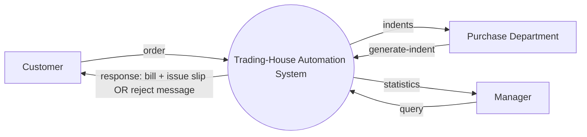

# Module 5: Data Flow Diagrams (DFD) — Theory, Rules & Data Dictionary


---

# Part V — Structured Analysis and Data Flow Diagrams

## 67. What the DFD exercises are teaching

The DFD materials use **structured analysis**. The core task is to read a requirements paragraph and convert its nouns and verbs into a data-oriented model.

The supplied practice materials establish four rules that should be treated as exam rules:

1. The **context diagram** contains the whole system as one bubble.
2. Every external entity appears at that boundary and nowhere else in the context diagram.
3. A bubble should usually decompose into around **3 to 7 child bubbles**.
4. A DFD shows **data in motion**, not control flow. Do not draw arrows whose meaning is “then,” “if,” “loop,” or “do this next.”

The practice sheets additionally emphasize that every function named in the requirement should appear somewhere and that the analyst should not invent extra behavior.

---

## 68. The four things to mine from a requirement

The worked Trading-House solution gives a very effective extraction method:

- every external “who” is a candidate **external entity**;
- every verb describing system work is a candidate **function**;
- every document or message produced is a candidate **report/output**;
- every noun that must be remembered between requests is a candidate **data store**.

This is a disciplined way to start a DFD before drawing any bubbles.

### Example vocabulary

Suppose the requirement says:

> A customer sends an order; the system checks the customer record; if valid, it updates inventory and produces a bill.

Candidate extraction:

- External entity: Customer.
- Function: accept/check order.
- Function: update inventory.
- Output: bill.
- Data stores: customer file, inventory.

The diagram comes after the vocabulary mining.

---

---

# Master Case Study: The Trading-House Automation System

# Part VI — Trading-House Automation System: Complete DFD Reasoning

## 69. Read the Trading-House requirement as a model

The requirement describes a trading house that maintains customers, checks creditworthiness, validates ordered items, checks inventory, issues bills and material issue slips, records pending orders, generates vendor indents, and answers manager queries about item sales.

The problem statement explicitly instructs the student to produce:

1. a list of entities, functions, and reports,
2. context diagram (level 0),
3. level 1 DFD,
4. one level 2 decomposition.

The worked solution follows exactly that order.

---

## 70. External entities in TAS

The worked solution identifies **three** external entities:

| Entity | Sends to system | Receives from system |
|---|---|---|
| Customer | order | bill + material-issue-slip or reject-message |
| Purchase Department | generate-indent command | indents |
| Manager | query | statistics |

A subtle but important point from the solution: **Vendors are not external entities in the DFD** because TAS does not communicate with them directly. The system reads the internal vendor list and prints indents for the Purchase Department, which then handles them.

This is an excellent example of the difference between “mentioned in the story” and “directly interacting with the software.”

---

## 71. Four level-1 functions in TAS

The four bubbles are:

| ID | Function | Main responsibility |
|---|---|---|
| 0.1 | Accept-order | look up customer, evaluate creditworthiness, accept/reject |
| 0.2 | Process-order | validate items, check stock, bill available items, log pending items |
| 0.3 | Handle-query | return sales statistics for a requested period |
| 0.4 | Handle-indent-request | consolidate pending orders, identify vendors, print indents |

Notice the clean decomposition: four functions are comfortably inside the 3–7 guideline.

---

## 72. TAS data stores

The worked solution identifies eight internal data stores:

1. Customer-file
2. Customer-history
3. Item-file
4. Inventory
5. Accepted-orders
6. Pending-order
7. Vendor-list
8. Sales-statistics

The solution explains that a data store is something the system remembers across requests. Vendors, by contrast, are not a store merely because the system stores vendor details; the **vendor-list** is the store.

---

## 73. TAS Level 0 — context diagram

The whole system is one bubble.



The context diagram intentionally collapses all internal distinctions. The response is shown generically because the level-0 picture does not yet distinguish between a successful order and a rejected one.

The important rule is **boundary purity**: internal files such as Customer-file or Inventory do not appear in the context diagram.

---

## 74. TAS Level 1 — Accept-order

`Accept-order (0.1)` receives a customer order, uses the Customer-file and Customer-history, and either sends an accepted order onward to Process-order or produces a reject message.

```text
Customer
   |
   | order
   v
+----------------+
| Accept-order   |
|      0.1       |
+----------------+
  |            |
  | accepted   | reject-message
  v            v
Process-order Customer
```

The data stores read by this function are:

- Customer-file → customer record,
- Customer-history → payment history.

The key semantic point is that an order rejected for creditworthiness **stops there** in the process model; it does not continue to Process-order.

---

## 75. TAS Level 1 — Process-order

`Process-order (0.2)` is more complex. It receives an accepted order and needs to:

1. validate ordered items against Item-file;
2. check availability in Inventory;
3. generate bill and material issue slip for available items;
4. record shortage/pending items;
5. update stores and sales information.

The source identifies Item-file, Inventory, Accepted-orders, and Pending-order here; Sales-statistics is updated when a sale completes.

This bubble still hides multiple distinct decisions, which is exactly why the worked solution chooses it for level 2 decomposition.

---

## 76. TAS Level 1 — Handle-query

`Handle-query (0.3)` is intentionally simple:

```text
Manager → query → Handle-query → Sales-statistics → statistics → Manager
```

The solution emphasizes that Sales-statistics is written when Process-order records a sale, while Handle-query simply reads it to answer managerial requests.

This separation prevents the query function from taking responsibility for generating sales data.

---

## 77. TAS Level 1 — Handle-indent-request

`Handle-indent-request (0.4)` receives a generate-indent command from the Purchase Department.

It reads:

- Pending-order,
- Vendor-list.

It determines the items still required and the total quantities, finds supplying vendors, and prints indents to the Purchase Department.

The shared store **Pending-order** is important: Process-order writes shortage information into it, while Handle-indent-request later reads it.

---

## 78. TAS Level 2 — decompose Process-order

The solution chooses Process-order because it hides the most complexity.

The four child bubbles are:

1. **Validate-items (0.2.1)**
2. **Check-availability (0.2.2)**
3. **Generate-documents (0.2.3)**
4. **Update-records (0.2.4)**

The high-level idea is:

```text
Accepted order
      |
      v
Validate items
      |
      v
Check availability
     / \
available short
    |      |
    +---+--+
        v
Generate documents / update records
```

The source describes this as a fan-out/fan-in pattern: one accepted-order stream splits into different result types and the information is ultimately consolidated into the record-update stage.

---

## 79. TAS DFD quality checklist

The worked tutorial’s final checks are exam-friendly:

- context diagram has one system bubble and all three external entities,
- level 1 contains exactly four bubbles,
- only the complex Process-order bubble is decomposed further,
- no arrow encodes execution order or conditions,
- every function mentioned in the requirement appears,
- nothing beyond the requirement is invented.

The last two are especially important. A DFD should be **requirement-driven, not imagination-driven**.

---

---

# Deep Dive: Structured Analysis, DFD Rules & System Modeling

# Deep Dive J — DFDs and Structured Analysis

## 165. What a DFD is trying to show

The DFD exercises teach structured analysis from requirements. The practice sheet gives a very explicit recipe:

1. list external entities, functions, and outputs;
2. draw the context diagram;
3. decompose it into a level-1 DFD;
4. choose one complex level-1 process and decompose it into level 2.

### What the DFD emphasizes

A DFD emphasizes **data in motion and transformations**.

It does not primarily show:

- execution sequence,
- timing,
- program statements,
- boolean conditions as control flow,
- implementation classes.

The practice sheet explicitly says:

> A DFD carries no control information — no order of execution, no conditions, just data in motion.

### Why this matters

Students often draw flowcharts instead of DFDs. A flowchart asks “what happens next?” A DFD asks “what data enters, what transformation occurs, what data leaves, and where is persistent data stored?”

---

## 166. Context diagram — the one-bubble rule

The context diagram represents the **entire system as one process/bubble**.

Every external entity should appear there, with every data flow crossing the system boundary.

Internal data stores do **not** belong in the context diagram.

### Why?

Because the context diagram establishes the system boundary. It answers:

> “What is inside the system, and who/what outside it exchanges data with the system?”

### Exam method

Before drawing anything, write:

```text
External entities:
1.
2.
3.

External inputs:
...

External outputs:
...
```

Then put the complete system in the center.

---

## 167. Level 1 DFD — decomposing the context bubble

The practice sheet recommends roughly **3 to 7 child bubbles**.

Why this range?

Because one giant process hides too much detail, while twenty tiny bubbles produce an unreadable first-level model.

The correct decomposition is not “split until there are exactly four processes.” It is to identify major responsibilities from the requirement and keep the level understandable.

### Example: Trading-House Automation System

The worked solution identifies four level-1 processes:

```text
0.1 Accept-order
0.2 Process-order
0.3 Handle-query
0.4 Handle-indent-request
```

These are not arbitrary names. The solution explicitly mines nouns and verbs from the requirement, then maps major system responsibilities to these bubbles.

---

## 168. Level 2 DFD — when to decompose

A level-2 decomposition should be used when a level-1 bubble still hides meaningful internal complexity.

The Trading-House solution chooses `Process-order` because it hides:

- item validation,
- stock checking,
- branching between available and unavailable quantities,
- document generation,
- record updates.

It then decomposes it into:

```text
0.2.1 Validate-items
0.2.2 Check-availability
0.2.3 Generate-documents
0.2.4 Update-records
```

### Important idea: decomposition must preserve the parent process's meaning

The level-2 processes together should explain the same external behavior as the level-1 process. This is the practical notion of **balancing** between levels.

---

## 169. DFD “do not invent” rule

The practice sheet says:

> Every function named in a requirement should show up as a bubble somewhere — and nothing beyond the requirement should be invented.

This is extremely important for exam questions.

Suppose the requirement says the system prints a bill for a valid order. Do not invent:

- a customer loyalty system,
- payment gateway,
- tax engine,
- notification server,

unless the requirement explicitly requires them.

A DFD answer is judged against the stated boundary, not against what a real-world application might eventually contain.

### Practical rule

When tempted to add something, ask:

> “Can I point to the exact requirement sentence that creates this entity, function, store, or flow?”

If not, treat it as suspicious.

---

# Deep Dive K — Trading-House Automation System

## 170. Step-by-step extraction from the Trading-House requirement

The source requirement contains several layers of information.

### External entities identified by the worked solution

- Customer
- Purchase Department
- Manager

The worked solution explicitly says vendors are **not** treated as external entities because the system merely prints indents and hands them to the purchase department; vendor details remain an internal file.

This is an excellent lesson in system boundaries.

### Major functions identified

```text
0.1 Accept-order
0.2 Process-order
0.3 Handle-query
0.4 Handle-indent-request
```

### Data stores identified

- Customer-file
- Customer-history
- Item-file
- Inventory
- Accepted-orders
- Pending-order
- Vendor-list
- Sales-statistics

### Reports/output documents

- reject message,
- bill,
- material issue slip,
- indents,
- statistics.

---

## 171. Trading-House context diagram reasoning

The context diagram is:

```text
                         Customer
                            |
                       order / response
                            |
                            v
              +---------------------------+
              | Trading-House Automation  |
              |          System           |
              +---------------------------+
                   ^                 ^
                   |                 |
            Generate-indent        query
                   |                 |
          Purchase Department     Manager
                   |
                indents
```

The worked solution emphasizes that the response flow is intentionally generic at level 0. It represents whichever result applies: bill + material issue slip or rejection message.

### Why not distinguish the branches yet?

Because the context diagram is about the **system boundary**, not internal decision detail. The detail belongs in the lower-level decomposition.

---

## 172. Trading-House `Accept-order` — what belongs here?

The requirement states that customer creditworthiness is checked before further processing. Therefore the worked solution uses:

```text
Customer
   ↓ order
Accept-order
   ↔ Customer-file
   ↔ Customer-history
   ↓
accepted-order → Process-order

or

reject-message → Customer
```

### Why customer history is separate from customer file

The worked solution distinguishes identity/details from payment history. This reflects the requirement's separate conceptual needs:

- current customer information,
- historical payment behavior.

### What should not happen here

Item validation and inventory checking belong to `Process-order` according to the worked solution. Keeping responsibilities separate improves the level-1 model's clarity.

---

## 173. Trading-House `Process-order` — why it gets a level-2 decomposition

At level 1 it interacts with:

- Item-file,
- Inventory,
- Accepted-orders,
- Pending-order,
- Customer/order input,
- Customer output.

Its behavior includes:

1. validate items against the item file;
2. check availability;
3. generate documents for available quantities;
4. record pending quantities;
5. update records.

Because that is more than one conceptual step, it is the natural level-2 candidate.

### Level-2 interpretation

```text
             accepted-order
                    |
                    v
          +-------------------+
          | Validate-items    |
          +-------------------+
                    |
                valid-items
                    |
                    v
          +-------------------+
          | Check-availability|
          +-------------------+
              /           \
     available-items     short-items
          |                  |
          v                  v
  Generate-documents     Update-records
          |                  ^
          |                  |
          +---------> Update-records
                         |
                  stores updated
```

The exact graphical arrangement can vary; what matters is that all major transformations represented in the source are preserved.

---

## 174. Why the DFD solution calls `Pending-order` a shared store

The worked solution explicitly says `Pending-order` is shared between two level-1 processes:

- `Process-order` writes backorders into it;
- `Handle-indent-request` reads pending orders from it.

This teaches an important DFD concept: data stores can be used by multiple processes when the requirement requires persistent information to flow between responsibilities.

### Why a file is not automatically an external entity

Because it remains inside the system boundary. A store is conceptually persistent system data; an external entity is something outside the system exchanging data with it.

---
